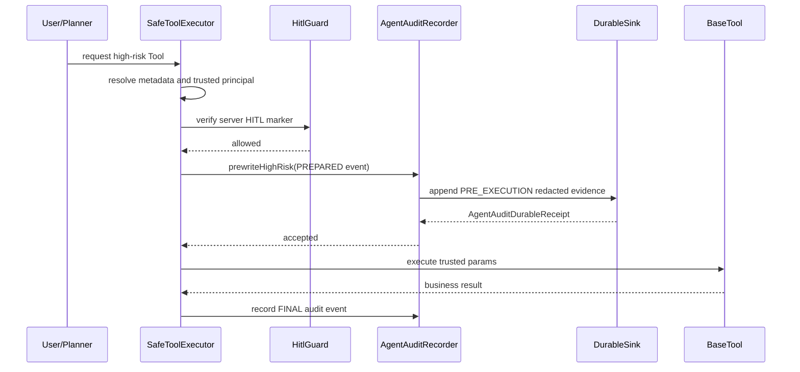

# kube-agent 顶级 Agent 架构与技术点学习地图

> 维护规则：这个文件是长期学习文档，不是一次性审计记录。后续每完成一个重要阶段，都要把新的架构决策、技术点、测试模式和学习要点同步进来。

## 2026-06-11 Frontend Memory/RAG Workbench

This slice is a frontend consumption slice for the existing backend Memory/RAG contracts, not a new Memory/RAG runtime opening.

`kube-agent-vue` now renders `/agent/memory` as a dedicated read-only Memory/RAG Workbench. The page consumes nine backend-owned GET contracts under `/api/agent/observability/memory-rag/**`:

- readiness
- citation and source custody
- source evidence digest
- durable memory lifecycle
- Memory/RAG eval gate
- eval-suite binding
- trace-set curation contract
- trace-set curation workbench overview
- reviewed trace-evidence manifest

Architecture lesson: top-tier Agent memory is not "the system can retrieve text." Memory becomes trustworthy only when the control plane can explain source custody, citation fidelity, tenant isolation, retention/deletion/export policy, reviewed redacted trace fixtures, and deterministic eval gates before retrieved content influences prompts.

The frontend workbench therefore shows evidence and blockers, not authority. It renders summary metrics, readiness cards, trace-set curation state, reviewed manifest rows, eval gate/suite binding, citation/source JSON, lifecycle/privacy/safety JSON, and raw read models. Missing backend evidence remains `Unknown`, `Unavailable`, or `Not evaluated`.

Safety invariant: the page does not run retrieval, call vector stores, call embeddings, invoke rerankers, execute GraphRAG, mutate prompts, write durable memory, mutate trace-set catalogs, run eval suites, enable CI blocking, call MCP `tools/call`, execute Tools, call kube-manager state-changing APIs, or reopen NIM/HPC/Slurm/BCM Phase 2 scope.

The same frontend slice adds a `Governance Evidence Matrix` to `/agent/top-tier`. That matrix is deliberately conservative: backend health, local session state, and SSE completion are displayed as evidence context only. They do not prove readiness, permission, policy, HITL, audit, eval, SLO, cost, release authority, or task success.

Teaching conclusion: a top-tier Agent learning project should make negative space visible. Closed buttons, missing evidence, unknown states, and blocked runtime shortcuts are not UI weakness; they are the learning surface that prevents "new technology" from quietly becoming unreviewed production authority.

## 2026-06-11 Frontend Settings Contract Evidence

`kube-agent-vue` now exposes `/agent/settings` as a read-only Settings Contract page. This page intentionally closes the last AgentOps placeholder route while avoiding the common mistake of turning frontend runtime values into configuration authority.

Frontend behavior:

- The page displays current frontend/runtime evidence: API base, Workbench mode, operator session, conversation anchor, backend health, readiness facts already present in the store, runtime status text, and local error text.
- It does not call backend settings write APIs, `fetch`, `postJson`, `loadObservabilityDocument(...)`, MCP endpoints, HITL endpoints, eval endpoints, or kube-manager state-changing endpoints.
- It renders explicit closed contracts: settings save is `Unavailable`; policy/model config, tool enablement, and HITL/Eval/Memory/Kube Outlet settings are `Unknown` until backend-owned contracts exist.
- It links only to Workbench and Readiness, and those links are navigation evidence, not configuration or runtime authority.

Architecture learning point:

- A top-tier Agent console must separate configuration evidence from configuration authority. A visible API base or `Health UP` state can help the operator understand the current browser context, but it cannot prove that model providers, policy rules, tool exports, HITL queues, eval gates, memory stores, or kube-manager outlets are correctly configured.
- Frontend settings pages are especially dangerous because they look harmless. If they quietly save flags, bypass backend contracts, or infer readiness from local state, they can teach the wrong mental model and open runtime authority before audit, permission, and release gates exist.
- The safe order is: display local/static/backend evidence first, mark missing contracts as `Unknown` or `Unavailable`, then later add backend-owned read/write contracts with permissions, audit records, deterministic tests, and recovery memory.

Safety invariant:

- No backend code changed in this slice. The frontend only consumed existing Pinia state.
- `/agent/settings` exposes no save, no config mutation, no runtime switch, no MCP `tools/call`, no Tool execution, no eval run, no HITL confirmation, no kube-manager write action, no CI blocking switch, and no Phase 2 NIM / HPC / Slurm / BCM reopening control.
- The governance scanner now requires `/agent/settings` to mount `SettingsContractView`, so all AgentOps navigation routes are real read-only pages rather than placeholders.

## 2026-06-11 Frontend Runs, HITL, And Observability Evidence

`kube-agent-vue` now exposes three more AgentOps surfaces: `/agent/runs`, `/agent/hitl`, and `/agent/observability`. They intentionally teach different evidence layers of a top-tier Agent console.

Backend contracts consumed by `/agent/observability`:

- `GET /api/agent/observability/snapshot`
- `GET /api/agent/observability/audit/index`
- `GET /api/agent/observability/audit/trace/{traceId}?limit=...`
- `GET /api/agent/observability/audit/id/{auditId}`

Frontend behavior:

- `/agent/runs` is a local session ledger derived from the current browser session, conversation, messages, and SSE events. It is useful for operator orientation, but it is not backend run history, audit truth, or eval evidence.
- `/agent/hitl` is a local HITL signal viewer. It derives clarify/HITL/approval-like/human-review evidence from current frontend events and messages only. It is not a backend approval queue, confirmation workflow, policy override, or checkpoint resume surface.
- `/agent/observability` reads backend metrics/audit read models through the shared read-only observability loader. It renders ReAct/tool/HITL counters, durable audit readiness, audit index redaction metadata, trace audit events, auditId lookup, local context, and raw JSON.
- All three pages render missing backend evidence as `Unknown`, `Unavailable`, or `Not evaluated`. The frontend does not convert missing events into success, policy approval, HITL completion, eval pass, or release authority.

Architecture learning point:

- A mature Agent console separates current UI session state from backend-owned audit truth. The current browser can explain what the operator just saw, but durable audit, backend HITL queue state, and replay/eval evidence must come from server-owned read models.
- Clarification is not approval. A `clarify` event can ask the user for information, but it cannot become a Tool execution decision unless a later backend-owned HITL contract records that authority.
- `traceId` and `auditId` are lookup anchors, not authorization facts. Authorization remains server-side through Spring Security and `AgentPrincipalResolver`; the frontend only asks for redacted evidence.
- Observability must start as GET/admin-only/read-only evidence. Replay execution, retry, eval-suite runs, trace-set curation, MCP `tools/call`, kube-manager writes, and release switches are separate authority planes and stay closed until reviewed backend contracts and tests explicitly open them.

Safety invariant:

- No backend code changed in this slice. The frontend consumed existing read models and the governance scanner now requires the snapshot/audit endpoint prefixes.
- `/agent/runs` exposes no backend run retrieval, persistence, rerun, retry, approval, or mutation control.
- `/agent/hitl` exposes no backend HITL queue call, confirm/clarify invocation, policy override, approval decision, checkpoint resume, or Tool execution.
- `/agent/observability` exposes no replay execution, Tool execution, eval-suite run, trace-set mutation, MCP runtime call, kube-manager state-changing action, runtime mutation, CI blocking switch, or Phase 2 NIM / HPC / Slurm / BCM reopening control.

## 2026-06-11 Frontend Tools Governance And MCP Manifest

`kube-agent-vue` now exposes `/agent/tools` as a real read-only Tools Governance page. This turns the backend MCP manifest and MCP governance overview into a learning surface for Agent tool safety.

Backend contracts consumed:

- `GET /api/agent/mcp/manifest`
- `GET /api/agent/mcp/governance/overview`

Frontend behavior:

- The page loads both contracts through the shared read-only observability loader.
- It renders total/exported/blocked tool counts, safe manifest policy, exported read-only tool metadata, governance cards, blocked capabilities, future enablement protocol, and raw JSON.
- Tool names, intent ids, HTTP methods, and agent names are displayed as review evidence only. They are not executable handles.

Architecture learning point:

- 顶级 Agent 的工具治理不是“先给前端一个调用按钮”。正确顺序是先让 manifest、export policy、blocked capabilities、future enablement protocol 和 raw evidence 可见。
- MCP manifest metadata, governance evidence, and runtime `tools/call` authority are separate layers. Mixing them in the UI would teach the wrong mental model and create production risk.
- A tool can be visible in a safe manifest while still not callable by the frontend. Visibility is evidence; it is not permission.

Safety invariant:

- No backend code changed in this slice. The frontend consumed existing MCP read models.
- The page does not call MCP `tools/call`, execute Tools, mutate ToolRegistry state, accept caller-provided tool arguments, export write tools, approve runtime MCP, or issue release decisions.
- `kube-agent-vue` governance scanning now treats `/agent/tools` as a required read-only route and checks the MCP manifest/governance endpoint prefixes.

## 2026-06-11 Frontend Trace Explorer And Evidence Read Models

`kube-agent-vue` now exposes `/agent/trace` as a real read-only Trace Explorer. This is the first frontend page that directly drills into the backend replay/eval evidence chain by trace id instead of only showing current session events.

Backend contracts consumed:

- `GET /api/agent/observability/replay/trace/{traceId}?limit=...`
- `GET /api/agent/observability/eval/trace/{traceId}?limit=...`

Frontend behavior:

- The page validates trace anchors locally and bounds `limit`, then calls only the shared `loadObservabilityDocument(...)` read-only loader.
- It renders summary tiles, a redacted replay timeline, deterministic eval checks, Replay Read Model JSON, and Eval Read Model JSON.
- Missing evidence stays Unknown or unavailable. The UI does not turn missing fields into policy, permission, risk, approval, score, pass/fail, or release authority.

Architecture learning point:

- Workbench Evidence Tabs and Trace Explorer serve different layers. Evidence Tabs are current-session event projections; Trace Explorer is backend-owned redacted audit/eval read-model replay by trace id.
- A top-tier Agent workbench should let learners inspect how runtime decisions become durable audit records, replay timeline steps, and deterministic eval evidence without giving the frontend runtime authority.
- The correct first frontend binding for observability is GET/admin-only/read-only, not a replay button. Replay, retry, approve, execute, publish, eval-suite run, and trace-set mutation stay closed until separate backend contracts, tests, and release evidence exist.

Safety invariant:

- No backend code changed in this slice. The frontend only consumed existing M5.32/M5.33 read models.
- The page does not call MCP `tools/call`, execute Tools, run eval suites, mutate trace-set catalogs, call kube-manager state-changing APIs, enable CI blocking, or reopen NIM / HPC / Slurm / BCM.
- `kube-agent-vue` governance scanning now covers Trace Explorer and the shared UI primitives used by governance/evidence pages, so security wording and empty-state semantics remain machine-checked.

## 2026-06-11 Frontend Admin Console And Backend Boot Reliability

This slice turns the temporary `kube-agent-vue` chat page into a vue-kube-manager-style admin console and restores a verified local backend runtime for frontend testing.

Runtime verification:

- Backend jar starts on `http://localhost:8500` with `--atlas.backend.base-url=http://localhost:8100`, local placeholder OpenAI keys, and `atlas.embedding.enabled=false`.
- `GET /api/agent/health` returns `status=UP`, `totalTools=183`, `supervisorGraphEnabled=true`, and `graphEnabled=true`.
- Frontend dev server runs on `http://localhost:5173`, and Vite `/api` proxy reaches the backend health endpoint.
- Browser verification confirms visible `Kube Agent`, `Agent Workbench`, backend `UP`, runtime panel, login form, and no console errors.

Backend learning point:

- Several read-only governance services use two constructors: a production constructor with Spring dependencies and a package-private constructor that accepts `Clock` for deterministic tests.
- Spring Boot runtime can fail constructor selection when more than one constructor exists and no explicit injection constructor is marked.
- The fix is intentionally small: add `@Autowired` to the production constructor while keeping the test constructor package-private. This preserves deterministic tests and removes startup ambiguity.

Frontend learning point:

- The first usable Agent UI should already teach the operator how the Agent is wired: backend health, session state, stream/graph mode, SSE events, capability blocks, and top-tier readiness are visible on one work surface.
- The visual language follows `vue-kube-manager`: fixed dark sidebar, compact white navbar, grey workspace background, white admin panels, and Element-family form controls.
- Phase 1 remains top-tier even while NIM / HPC / Slurm / BCM are paused: the frontend keeps those domains out of the primary workflow and focuses on Agent orchestration, Memory/RAG, Eval Gate, kube-manager outlet governance, and safe operator visibility.

Current limitations:

- Local backend uses a placeholder OpenAI key, so real LLM chat still needs a valid key.
- Real login/chat requires kube-manager on port `8100` and valid credentials.
- Frontend production build passes, but Vite/Rolldown reports third-party `@vueuse/core` pure-annotation warnings and a large chunk warning; these are not current blockers but should be revisited when code-splitting the workbench.

## 2026-06-11 Governance Read Model Pages

The `kube-agent-vue` workbench now has four dedicated governance pages instead of generic placeholders:

- `/agent/top-tier`: top-tier readiness, technology introduction playbook, compatibility evidence, official protocol watch, and Vue readiness.
- `/agent/memory`: Memory/RAG readiness, trace-set curation, reviewed evidence manifest, eval gate, and suite binding.
- `/agent/eval`: eval workbench overview, reviewed trace evidence, release-blocking contract, gate bundle summary, and trace-set catalog.
- `/agent/kube-manager`: kube-manager HTTP outlet governance, health, write retry readiness, write safety contract, and write release gate.

Architecture rule:

- These pages are read-only operator and learning surfaces. They call existing `GET /api/agent/observability/**` read models and render endpoint paths, status facts, collection counts, and raw JSON.
- They do not add write APIs, runtime switches, MCP `tools/call`, retrieval execution, CI blocking, kube-manager state-changing actions, retry enablement, or Phase 2 domain controls.
- Unauthenticated and unauthorized states are visible by design. This teaches the security boundary instead of hiding it behind empty screens.

Learning point: top-tier Agent frontend work is not only chat UX. A serious Agent needs pages that teach why a capability is ready, blocked, reviewed, or forbidden before the runtime is allowed to act.

Quality gate:

- `kube-agent-vue` now provides `npm run verify:governance`.
- The scan verifies required governance routes, observability endpoint prefixes, and a unified read-only loader.
- It fails if governance pages introduce mutating HTTP methods, MCP `tools/call`, CI blocking enablement, write retry enablement, kube-manager state-changing actions, retrieval runtime execution, or Phase 2 domain reopening controls.
- `npm run verify` is the preferred frontend slice acceptance entry point. It runs the governance scan, TypeScript checking, and production build in one sequence.

## 2026-06-11 Governance Teaching Panels And Scan Hardening

The four `kube-agent-vue` governance pages now teach the domain boundary directly in the UI:

- Each page passes `learningNotes` and `blockedActions` into `GovernanceReadModelView`.
- The shared component renders two compact panels: `学习要点` and `当前关闭的权力`.
- The pages still only call GET read models through `loadObservabilityDocument(endpoint.path)`.
- Browser verification on `/agent/top-tier` confirmed visible `MCP tools/call`, `NIM/HPC/Slurm/BCM`, `刷新全部`, and no console errors.

Why this matters:

- A top-tier Agent workbench must teach the operator why a capability is blocked, not merely hide the button.
- Governance pages are a controlled learning surface for advanced Agent engineering: technical adoption, Memory/RAG, Eval Gate, and kube-manager outlet safety are visible before runtime authority is granted.
- Teaching text is allowed to mention dangerous concepts, but executable endpoints and handlers remain forbidden.

Quality gate hardening:

- `verify-governance-readonly.mjs` now requires every governance page to declare and render `learningNotes` and `blockedActions`.
- It preserves boundary markers such as MCP `tools/call`, `run retrieval`, `enable ci blocking`, `enable write retry`, `kube-manager state changing action`, and `NIM/HPC/Slurm/BCM`.
- It also scans AgentOps placeholder routes and rejects runtime-authority shortcuts under `path`, `url`, `endpoint`, `href`, or `to`.
- Handler detection now covers camelCase, snake_case, and kebab-case names, so future frontend code cannot quietly add runtime controls by renaming them.

Recovery note:

- `kube-agent-vue` is the current Vue 3 / Element Plus temporary workbench used for fast learning and integration tests.
- Formal `vue-kube-manager` integration remains a future reviewed migration target through the M5.84 package.
- Quick restore path: backend `http://localhost:8500`, frontend `http://localhost:5173/agent/workbench`, then run `npm run verify` in `F:\gitProject\kube-agent-vue`.

## 2026-06-10 M5.84 Top-tier Vue Workbench Migration Package

M5.84 adds a backend-owned dry-run migration package for applying the top-tier Agent technology workbench to `vue-kube-manager`. It is the bridge between the M5.83 acceptance contract and a future real frontend patch.

Endpoint:

```text
GET /api/agent/observability/top-tier/vue-workbench-migration-package
```

Current contract:

- `schemaVersion=agent-top-tier-vue-workbench-migration-package.v1`
- `migrationStatus=MIGRATION_PACKAGE_READY_TO_APPLY_TO_VUE_KUBE_MANAGER`
- `repositoryFactCount=5`
- `routePatchCount=5`
- `fileBlueprintCount=10`
- `apiExportCount=8`
- `testBlueprintCount=9`
- `validationCheckCount=8`
- `forbiddenRuntimeAssertionCount=12`
- `directFrontendWritePerformed=false`
- `frontendRepositoryWritableInCurrentWorkspace=false`
- `gitSafeDirectoryRequired=true`
- `readOnlyMigrationOnly=true`
- `runtimeControlAllowed=false`

Architecture path:

```text
M5.83 acceptance contract
        |
        v
M5.84 migration package
        |
        +-- repository facts and Git safe-directory warning
        +-- asyncRoutes / BackendLayout route snippets
        +-- GET-only api module blueprint
        +-- five read-only Element UI page blueprints
        +-- mocked fixtures and Jest test blueprints
        +-- validation scans and forbidden runtime assertions
```

Key design:

- The package does not write `F:/gitProject/vue-kube-manager`; it describes a reviewed patch because the frontend repo is currently outside the writable root and Git reports a safe-directory requirement.
- The package records the real Vue permission trap: menu filtering uses exact path matching with `menus.some(menu => menu.path === route.path)`, so children must use absolute `/agent/top-tier/*` paths and the parent `/agent` must not require permission unless the backend menu API also returns `/agent`.
- The generated API blueprint uses only `@/utils/request`, `method: 'get'`, `params: query`, and `response.data` unwrapping.
- The generated tests prove both visible UI and absent authority: Element UI selectors should render evidence, while MCP `tools/call`, kube-manager writes, RAG runtime, dependency upgrades, CI blocking, HITL, and Phase 2 reopen buttons must be absent.

Latest-technology calibration:

- Official Spring Boot docs show stable `4.0.6` while `3.5.14` remains a stable line; this project keeps major migration behind compatibility branches.
- Official Spring AI docs show stable `1.1.7`; the `2.0` line stays compatibility/evidence work until tests and release gates pass.
- OpenAI Agents guidance treats Agents as applications that plan, call tools, collaborate across specialists, and keep state; M5.84 turns these concepts into frontend governance and teaching checks before runtime authority.
- MCP latest specification is `2025-11-25`; M5.84 keeps MCP resources/prompts/tools visible as governance evidence while forbidding runtime `tools/call`.
- A2A latest released specification is `1.0.0`; M5.84 keeps it as a provenance and interoperability lane, not runtime handoff.
- OTel GenAI semantic conventions remain `Development`, so any GenAI span mapping must stay opt-in and evidence-gated.

Learning point: a top-tier Agent workbench is not only a UI. It is a migration artifact that teaches why route permissions, API method shape, fixture isolation, XSS-safe rendering, validation scans, and forbidden controls all matter before an Agent runtime is allowed to act.

Safety invariant:

- M5.84 is admin-only, GET-only, read-only, migration-package-only, dry-run-only, source-contract-composition-only, and external-call-free at request time.
- It does not modify `pom.xml`, upgrade Java/Spring/Spring AI, write `vue-kube-manager`, run evals, execute Tools, invoke `SafeToolExecutor`, invoke HITL, call kube-manager or port `8100`, expose MCP runtime `tools/call`, run A2A runtime handoff, execute retrieval/vector/embedding/reranker/GraphRAG, write memory, write audit, issue durable receipts, enable CI blocking, or touch NIM / HPC / Slurm / BCM Phase 2 scope.

Multi-expert review:

- Parfit / frontend explorer confirmed the real `vue-kube-manager` route model: Vue 2, Element UI, `asyncRoutes`, `BackendLayout`, exact-path menu permissions, `@/utils/request`, Jest + Vue Test Utils, and no existing local menu permission mock.
- Carver / backend architecture reviewer recommended making M5.84 a migration kit/package rather than a generator that writes the frontend repository.

Next work: make `vue-kube-manager` writable/trusted, apply the M5.84 package as a reviewed frontend patch, run lint/unit/CI plus forbidden-runtime scans, then commit and push frontend and recovery memory. Runtime MCP, A2A, retrieval, CI blocking, kube-manager writes, Java/Spring/Spring AI major upgrades, and Phase 2 NIM/HPC/Slurm/BCM remain release-gated.

## 2026-06-10 M5.83 Top-tier Vue Workbench Acceptance Contract

M5.83 adds the backend-owned acceptance contract for the future `vue-kube-manager` top-tier Agent workbench. It turns the M5.79-M5.82 implementation package into executable frontend expectations: route shape, API client shape, mocked fixtures, Jest scenarios, forbidden runtime selectors, governance alignment, and teaching checkpoints.

Endpoint:

```text
GET /api/agent/observability/top-tier/vue-workbench-acceptance-contract
```

Current contract:

- `schemaVersion=agent-top-tier-vue-workbench-acceptance-contract.v1`
- `contractStatus=ACCEPTANCE_CONTRACT_READY_FOR_VUE2_ELEMENT_UI_IMPLEMENTATION`
- `frontendStackFactCount=6`
- `routeMountSpecCount=5`
- `apiClientSpecCount=8`
- `pageFixtureSpecCount=5`
- `acceptanceScenarioCount=10`
- `forbiddenRuntimeSelectorCount=12`
- `implementationFileCount=10`
- `testCommandCount=3`
- `fixtureOnly=true`
- `runtimeControlAllowed=false`

Architecture path:

```text
official source watch
        |
        v
technology playbook and Vue implementation package
        |
        v
M5.83 Vue acceptance contract
        |
        +-- asyncRoutes / BackendLayout / menu permission fixture
        +-- GET-only api client / ApiResponse.data unwrap
        +-- mocked Jest fixtures / Element UI selectors
        +-- absent runtime selectors / absent mutation APIs
        +-- XSS-safe read-only JSON evidence panels
```

Key design:

- The contract is locked to the observed `vue-kube-manager` stack: Vue 2.6, vue-router 3, Vuex 3, Element UI 2, axios through `src/utils/request.js`, Vue CLI/Jest, and `tests/unit/**/*.spec.js`.
- It explicitly rejects premature Vue 3, vue-router 4, Element Plus, Vite, Pinia, direct `fetch`, and `axios.create` additions for this workbench slice. These may be future compatibility lanes, not hidden changes inside the Agent workbench.
- It separates acceptance tests from production read-model calls: mocked HTTP is required for Jest acceptance, production GET read-model calls are allowed, mutating backend calls remain forbidden.
- It turns forbidden runtime authority into machine-checkable absence: DOM selectors must not exist and API modules must not export `post`, `put`, `patch`, or `delete`.
- It maps OpenAI Agents primitives, MCP authorization concerns, OTel GenAI semantics, and OWASP LLM Top 10 risks into governance evidence without starting Agent loops, MCP runtime, GenAI spans, retrieval, or Tool calls.

Learning point: top-tier frontend engineering is not just "make pages". The frontend must become an operator workbench and teaching surface whose tests prove both what is visible and what authority is absent. This is especially important for Agent systems because unsafe buttons, unreviewed API methods, and unescaped evidence panels can become production risk.

Safety invariant:

- M5.83 is admin-only, GET-only, read-only, fixture-only, acceptance-contract-only, source-package-composition-only, and external-call-free at request time.
- It does not modify `pom.xml`, upgrade Java/Spring/Spring AI, edit `vue-kube-manager`, run evals, execute Tools, invoke `SafeToolExecutor`, invoke HITL, call kube-manager or port `8100`, expose MCP runtime `tools/call`, run A2A runtime handoff, execute retrieval/vector/embedding/reranker/GraphRAG, write memory, write audit, issue durable receipts, enable CI blocking, or touch NIM / HPC / Slurm / BCM Phase 2 scope.

Multi-expert review:

- Hypatia / frontend explorer reviewed the real `vue-kube-manager` shape and recommended `asyncRoutes`, `BackendLayout`, menu permission fixtures, `ApiResponse.data`, Element UI selectors, and DOM/API absence checks.
- Planck / architecture-security reviewer recommended fail-closed source-package checks, separation between mocked acceptance HTTP and production read-model GETs, governance alignment, and XSS-safe evidence rendering rules.

Next work: implement the five-page `vue-kube-manager` workbench from this contract with mocked fixtures and Jest first. Runtime MCP, A2A, retrieval, CI blocking, kube-manager writes, Java/Spring/Spring AI major upgrades, and Phase 2 NIM/HPC/Slurm/BCM remain release-gated.

## 2026-06-10 M5.82 Top-tier Technology Introduction Playbook

M5.82 adds the Phase 1 "latest technology introduction playbook". It answers the newest mission wording: introduce all advanced technologies and still finish the top-tier Agent goal, without turning that ambition into blind dependency upgrades or unsafe runtime switches.

Endpoint:

```text
GET /api/agent/observability/top-tier/technology-introduction-playbook
```

Current contract:

- `schemaVersion=agent-top-tier-technology-introduction-playbook.v1`
- `playbookStatus=PLAYBOOK_READY_EVIDENCE_GAPS_BLOCK_RUNTIME`
- `officialSourceCount=8`
- `technologyLaneCount=10`
- `playbookStageCount=8`
- `releaseGateCount=10`
- `expertReviewRoundCount=6`
- `learningModuleCount=8`
- `forbiddenShortcutCount=10`
- `vueRouteCount=5`
- `phase1TopTierGoalPreserved=true`
- `javaSpringControlPlanePreserved=true`
- `phase2NimHpcSlurmBcmPaused=true`
- `runtimeControlAllowed=false`
- `runtimeUpgradeAllowedNow=false`
- `dependencyUpgradeAllowedNow=false`
- `ciBlockingAllowedNow=false`

Architecture path:

```text
official source watch
        |
        v
advanced technology compatibility matrix
        |
        v
evidence readiness
        |
        v
backend modernization decision
        |
        v
M5.82 technology introduction playbook
        |
        +-- compatibility branch
        +-- focused regression tests
        +-- Vue read-only workbench
        +-- multi-expert release review
        +-- separate runtime binding slice
```

Key design:

- The playbook composes only four existing read models: official source watch, compatibility matrix, evidence readiness, and backend modernization decision.
- It turns 10 advanced technology lanes into learnable rows: Java 21/25, Spring Boot 4, Spring AI 2.0.0-RC2, OpenAI Responses/Agents patterns, MCP runtime, A2A provenance, OTel GenAI adapter, Memory/RAG/GraphRAG/reranker/vector store, kube-manager writes, and supply-chain/CI quality gates.
- It makes multi-expert review a backend contract with six required review rounds: architecture, security, frontend Vue, eval quality, Memory/RAG, and release management.
- It publishes eight learning modules so this project remains a teaching project, not just a feature delivery project.
- It expands the Vue latest-technology workbench from four pages to five pages by adding the playbook page.

Learning point: 顶级 Agent 的先进性不是把所有新框架直接接到 runtime，而是把每个先进能力先变成官方来源、兼容矩阵、证据缺口、可见工作台、评审角色、测试门禁和发布路径。这样学习者能看到“为什么还不能打开某个按钮”，也能学会怎样把一个前沿技术安全地推进到生产边界。

Safety invariant:

- M5.82 is admin-only, read-only, playbook-only, source-read-model-composition-only, and external-call-free at request time.
- It does not modify `pom.xml`, upgrade Java/Spring/Spring AI, create compatibility branches, run evals, discover candidates, run curation review, mutate trace-set catalogs, enable CI blocking, run LLMs, execute Tools, call `SafeToolExecutor`, invoke HITL, call kube-manager or port `8100`, expose MCP runtime `tools/call`, run A2A runtime handoff, execute retrieval/vector/embedding/reranker/GraphRAG, write memory, write audit, issue durable receipts, or touch NIM / HPC / Slurm / BCM Phase 2 scope.

Multi-expert review:

- Confucius / security-architecture review confirmed the M5.82 risk focus: keep the endpoint GET/admin-only/read-only and prevent hidden LLM, Tool, MCP `tools/call`, A2A, RAG, kube-manager, audit, memory, dependency, CI, and Phase 2 authority.
- Erdos / docs-recovery review confirmed the M5.82 recovery checklist: update `CHANGELOG.md`, architecture learning map, project mission memory, backend tech roadmap, workspace-local recovery memory, SHA manifests, and post-push checkpoint.

Next work: wire `vue-kube-manager` to the five-page latest-technology workbench, then populate real reviewed redacted eval traces and Memory/RAG fixtures. Java 21/25, Boot 4, Spring AI 2.0.0-RC2, MCP runtime, A2A, retrieval, CI blocking, and kube-manager writes remain evidence-gated. NIM / HPC / Slurm / BCM remain Phase 2.

## 2026-06-10 M5.81 Backend Technology Modernization Decision

M5.81 adds the backend technology modernization decision layer. It answers the user's latest strategic question: if Phase 1 must become a top-tier Agent and must track the newest Agent technologies, should the backend stay Java/Spring, or should it jump directly to newer runtimes and frameworks?

Endpoint:

```text
GET /api/agent/observability/top-tier/backend-technology-modernization-decision
```

Current decision:

- `schemaVersion=agent-backend-technology-modernization-decision.v1`
- `decisionStatus=JAVA_SPRING_MAINLINE_ADVANCED_COMPATIBILITY_LANES_BLOCKED_BY_EVIDENCE`
- `javaBackendStillPreferred=true`
- `javaSpringControlPlanePreserved=true`
- `phase2NimHpcSlurmBcmPaused=true`
- `officialSourceCount=8`
- `mainlineDecisionCount=8`
- `compatibilityLaneCount=10`
- `blockedCompatibilityLaneCount=10`
- `modernizationGateCount=8`
- `blockedShortcutCount=9`
- `learningStepCount=8`
- `mainlineRuntimeUpgradeAllowedNow=false`
- `dependencyUpgradeAllowedNow=false`
- `runtimeControlAllowed=false`
- `ciBlockingAllowedNow=false`

Architecture decision:

```text
Java/Spring typed control plane
        |
        +-- identity / RBAC / tenant boundary
        +-- SafeToolExecutor / HITL / durable audit
        +-- replay / deterministic eval / release gates
        +-- backend-owned Vue read models
        +-- recovery memory and Git-reviewed checkpoints
        |
        v
Latest technology lanes enter through evidence, not direct runtime authority
        |
        +-- Java 21 / 25
        +-- Spring Boot 4 / Framework 7
        +-- Spring AI 2.0.0-RC2
        +-- OpenAI Responses / Agents patterns
        +-- MCP 2025-11-25 tools/call
        +-- A2A provenance
        +-- OTel GenAI semconv adapter
        +-- GraphRAG / reranker / vector store
        +-- kube-manager writes
        +-- SBOM / dependency audit / CI blocking
```

Key design:

- The service composes only the official version/protocol watch and the evidence-readiness read model.
- It turns "引入全部最先进技术" into a governed decision: mainline, compatibility lane, blocked shortcut, modernization gate, learning path, endpoint map, safety proof, and privacy proof.
- It refreshes the official-source posture to `2026-06-10`; Spring AI 2 is tracked as `2.0.0-RC2` preview in the compatibility lane, not as a mainline dependency.
- It expands the top-tier Vue workbench package from three pages to four pages and the Vue readiness control plane from 16 to 17 targets.

Learning point: 顶级 Agent 的后端不是追求“看起来最新”的运行时，而是要有一个能承载权限、审计、评测、发布门禁、前端工作台和恢复记忆的 typed control plane。Java/Spring 在这里不是保守选择，而是控制平面选择。最新技术必须进入视野，但要先走 official source -> compatibility matrix -> evidence readiness -> reviewed tests -> release gate -> runtime binding。

Multi-expert review:

- Confucius / security-architecture review found no P0/P1/P2 blockers and confirmed the endpoint is admin-only, read-only, and free of LLM, Tool, SafeToolExecutor, HITL, kube-manager/8100, MCP tools/call, A2A runtime, retrieval/vector/reranker/GraphRAG, audit/memory write, dependency upgrade, and Phase 2 domain touch.
- Erdos / docs-recovery review confirmed the required M5.81 documentation and recovery-memory checklist, including workspace-local memory under `codex-memory/kube-agent/current`.

Next work: wire `vue-kube-manager` to the four-page workbench package, then curate reviewed redacted eval traces and Memory/RAG fixtures. Java 21/25, Boot 4, Spring AI 2.0.0-RC2, MCP runtime, A2A, retrieval, CI blocking, and kube-manager writes remain evidence-gated. NIM / HPC / Slurm / BCM remain Phase 2.

## 2026-06-10 M5.80 Advanced Technology Evidence Readiness

M5.80 adds the evidence-readiness layer for the advanced technology compatibility matrix. It answers: when the project says it wants "all the most advanced technologies", how do we prevent that from becoming an unsafe dependency bump or runtime switch?

```text
M5.77 compatibility matrix
        |
        +-----------------------------+
                                      v
M5.80 evidence readiness       every technology lane becomes
                                      |
        +-----------------------------+
        |
        +-- reviewed eval trace evidence gap
        +-- Memory/RAG reviewed fixture gap
        +-- release gate gap
        +-- Vue read-only visibility gap
        +-- recovery memory gap
        +-- human Git review gap
```

Endpoint:

```text
GET /api/agent/observability/top-tier/advanced-technology-compatibility-matrix/evidence-readiness
```

Current state:

- `schemaVersion=agent-advanced-technology-compatibility-matrix-evidence-readiness.v1`
- `readinessStatus=EVIDENCE_READINESS_BLOCKED_BY_REVIEWED_TRACE_GAPS`
- `matrixItemCount=10`
- `evidenceRowCount=10`
- `blockedEvidenceRowCount=10`
- `reviewedTraceSetCount=0`
- `memoryRagRequiredTraceSetCount=3`
- `runtimeControlAllowed=false`
- `ciBlockingAllowedNow=false`

Key design:

- The service composes only three read models: compatibility matrix, reviewed eval trace evidence, and Memory/RAG reviewed trace evidence manifest.
- It does not call candidate discovery, curation review, trace-set gates, eval suites, audit query, retrieval, tools, LLMs, or kube-manager.
- Every advanced technology lane receives the same baseline proof model: official source, reviewed trace, focused tests, Vue visibility, recovery memory, and Git review.
- High-risk lanes add extra proof: MCP needs consent/SafeToolExecutor/audit/eval; Memory/RAG needs citation/source/tenant/lifecycle fixtures; kube-manager writes need idempotency/safety/readback/release-gate evidence; CI needs real reviewed trace evidence before blocking releases.

Learning point: 顶级 Agent 的“先进”不是按版本号堆出来的，而是按证据链生长出来的。M5.80 把每个先进技术候选项变成可见的证据缺口，这样学习者能看到为什么 Java 21/25、Spring Boot 4、Spring AI 2、OpenAI Agents、MCP tools/call、A2A、OTel GenAI、GraphRAG、reranker、vector store、CI blocking 还不能直接进入 runtime。

Technology point: Evidence readiness is the bridge between architecture ambition and release discipline. It keeps the project modern without allowing "latest" to bypass identity, Tool governance, audit, replay, eval, privacy, Vue UX, and recovery memory.

M5.80 also upgrades the M5.79 Vue workbench implementation package from two pages to three pages. The third page is the evidence-readiness board, so `vue-kube-manager` can teach operators not only what technologies are being tracked, but why each one is still blocked.

## 2026-06-10 M5.79 Top-Tier Vue Workbench Implementation Package

M5.79 turns the two latest-technology Vue binding specs into a page-level implementation package. It answers: how can `vue-kube-manager` implement the official watch page and compatibility matrix page as one governed workbench without inventing routes, API client behavior, shared components, fixtures, or runtime controls?

```text
M5.76 official watch Vue binding spec
        |
        +--------------------+
                             v
M5.79 Vue workbench implementation package
                             ^
        +--------------------+
        |
M5.78 compatibility matrix Vue binding spec

M5.79 publishes:
        +-- routeSpecs
        +-- apiClientBindings
        +-- pageAssemblies
        +-- sharedComponentContracts
        +-- acceptanceFixtures
        +-- forbiddenRuntimeControls
        |
        v
vue-kube-manager can implement two pages with mocked fixtures and no runtime buttons
```

Endpoint:

```text
GET /api/agent/observability/top-tier/vue-workbench-implementation-package
```

Current state:

- `schemaVersion=agent-top-tier-vue-workbench-implementation-package.v1`
- `packageStatus=IMPLEMENTATION_PACKAGE_READY`
- `routeSpecCount=2`
- `apiClientBindingCount=4`
- `pageAssemblyCount=2`
- `sharedComponentCount=7`
- `acceptanceFixtureCount=6`
- `runtimeControlAllowed=false`

Key design:

- The package service composes only the official watch binding spec service and the compatibility matrix binding spec service.
- It publishes two frontend route specs: official watch and compatibility matrix.
- It publishes four read-only API client bindings and marks all as mocked-fixture-friendly.
- It defines shared components as security semantics, not just UI widgets.
- It groups disabled runtime controls from both source specs and adds a global forbidden-control group.
- It embeds both source binding specs so Vue can drill into backend-owned evidence.

Multi-expert review:

- Newton / frontend-contract review recommended a cross-page workbench package because single-page specs still leave Vue guessing about route, tab, drilldown, disabled action, and fixture behavior. M5.79 implements that recommendation.
- Faraday / backend-architecture review recommended a follow-up evidence-readiness endpoint that maps compatibility-matrix lanes to reviewed trace/eval/Memory-RAG evidence gaps. M5.80 implements that recommendation as a separate read-only slice.

Learning point: 顶级 Agent 的前端不是“把接口数据显示出来”。它是一个 operator UX + learning UX + governance UX。后端要发布的不只是数据，还包括页面边界、组件语义、验收 fixture、禁用动作和安全证明。

Technology point: 最新技术治理应该先变成可见、可测、可教学的工作台，再变成运行时能力。这个顺序可以防止“看起来先进”的按钮绕开审计、评测、HITL、release gate 和恢复记忆。

## 2026-06-10 M5.78 Compatibility Matrix Vue Binding Spec

M5.78 turns the M5.77 compatibility matrix into a backend-owned frontend binding specification. It answers: how can `vue-kube-manager` render the latest-technology compatibility workbench without duplicating backend governance logic or accidentally adding runtime controls?

```text
M5.77 compatibility matrix
        |
        v
M5.78 Vue binding spec
        |
        +-- componentSpecs
        +-- fieldBindings
        +-- tableColumnGroups
        +-- stateRenderingRules
        +-- disabledActionBindings
        +-- testFixtures
        |
        v
vue-kube-manager renders a read-only learning/operator workbench
```

Endpoint:

```text
GET /api/agent/observability/top-tier/advanced-technology-compatibility-matrix/vue-binding-spec
```

Current state:

- `schemaVersion=agent-advanced-technology-compatibility-matrix-vue-binding-spec.v1`
- `bindingStatus=VUE_BINDING_SPEC_READY`
- `componentSpecCount=8`
- `fieldBindingCount=14`
- `tableColumnGroupCount=5`
- `disabledActionBindingCount=7`
- `fixtureCount=5`
- `runtimeControlAllowed=false`

Key design:

- The binding spec service composes only `AgentAdvancedTechnologyCompatibilityMatrixService.matrix()`.
- The spec embeds the matrix as `sourceMatrix`, so Vue can drill from UI rules back to backend evidence.
- It defines table columns for `sourceBaselines`, `matrixItems`, `migrationGates`, `blockedUpgradeShortcuts`, and `testLanes`.
- It explicitly renders blocked upgrade shortcuts as disabled rows, not buttons.
- Fixtures require mocked HTTP and explicitly state no runtime backend calls or kube-manager `8100` access.

Learning point: 顶级 Agent 前端不是“想渲染什么就渲染什么”，而是由后端发布可验证绑定契约。这样学习者能看到最新技术路线，也能看到为什么某些按钮不该出现。

Technology point: 先进技术工作台应该把 Java/Spring/OpenAI/MCP/A2A/RAG/CI 的候选线展示出来，但把执行权留在 release gate 后面。这是 operator UX、教学 UX 和安全架构的交汇点。

## 2026-06-10 M5.77 Advanced Technology Compatibility Matrix

M5.77 adds a backend-owned compatibility matrix for advanced Agent technologies. It answers: how can this project use latest frameworks and Agent protocols while keeping the mainline buildable, secure, testable, and recoverable?

```text
Official version/protocol watch
        |
        v
M5.77 compatibility matrix
        |
        +-- sourceBaselines
        +-- matrixItems
        +-- migrationGates
        +-- blockedUpgradeShortcuts
        +-- testLanes
        |
        v
future compatibility branches
        |
        v
reviewed runtime/dependency release slices
```

Endpoint:

```text
GET /api/agent/observability/top-tier/advanced-technology-compatibility-matrix
```

Current state:

- `schemaVersion=agent-advanced-technology-compatibility-matrix.v1`
- `matrixStatus=MATRIX_DEFINED_NOT_EXECUTED`
- `sourceBaselineCount=8`
- `matrixItemCount=10`
- `migrationGateCount=8`
- `blockedShortcutCount=7`
- `testLaneCount=8`
- `runtimeUpgradeAllowedNow=false`
- `dependencyUpgradeAllowedNow=false`

Key design:

- The matrix service composes only `AgentOfficialVersionProtocolWatchService.watch()`.
- The matrix does not change dependencies, run tests, call LLMs, execute Tools, call kube-manager, or open runtime controls.
- It captures candidate lanes for Java 21/25, Spring Boot 4, Spring AI 2, OpenAI Agents/Responses, MCP runtime, A2A, OTel GenAI, GraphRAG/rerankers/vector stores, kube-manager writes, and CI/SBOM quality.
- It exposes migration gates and blocked shortcuts so a future Vue page can teach why "latest" is not automatically "safe".

Learning point: 顶级 Agent 的升级路径是 compatibility matrix first。一个 Agent 工程师需要学会判断：哪些技术可以在主线稳定使用，哪些必须先进入兼容矩阵，哪些必须等 release gate 才能进入 runtime。

Technology point: Spring Boot 4、Spring AI 2、Java 21/25、MCP runtime、A2A、GraphRAG、reranker、vector store、CI blocking 都在一期目标的技术视野内，但它们进入系统的方式是证据链，而不是按钮或版本号冲动。

## 2026-06-09 M5.76 Official Version / Protocol Watch Vue Binding Spec

M5.76 turns the M5.75 dashboard into a backend-owned frontend binding spec. It answers: how can `vue-kube-manager` implement the official technology/protocol watch page without duplicating or weakening backend governance logic?

```text
M5.74 official version/protocol watch
        |
        v
M5.75 Vue-ready dashboard
        |
        +-- sourceCards
        +-- technologyTrackCards
        +-- adoptionGateRows
        +-- blockedRuntimeShortcutRows
        +-- disabledRuntimeActions
        |
        v
M5.76 Vue binding spec
        |
        +-- componentSpecs
        +-- fieldBindings
        +-- tableColumnGroups
        +-- stateRenderingRules
        +-- disabledActionBindings
        +-- testFixtures
        |
        v
vue-kube-manager implements a read-only workbench with no runtime buttons
```

Endpoint:

```text
GET /api/agent/observability/top-tier/official-version-protocol-watch/vue-binding-spec
```

Current state:

- `schemaVersion=agent-official-version-protocol-watch-vue-binding-spec.v1`
- `bindingStatus=VUE_BINDING_SPEC_READY`
- `componentSpecCount=7`
- `fieldBindingCount=12`
- `tableColumnGroupCount=4`
- `disabledActionBindingCount=6`
- `fixtureCount=4`
- `runtimeControlAllowed=false`

Key design:

- The binding spec service composes only `AgentOfficialVersionProtocolWatchDashboardService.dashboard()`.
- The response embeds the M5.75 `sourceDashboard`.
- It publishes concrete frontend component names, renderer hints, field paths, table columns, disabled action bindings, and mock fixture requirements.
- It integrates into the top-tier readiness recommended build order and the Vue readiness control plane as `official-version-protocol-watch-binding-spec`.
- It keeps all runtime actions absent: dependency upgrades, MCP `tools/call`, A2A handoff, retrieval runtime, CI blocking, and Phase 2 domain reopening remain separate reviewed slices.

Learning point: 顶级 Agent 的前端需要“后端权威绑定规格”。这样 Vue 既能做出好用的工作台，又不会把治理逻辑、运行时权限、官方来源解释、禁用动作原因散落在前端代码里。

Technology point: 最新技术被引入系统的第一形态不一定是 runtime integration。对高风险 Agent 系统来说，官方源、契约、fixture、禁用动作和 Vue 证据面板也是先进技术的一部分，因为它们决定了未来 runtime 能否安全上线。

Official references rechecked for this anchor:

- Spring AI Reference: https://docs.spring.io/spring-ai/reference/
- Spring Boot Documentation: https://docs.spring.io/spring-boot/index.html
- OpenAI Agents SDK guide: https://platform.openai.com/docs/guides/agents
- MCP latest specification: https://modelcontextprotocol.io/specification/latest
- OpenTelemetry GenAI semantic conventions: https://opentelemetry.io/docs/specs/semconv/gen-ai/
- A2A protocol specification: https://a2a-protocol.org/latest/specification/
- OWASP Top 10 for LLM Applications: https://genai.owasp.org/llm-top-10/

## 2026-06-09 M5.75 Official Version / Protocol Watch Dashboard

M5.75 turns the M5.74 official watch into a Vue-ready dashboard. It answers: how can `vue-kube-manager` show the newest Agent technology sources, security guidance, adoption tracks, gates, blockers, and disabled runtime actions without duplicating governance rules in the frontend?

```text
M5.74 official version/protocol watch
        |
        +-- officialSources
        +-- technologyTracks
        +-- adoptionGates
        +-- blockedRuntimeShortcuts
        |
        v
M5.75 Vue-ready dashboard
        |
        +-- sourceCards
        +-- technologyTrackCards
        +-- adoptionGateRows
        +-- blockedRuntimeShortcutRows
        +-- disabledRuntimeActions
        +-- renderSections / dashboardPolicy
        |
        v
vue-kube-manager renders evidence and hides runtime buttons
```

Endpoint:

```text
GET /api/agent/observability/top-tier/official-version-protocol-watch/dashboard
```

Current state:
- `schemaVersion=agent-official-version-protocol-watch-dashboard.v1`
- `dashboardStatus=DASHBOARD_READY_TO_RENDER_OFFICIAL_WATCH`
- `sourceCardCount=8`
- `technologyTrackCardCount=8`
- `adoptionGateCount=7`
- `blockedRuntimeShortcutCount=6`
- `runtimeControlAllowed=false`

Key design:
- The dashboard service composes only `AgentOfficialVersionProtocolWatchService.watch()`.
- The response embeds the source watch so the frontend can drill from cards back to the official-source contract.
- It creates disabled action descriptors for dependency upgrades, MCP `tools/call`, A2A handoff, retrieval runtime, CI blocking, and Phase 2 domain reopening.
- It integrates into the top-tier readiness recommended build order and the Vue readiness control plane as `official-version-protocol-watch-dashboard`.
- It adds the 2026-06-02 NSA MCP Security Cybersecurity Information as `nsa-mcp-security-2026-06`, increasing official watch sources from 7 to 8.

Learning point: 顶级 Agent 的前端不是“按钮集合”，而是治理证据的操作台。后端给出可渲染的卡片、禁用动作和安全证明，Vue 负责清晰呈现；运行时能力必须在独立的 release-gated slice 中开启。

Technology point: 最新 MCP 安全指南进入 watch/dashboard 后，只增强安全门禁和学习材料，不改变 runtime authority。MCP `tools/call`、A2A、retrieval、GraphRAG、reranker、vector store、CI blocking 仍需要 reviewed traces、eval gates、audit/replay、SafeToolExecutor/HITL 证据和 Git review。

Official references:
- NSA MCP Security Cybersecurity Information: https://media.defense.gov/2026/Jun/02/2003943289/-1/-1/0/CSI_MCP_SECURITY.PDF
- MCP specification 2025-11-25: https://modelcontextprotocol.io/specification/2025-11-25
- Spring AI Reference: https://docs.spring.io/spring-ai/reference/
- OpenAI Responses API migration guide: https://platform.openai.com/docs/guides/migrate-to-responses
- OpenAI Agents SDK guide: https://platform.openai.com/docs/guides/agents-sdk/
- OpenTelemetry GenAI semantic conventions: https://opentelemetry.io/docs/specs/semconv/gen-ai/
- A2A protocol specification: https://a2a-protocol.org/latest/specification/
- OWASP Top 10 for LLM Applications: https://genai.owasp.org/llm-top-10/

## 2026-06-09 M5.74 Official Version / Protocol Watch

M5.74 adds a backend-owned official source watch for the latest Agent technology stack. It answers: how do we keep the project aligned with current Spring AI, OpenAI Responses/Agents, MCP, A2A, OpenTelemetry GenAI, OWASP LLM, and advanced RAG directions without blindly upgrading the only recoverable mainline?

```text
official technology source
        |
        +-- review date
        +-- official URL
        +-- current finding
        +-- adoption mode
        |
        v
M5.74 official version/protocol watch
        |
        +-- officialSources
        +-- technologyTracks
        +-- adoptionGates
        +-- blockedRuntimeShortcuts
        +-- standardsAlignment
        |
        v
compatibility matrix / typed contracts / Vue read-only dashboard
        |
        v
future runtime binding only after reviewed eval and safety evidence
```

Endpoint:

```text
GET /api/agent/observability/top-tier/official-version-protocol-watch
```

Current state:
- `schemaVersion=agent-official-version-protocol-watch.v1`
- `watchStatus=OFFICIAL_WATCH_DEFINED_NOT_RUNTIME_BOUND`
- `sourceReviewDate=2026-06-09`
- `officialSourceCount=7`
- `technologyTrackCount=8`
- `runtimeUpgradePerformed=false`
- `dependencyUpgradePerformed=false`
- `externalCallsPerformed=false`

Key design:
- The service is static/read-only and uses only `Clock`; it does not fetch official docs at request time.
- The response records official source URLs for Spring AI, OpenAI Responses, OpenAI Agents SDK, MCP 2025-11-25, A2A latest spec, OTel GenAI semconv, and OWASP LLM Top 10.
- It divides adoption into tracks: Java/Spring control plane, Spring AI Memory/RAG/MCP, OpenAI Responses/Agents interop, MCP runtime call plane, A2A provenance, OTel GenAI adapter, OWASP risk controls, and advanced RAG/GraphRAG/reranker/vector stores.
- It integrates into advanced technology adoption, top-tier readiness, Phase 1 roadmap, and Vue readiness so the frontend can render the watch as a learning/workbench surface.
- It keeps runtime authority closed: no Tool execution, no MCP `tools/call`, no A2A handoff, no retrieval, no vector store, no LLM, no kube-manager call, no audit/memory write, no dependency upgrade.

Learning point: 最新技术不是“越新越好”的版本竞赛，而是“官方来源 -> 采纳判断 -> 安全门禁 -> 可测试契约 -> 可观测证据 -> 前端只读可见 -> 独立运行时绑定”的工程链路。M5.74 是这条链路的入口。

Technology point: Java/Spring remains the Phase 1 governed control plane, while the newest Agent ecosystem is tracked as evidence-first interop lanes. This is how a production-grade learning project can stay current without sacrificing security, auditability, and recovery.

Official references:
- Spring AI Reference: https://docs.spring.io/spring-ai/reference/
- OpenAI Responses API migration guide: https://platform.openai.com/docs/guides/migrate-to-responses
- OpenAI Agents SDK guide: https://platform.openai.com/docs/guides/agents-sdk/
- MCP specification 2025-11-25: https://modelcontextprotocol.io/specification/2025-11-25
- OpenTelemetry GenAI semantic conventions: https://opentelemetry.io/docs/specs/semconv/gen-ai/
- A2A protocol specification: https://a2a-protocol.org/latest/specification/
- OWASP Top 10 for LLM Applications: https://genai.owasp.org/llm-top-10/

## 2026-06-09 M5.73 Memory/RAG Reviewed Trace-Evidence Manifest

M5.73 adds the evidence intake manifest that sits below the M5.72 workbench overview. It answers: before we add reviewed redacted trace IDs to `eval-trace-sets.json`, what exact fixture schema, digest evidence, review workflow, and advanced technology mappings must a human reviewer see?

```text
M5.72 workbench overview
        |
        +-- curationCards
        +-- suiteLatchCard
        +-- disabledRuntimeActions
        |
        v
M5.73 reviewed trace-evidence manifest
        |
        +-- requiredTraceSets
        +-- requiredTraceAnchorSchema
        +-- requiredDigestEvidence
        +-- evidenceIntakeSchema
        +-- reviewWorkflow
        +-- advancedTechnologyMappings
        |
        v
future human/Git reviewed redacted trace IDs
        |
        v
future advisory gate bundle, then separate CI/runtime promotion
```

Endpoint:

```text
GET /api/agent/observability/memory-rag/workbench/trace-set-curation/review-manifest
```

Current state:
- `schemaVersion=agent-memory-rag-reviewed-trace-evidence-manifest.v1`
- `manifestStatus=WAITING_FOR_REVIEWED_REDACTED_TRACE_FIXTURES`
- `requiredTraceSetCount=3`
- `reviewedTraceSetCount=0`
- `reviewedTraceAnchorCount=0`
- `authoritativeFixtureCount=0`
- `promotionReadyTraceSetCount=0`
- `runtimeControlAllowed=false`

Key design:
- The service composes Memory/RAG contracts and readiness only:
  `curationContractService.contract()`,
  `sourceEvidenceDigestContractService.contract()`,
  `durableMemoryLifecycleContractService.contract()`,
  `evalGateContractService.contract()`,
  `evalSuiteBindingContractService.contract()`, and
  `memoryRagReadinessService.readiness()`.
- It does not call `.gate()`, `.gateBundle()`, `.run()`, `.curationReview()`, candidate discovery, raw audit query, replay, retrieval, vector store, embedding, reranker, LLM, MCP tools/call, kube-manager, memory write, audit write, or catalog write.
- It keeps trace values hidden: `traceIdsVisibleInManifest=false` and `traceIdsAcceptedFromCaller=false`.
- It adds per-trace-set `requiredDigestEvidence`, such as `sourceDigest`, `chunkDigest`, `tenantPartitionDigest`, `retentionPolicyId`, `deleteProofDigest`, and `evalGateDigest`.
- It adds `advancedTechnologyMappings`, so Spring AI RAG/VectorStore, OpenAI Agents tracing/guardrails/evals, MCP tools/resources/prompts, OpenTelemetry GenAI, A2A provenance, and OWASP LLM risks are visible as evidence gates rather than runtime buttons.
- It integrates into the Vue readiness control plane and Phase 1 roadmap as a first-class backend-owned dashboard target.

Learning point: 顶级 Agent 的 RAG 不是“接一个向量库就完事”。真正的 RAG 上线前，需要证明来源、引用、租户边界、生命周期、删除/导出/恢复、红队隐私样例、确定性 eval、可观测性和人工 Git review 都闭环。M5.73 把这些要求变成可测试的后端契约，避免未来为了“看起来先进”而绕过证据链。

Technology point: Java/Spring is still the control plane. The latest Agent technologies enter as typed contracts and read models first, because that is how we keep strong identity, tenant isolation, SafeToolExecutor boundaries, trace/replay/eval evidence, and Vue operator visibility. Runtime adoption of Spring AI retrieval, MCP call plane, OpenAI-style handoffs, A2A, OTel GenAI, GraphRAG, rerankers, and vector stores remains gated by reviewed evidence.

Official references:
- Spring AI Reference: https://docs.spring.io/spring-ai/reference/
- OpenAI Agents SDK: https://openai.github.io/openai-agents-python/
- MCP specification 2025-11-25: https://modelcontextprotocol.io/specification/2025-11-25
- OpenTelemetry GenAI semantic conventions: https://opentelemetry.io/docs/specs/semconv/gen-ai/
- A2A protocol specification: https://a2a-protocol.org/latest/specification/
- OWASP Top 10 for LLM Applications: https://owasp.org/www-project-top-10-for-large-language-model-applications/

## 2026-06-09 M5.72 Memory/RAG Trace-Set Curation Workbench

M5.72 turns the M5.71 curation contract into a Vue-ready workbench read model. It answers: can `vue-kube-manager` render Memory/RAG trace-set curation cards, suite latch state, missing evidence, and disabled runtime actions without owning governance logic or opening runtime authority?

```text
M5.71 curation contract
        |
        +-- contractStatus
        +-- suiteRuntimeLatch
        +-- traceSetRows
        +-- blockedReasons / missingEvidence
        |
        v
M5.72 workbench overview
        |
        +-- curationCards
        +-- suiteLatchCard
        +-- disabledRuntimeActions
        +-- renderHints
        +-- workbenchPolicy / safety / privacy
        |
        v
vue-kube-manager renders governance, not runtime controls
        |
        v
future human/Git reviewed redacted trace IDs
```

Endpoint:

```text
GET /api/agent/observability/memory-rag/workbench/trace-set-curation/overview
```

Current state:
- `schemaVersion=agent-memory-rag-trace-set-curation-workbench-overview.v1`
- `workbenchStatus=WORKBENCH_READY_TO_RENDER_REVIEWED_EVIDENCE_GAPS`
- `curationCardCount=3`
- `blockingCardCount=3`
- `reviewedTraceSetCount=0`
- `runtimeControlAllowed=false`

Key design:
- The service only composes `AgentMemoryRagTraceSetCurationContractService.contract()`, `AgentMemoryRagEvalSuiteBindingContractService.contract()`, and `AgentMemoryRagReadinessService.readiness()`.
- It does not call `gateBundle`, `gate`, `run`, `curationReview`, candidate discovery, promotion workflow, raw audit query, replay, retrieval, vector store, embedding, reranker, LLM, MCP tools/call, kube-manager, memory write, or audit write.
- Vue receives explicit disabled actions instead of deriving button state locally.
- `AgentVueReadinessControlPlaneResponse`, `AgentPhase1ExecutionRoadmapResponse`, and `AgentMemoryRagReadinessResponse` now all point to the workbench endpoint.
- `AgentMemoryRagTraceSetCurationContractResponse.endpointMap` also points back to the workbench endpoint.

Learning point: 顶级 Agent 的前端工作台应该渲染“后端已经审计过的治理事实”，而不是自己推断是否可以运行某个动作。M5.72 把 UI 需要的卡片、状态、禁用动作、下一步、隐私证明和安全证明都放进后端契约，保证 Vue 页面漂亮可用，同时不会变成绕过 eval / audit / Git review 的运行时入口。

Technology point: this is the practical way to introduce advanced Agent technology. Spring AI RAG, MCP runtime, OpenTelemetry GenAI, OpenAI Agents SDK-style tracing/guardrails/handoffs, A2A provenance, GraphRAG, rerankers, and vector stores remain in Phase 1 scope, but they first appear as contracts, evidence lanes, read models, eval gates, and compatibility matrices. Runtime power comes later, after deterministic tests and reviewed traces.

## 2026-06-09 M5.71 Memory/RAG Trace-Set Curation Contract

M5.71 adds the read-only contract that sits between "Memory/RAG trace-set rows exist" and "reviewed trace ids can be curated." It answers: can the backend expose enough state for Vue and Git review to see every trace-set gap, without accidentally running evals or opening retrieval?

```text
M5.70 trace-set catalog entries
        |
        +-- memory-rag-citation-fidelity
        +-- memory-rag-privacy-tenant
        +-- memory-rag-lifecycle-policy
        |
        v
M5.71 trace-set curation contract
        |
        +-- suiteRuntimeLatch for memory-rag-release-gate
        +-- per-row rowStatus
        +-- missingPolicyKeys / policyMismatches
        +-- missingEvidence / blockedReasons
        |
        v
future reviewed redacted trace ids
        |
        v
future advisory gate bundle, Vue workbench, CI/runtime promotion
```

Endpoint:

```text
GET /api/agent/observability/memory-rag/trace-set-curation-contract
```

Current state:
- `contractStatus=TRACE_SETS_DEFINED_REVIEWED_EVIDENCE_NOT_CURATED`
- `suiteRuntimePolicyClosed=true`
- `allRequiredTraceSetsDefined=true`
- `allRequiredTraceSetsPolicyClosed=true`
- `reviewedTraceEvidenceCurated=false`
- `requiredTraceSetCount=3`
- `definedTraceSetCount=3`
- `reviewedTraceSetCount=0`
- `evalRuntimeAllowedNow=false`
- `retrievalRuntimeAllowedNow=false`
- `ciBlockingAllowedNow=false`

Key design:
- The service reads only `AgentEvalTraceSetCatalogService.catalog()` and `AgentEvalSuiteCatalogService.catalog()`.
- It does not call `.gate()`, `.run()`, `.curationReview()`, candidate discovery, audit query, retrieval, vector stores, LLMs, Tools, MCP, or kube-manager.
- The suite latch verifies that `memory-rag-release-gate` is still catalog-only and runtime-closed.
- Each Memory/RAG trace-set row verifies required policy keys explicitly. Missing keys are blockers, not silently defaulted safe values.
- Each row now has a Vue-ready `rowStatus`: `CATALOG_ROW_MISSING`, `POLICY_LATCH_MISCONFIGURED`, `REVIEWED_EVIDENCE_MISSING`, or `READY_FOR_ADVISORY_GATE_BUNDLE`.
- The trace-set gate-bundle endpoint is described as a future-stage descriptor with `runtimeAllowedNow=false`, so the UI does not render it as an enabled action.

Learning point: 顶级 Agent 的安全不是“代码里默认 false 就行”。真正可恢复、可审计、可教学的系统必须让缺失配置也变成可见证据。M5.71 把这个原则落到 Memory/RAG：如果 someone removes `failClosedWhenEmpty` or `suiteRuntimeExecutionAllowed`, the contract no longer pretends the row is safe. It reports missing policy keys and blocks progression.

Technology point: this is how latest Agent ideas enter the Java/Spring mainline without chaos. OpenAI Agents/Evals-style tracing and guardrails, Spring AI RAG/eval/observability, MCP tools/resources/prompts, OpenTelemetry GenAI adapters, A2A provenance, GraphRAG, rerankers, and vector stores all need explicit evidence lanes before runtime authority expands. M5.71 creates the curation lane that these future capabilities will depend on.

Official latest-technology anchor checked on 2026-06-09:
- Spring Boot and Spring AI remain the Java/Spring adoption baseline, with major upgrades tracked through compatibility matrices rather than blind dependency jumps.
- MCP `2025-11-25` remains the governed protocol reference for tools/resources/prompts.
- OpenTelemetry GenAI semantic conventions remain an external adapter target while `atlas.agent.*` remains the stable internal telemetry contract.
- A2A Agent Card/task/artifact concepts stay in future handoff/provenance work after local eval evidence matures.

## 2026-06-09 M5.70 Memory/RAG Trace-Set Catalog Entries

M5.70 implements the next Memory/RAG evidence step after the non-runnable `memory-rag-release-gate` suite. It answers: are the required trace-set lanes now present in the catalog so reviewed redacted evidence has a stable Git-reviewed home?

```text
M5.69 memory-rag-release-gate suite
        |
        +-- runtimeExecutionAllowed=false
        +-- all 9 Memory/RAG check codes defined
        |
        v
M5.70 Memory/RAG trace-set catalog entries
        |
        +-- memory-rag-citation-fidelity
        +-- memory-rag-privacy-tenant
        +-- memory-rag-lifecycle-policy
        |
        +-- traceIds=[]
        +-- suiteRuntimeExecutionAllowed=false
        +-- runtimeRetrievalAllowed=false
        +-- ciBlockingAllowed=false
        |
        v
future reviewed redacted trace ids
        |
        v
future advisory Memory/RAG gate bundle, Vue visibility, CI/runtime promotion
```

Key design:
- `observability/eval-trace-sets.json` now contains seven trace sets: four existing Phase 1 sets plus the three Memory/RAG sets.
- The three Memory/RAG trace sets all bind to `suiteId=memory-rag-release-gate`, but that suite remains non-runnable.
- `AgentEvalTraceSetCatalogService` now checks suite runtime eligibility before trying to run a trace-set gate. Disabled suites produce a compact fail-closed artifact instead of invoking suite runtime.
- It also checks the trace-set's own curation policy. If a future suite is promoted but the trace-set still says `suiteRuntimeExecutionAllowed=false` or `catalogOnlyUntilReviewed=true` with no reviewed `traceIds`, the gate returns `TRACE_SET_RUNTIME_DISABLED`.
- Memory/RAG trace-set gates return `gateVerdict=SUITE_RUNTIME_DISABLED`, `pass=false`, `emptyInput=true`, `traceIds=[]`, and `suiteGate=null`.
- `AgentMemoryRagEvalSuiteBindingContractResponse` now reports `contractStatus=TRACE_SETS_DEFINED_REVIEWED_EVIDENCE_NOT_CURATED`.
- The binding contract now reads Memory/RAG trace-set policy fields from the catalog rows, so a policy misconfiguration can surface as a contract problem instead of being hidden by hard-coded safe text.
- `memoryRagTraceSetBound=false` still means no reviewed redacted trace ids have been curated. It does not mean the trace-set catalog rows are missing.
- The blocked reason `memory-rag-trace-sets-not-defined` is gone; `memory-rag-trace-sets-not-curated` remains.

Learning point: 顶级 Agent 的 RAG 不能先让检索结果影响 prompt，再回头补安全与质量证据。正确顺序是先让 reviewed redacted traces、eval gate bundle、Vue operator visibility、CI/runtime promotion 形成证据链，再允许 retrieval runtime 进入回答路径。M5.70 把 Memory/RAG 证据拆成三条学习主线：citation fidelity、privacy/tenant isolation、lifecycle policy。

Technology point: this is still part of introducing the latest Agent technology. Modern RAG systems often combine source digests, chunk provenance, retention policy, tenant partitioning, evals, red-team traces, rerankers, vector stores, MCP resources/tools, and observability spans. The project translates those ideas into Java/Spring-owned trace-set contracts first, so future Spring AI VectorStore, GraphRAG, reranker, MCP resource, OpenTelemetry GenAI, OpenAI Agents/Evals, or A2A provenance work has a deterministic evidence lane instead of a prompt-only promise.

Latest-technology anchor checked on 2026-06-09: OpenAI Agents SDK-style tools, handoffs, guardrails, sessions, tracing, HITL, and eval loops; Spring AI ChatClient/advisors/chat memory/RAG/VectorStore/MCP/eval/observability; MCP tools/resources/prompts plus consent and tool-safety governance; OpenTelemetry GenAI agent/model spans and metrics; A2A Agent Card/task/message/artifact/streaming/security concepts; GraphRAG, rerankers, and vector stores are all Phase 1 architecture targets. M5.70 intentionally adopts them as evidence contracts first, not as direct runtime authority.

Terminology guard:
- `trace-set defined` means a catalog row exists and can be reviewed in Git.
- `reviewed trace ids present` means real redacted replay anchors have been curated into that row.
- `suite runtime disabled` means the current trace-set gate cannot run the attached suite, even if the row exists.
- `trace-set runtime disabled` means the attached suite may be runnable in the future, but this catalog row's own policy still blocks execution.
- `retrieval runtime allowed` remains false until a later reviewed slice explicitly promotes it.

## 2026-06-09 M5.69 Memory/RAG Release-Gate Suite Catalog

M5.69 implements the first concrete Memory/RAG suite catalog step after the M5.68 binding contract. It answers a narrower but important question: do the required Memory/RAG gate checks now exist as deterministic suite check codes in the built-in eval catalog?

```text
M5.62 Memory/RAG gate contract
        |
        +-- 9 required quality/safety gates
        |
        v
M5.68 binding contract
        |
        +-- maps required gates to future suite check codes
        |
        v
M5.69 memory-rag-release-gate suite
        |
        +-- all 9 suite check codes defined
        +-- min score 95
        +-- failOnWarnings=true
        |
        v
future reviewed Memory/RAG trace sets
        |
        v
future advisory gate bundle, Vue workbench, CI promotion, retrieval promotion
```

Suite id:

```text
memory-rag-release-gate
```

Key design:
- `AgentEvalSuiteCatalogService` now exposes five built-in suites, including `memory-rag-release-gate`.
- The suite defines `MEMORY_RAG_CITATION_FIDELITY`, `MEMORY_RAG_SOURCE_DIGEST_INTEGRITY`, `MEMORY_RAG_PRIVACY_LEAKAGE`, `MEMORY_RAG_TENANT_ISOLATION`, `MEMORY_RAG_RETENTION_STALENESS`, `MEMORY_RAG_DELETE_EXPORT_RECOVERY_PROOF`, `MEMORY_RAG_RETRIEVAL_POLICY_BUDGET`, `MEMORY_RAG_UNSUPPORTED_ANSWER`, and `MEMORY_RAG_PROMPT_INJECTION_BOUNDARY`.
- The suite is catalog-only: `catalogOnly=true`, `runtimeExecutionAllowed=false`, `requiresReviewedTraceSetsBeforeRun=true`, `ciBlockingAllowed=false`, and `retrievalRuntimeAllowed=false`.
- The binding contract now reports `contractStatus=SUITE_CHECKS_DEFINED_TRACE_SETS_NOT_CURATED`, `memoryRagEvalSuiteBound=true`, `mappedGateCheckCount=9`, and `missingGateCheckCount=0`.
- `memoryRagEvalSuiteBound=true` is intentionally narrow: suite codes are catalog-defined. Trace-set evidence, eval runtime, CI blocking, and retrieval runtime are still closed.
- Existing named suite `/run` and `/gate` endpoints fail closed for `memory-rag-release-gate`; a later reviewed slice must explicitly open advisory Memory/RAG eval execution.
- `memoryRagTraceSetBound=false`, `evalRuntimeExecuted=false`, `ciBlockingEnabled=false`, and `retrievalRuntimeAllowedNow=false` remain the important fail-closed fields.

Learning point: 顶级 Agent 的 Memory/RAG 不是“先接向量库再慢慢补评测”。正确顺序是把每个未来会影响回答的能力拆成可命名、可测试、可审查、可回放的 release-gate check。M5.69 把 Memory/RAG 的九个质量与安全边界放进确定性 suite catalog，但仍然不允许 retrieval 影响 prompt。

Technology point: this is how the project introduces advanced Agent technology safely. OpenAI Agents / Responses patterns, Spring AI Memory/RAG/MCP/eval/observability, MCP tools/resources/prompts, OpenTelemetry GenAI spans, A2A Agent Card/task/artifact provenance, OWASP LLM safety categories, and W3C trace context are translated into Java/Spring-owned contracts and deterministic catalog entries first. Runtime wiring comes later, after reviewed redacted traces and release evidence prove behavior.

Terminology guard:
- `suite catalog defined` means check names and default policies exist.
- `trace evidence curated` means reviewed redacted trace ids are present in trace-set catalogs.
- `eval runtime executed` means deterministic suite/gate artifacts have been generated from evidence.
- `retrieval allowed` means a later reviewed slice explicitly promotes Memory/RAG evidence into prompt influence.

## 2026-06-09 M5.68 Memory/RAG Eval-Suite Binding Contract

M5.68 implements the fourth M5.64 roadmap slice as a backend-owned Memory/RAG eval-suite binding contract. It answers the question between "we have Memory/RAG gate definitions" and "retrieval may affect prompts": are those gates mapped to deterministic suite checks and reviewed trace-set evidence?

```text
M5.62 Memory/RAG eval gate contract
        |
        +-- 9 required gate checks
        |   citation fidelity, source digest, privacy, tenant isolation,
        |   lifecycle, retrieval budget, unsupported answer, prompt boundary
        |
        v
M5.68 eval-suite binding contract
        |
        +-- future suite check codes
        +-- required trace-set ids
        +-- current mapping gaps
        |
        v
future reviewed traces + advisory gate bundle
        |
        v
separate reviewed retrieval/runtime promotion
```

Endpoint:

```text
/api/agent/observability/memory-rag/eval-suite-binding-contract
```

Key design:
- `AgentMemoryRagEvalSuiteBindingContractResponse` publishes `schemaVersion=agent-memory-rag-eval-suite-binding-contract.v1`.
- At M5.68, the state was fail-closed: `contractStatus=CONTRACT_DEFINED_NOT_BOUND`, `memoryRagEvalSuiteBound=false`, `memoryRagTraceSetBound=false`, `evalRuntimeExecuted=false`, `ciBlockingEnabled=false`, and `retrievalRuntimeAllowedNow=false`.
- It maps the M5.62 gate checks to future codes such as `MEMORY_RAG_CITATION_FIDELITY`, `MEMORY_RAG_SOURCE_DIGEST_INTEGRITY`, and `MEMORY_RAG_PROMPT_INJECTION_BOUNDARY`.
- It declares three future trace sets: `memory-rag-citation-fidelity`, `memory-rag-privacy-tenant`, and `memory-rag-lifecycle-policy`.
- It integrates with Memory/RAG readiness, eval workbench capabilities, Phase 1 roadmap, Vue readiness control plane, advanced technology adoption, and top-tier readiness.

Learning point: 顶级 RAG 的关键不是“先把向量库接上”。关键是先证明每个将来会影响回答的记忆证据都有 suite check、trace set、reviewed evidence、gate bundle 和 Vue 可见性。M5.68 把 gate intent 和 future runtime binding 之间的空白补成后端契约，所以后续 retrieval runtime 不会靠口头约定打开。

Technology point: M5.68 is how the project safely absorbs the newest Agent stack into Phase 1. OpenAI Agents-style tools, handoffs, guardrails, tracing and eval loops; Spring AI Chat Memory, advisors, VectorStore RAG, MCP and observability; MCP tools/resources/prompts with consent; OTel GenAI spans; and A2A Agent Card/task/artifact provenance all remain in scope. The implementation still keeps runtime authority closed until project-owned contracts, deterministic evals, reviewed redacted traces, Vue operator visibility, and recovery memory prove the path.

## 2026-06-09 M5.67 Release-Blocking Eval Gate Contract

M5.67 implements the third M5.64 roadmap slice as a backend-owned release-blocking eval gate contract. It answers a stricter release question: even if eval artifacts exist, are they mature enough to become a release blocker?

```text
reviewed eval trace evidence
        |
        +-- reviewed redacted anchors
        +-- human Git review required
        |
        v
eval workbench gate bundle summary
        |
        +-- no empty trace sets
        +-- compact deterministic release artifact
        |
        v
release-blocking eval gate contract
        |
        +-- advisory release-readiness state
        +-- CI blocking still disabled
        +-- runtime authority unchanged
```

Endpoint:

```text
/api/agent/observability/eval/release-blocking-gate-contract
```

Key design:
- `AgentReleaseBlockingEvalGateContractResponse` publishes `schemaVersion=agent-release-blocking-eval-gate-contract.v1`.
- Current state is fail-closed: `contractStatus=BLOCKED_BY_REVIEWED_TRACE_EVIDENCE`, `releaseBlockingEnabled=false`, `ciBlockingEnabled=false`, `releaseGateCanOpenNow=false`, and `runtimeMutationAllowed=false`.
- It composes M5.66 reviewed trace evidence with the eval workbench gate bundle summary; no raw replay, raw audit, Tool execution, kube-manager call, MCP `tools/call`, LLM call, retrieval, memory write, or CI mutation is added.
- It publishes six checks: reviewed trace evidence, gate-bundle eligibility, no empty trace sets, human Git review, CI switch intentionally absent, and unchanged runtime authority.
- It makes future readiness explicit but still safe: even if synthetic reviewed evidence and passing gate bundle data exist, the contract can only say `READY_FOR_MANUAL_RELEASE_GATE_PROMOTION`; CI blocking remains a separate future slice.

Learning point: 发布阻断不是“eval 分数够了就打开开关”。顶级 Agent 的 release gate 是一个证据系统：先证明输入 trace 真实、脱敏、已审阅，再证明 gate bundle 确定性可复现，再由人工 Git review 接住发布责任，最后才允许 CI 消费紧凑 artifact。M5.67 把这条链路写成后端契约，让前端、测试、文档和恢复记忆都看到同一个事实。

Technology point: 这一步是“引入最新 Agent 技术”的正确姿势。OpenAI Agents/Evals 的 trace grading 和 guardrails、MCP 的工具调用治理、OpenTelemetry GenAI 的 span/evidence 方向、OWASP LLM Top 10 的 excessive agency / sensitive information 风险、W3C Trace Context 的 trace 锚点，都被收敛成 Java/Spring 可测试的 release gate contract。先进协议先进在证据闭环，而不是绕过本地控制面。

## 2026-06-09 M5.66 Reviewed Eval Trace Evidence Contract

M5.66 implements the second M5.64 roadmap slice as a backend-owned reviewed evidence contract. It answers the release-quality question: do our eval gates have real reviewed redacted trace anchors, or are they still schema-only?

```text
redacted audit + replay timeline
        |
        +-- candidate discovery
        +-- curation review
        +-- Vue catalog patch review
        +-- human Git review
        +-- gate bundle regeneration
        |
        v
reviewed eval trace evidence contract
```

Endpoint:

```text
/api/agent/observability/eval/reviewed-trace-evidence
```

Key design:
- `AgentReviewedEvalTraceEvidenceResponse` publishes `schemaVersion=agent-reviewed-eval-trace-evidence.v1`.
- Current state is fail-closed: `evidenceStatus=NEEDS_REVIEWED_REDACTED_TRACE_EVIDENCE`, `reviewedEvidenceReady=false`, `releaseBlockingAllowedNow=false`, and `ciBlockingEnabled=false`.
- It lists per-trace-set evidence rows for the four built-in Phase 1 trace sets and shows all four still need reviewed anchors.
- It publishes the review pipeline, quality gates, standards alignment, next actions, endpoint map, safety proof, and privacy proof.
- Even future reviewed anchors do not automatically enable CI blocking; M5.67 must explicitly promote release gates.

Learning point: 顶级 Agent 的 eval 不是“跑几个测试看看分数”。成熟做法是把 trace evidence 变成 release-quality artifact：可回放、已脱敏、可评测、经过人工 Git review、能进入 gate bundle、但不会自动获得运行时权限。M5.66 把这条证据链变成后端契约，避免后续 release gate 只依赖口头承诺。

Technology point: M5.66 把 OpenAI Agents-style tracing/evals、MCP tool-call governance、OpenTelemetry GenAI 观测、OWASP LLM 风险门禁、W3C Trace Context 统一映射到本项目的稳定 Java/Spring 控制面。最新技术进入主线的方式是 evidence contract，而不是直接打开外部运行时、CI blocking 或工具调用权限。

## 2026-06-09 M5.65 Vue Readiness Control Plane Contract

M5.65 implements the first M5.64 roadmap slice as a backend-owned Vue binding contract. It gives future `vue-kube-manager` pages a single control-plane read model for what can be rendered and what must remain absent.

```text
vue-readiness-control-plane
        |
        +-- dashboards: readiness, technology, roadmap, kube governance,
        |    Memory/RAG, eval workbench, MCP governance
        |
        +-- required API bindings
        |
        +-- operator state rendering rules
        |
        +-- forbidden UI actions
```

Endpoint:

```text
/api/agent/observability/top-tier/vue-readiness-control-plane
```

Key design:
- `AgentVueReadinessControlPlaneResponse` publishes `schemaVersion=agent-vue-readiness-control-plane.v1` and `controlPlaneStatus=BACKEND_CONTRACT_READY_FOR_VUE_BINDING`.
- It exposes seven dashboards and ten required API bindings, all read-only.
- It defines rendering states for `READY`, `PARTIAL`, `BLOCKED`, `CONTRACT_DEFINED_NOT_BOUND`, and `PHASE2_PAUSED`.
- It forbids UI controls for write retry, kube-manager state-changing calls, MCP `tools/call`, retrieval prompt influence, eval catalog mutation, CI blocking switches, durable receipts, HITL triggers, dependency upgrades, and Phase 2 reopening.

Learning point: 顶级 Agent 的 UI 不是按钮集合，而是 operator control plane。前端应先消费后端拥有的 read model，再考虑控制动作。M5.65 把“什么能显示、什么不能显示”变成后端契约，避免 Vue 页面自行推断权限或制造误导性按钮。

## 2026-06-09 M5.64 Phase 1 Execution Roadmap Contract

M5.64 adds the backend-owned roadmap for the next Phase 1 execution order. It answers a practical top-tier Agent question: after accepting all advanced technologies into scope, which ones are allowed to become runtime capabilities first?

```text
top-tier readiness overview + advanced technology adoption contract
        |
        v
phase1 execution roadmap
        |
        +-- Vue read models first
        +-- reviewed eval evidence before release gates
        +-- Memory/RAG eval and lifecycle before retrieval
        +-- MCP runtime only behind safe execution gates
        +-- Agent handoff/A2A only after provenance is stable
```

Endpoint:

```text
/api/agent/observability/top-tier/phase1-execution-roadmap
```

Key design:
- `AgentPhase1ExecutionRoadmapResponse` publishes `schemaVersion=agent-phase1-execution-roadmap.v1` and `roadmapStatus=PHASE_1_TOP_TIER_ROADMAP_ACTIVE`.
- The roadmap exposes eight ordered steps from Vue readiness control plane through Agent handoff/A2A provenance.
- It publishes dependency gates for admin auth, `SafeToolExecutor`, trace/audit/replay, eval-before-runtime, Vue read-model-first, closed kube-manager write authority, and Phase 2 pause.
- It publishes a `doNotStartYet` list that keeps NIM, HPC, Slurm, BCM, kube-manager state-changing writes, blind major framework upgrades, unsafe MCP calls, and retrieval prompt influence closed.
- The top-tier readiness overview and advanced technology adoption contract now link to this roadmap.

Learning point: 顶级 Agent 的计划不能只靠口头约定。计划也要进入后端契约、测试、前端可消费 read model、恢复记忆和 changelog。这样你学习 Agent 开发时看到的不只是功能堆叠，而是工程系统如何把“愿景”变成可验证的顺序、门禁和禁止项。

Technology point: M5.64 keeps the latest Agent directions in scope: Spring AI Memory/RAG, MCP runtime, OpenAI Responses/Agents-style tools/tracing/handoffs, OTel GenAI, A2A, GraphRAG and rerankers. But each direction must pass project-owned contracts first. Runtime capability enters only after identity, tenant/privacy, trace/audit/replay, deterministic eval, Vue visibility, and recovery memory are ready.

## 2026-06-09 M5.63 Advanced Technology Adoption Contract

M5.63 adds a top-tier adoption gate for the owner's latest requirement: Phase 1 must stay top-tier while adopting the newest Agent engineering direction.

```text
advanced technology request
        |
        +-- stable mainline: Java/Spring control plane, SafeToolExecutor,
        |    trace/audit/replay, eval workbench, Memory/RAG contracts,
        |    MCP governance, kube-manager governance
        |
        +-- compatibility matrix: Java 21/25/26, Boot 4, Spring AI 2,
             Responses/Agents runtime mapping, MCP runtime server,
             OTel GenAI, A2A, GraphRAG/rerankers/vector stores
```

Endpoint:

```text
/api/agent/observability/top-tier/advanced-technology-adoption-contract
```

Key design:
- `AgentAdvancedTechnologyAdoptionContractResponse` publishes `schemaVersion=agent-advanced-technology-adoption-contract.v1` and `contractStatus=CONTRACT_DEFINED_NOT_BOUND`.
- The contract explicitly preserves Java/Spring as the Phase 1 control plane, while putting Java 21/25/26, Spring Boot 4, Spring AI 2, MCP runtime, OTel GenAI, A2A, and advanced retrieval into a compatibility matrix.
- The top-tier readiness overview now has an `advanced-technology-adoption` READY card, increasing the capability map from 9 to 10 cards.
- Adoption gates require source-owned contracts, build/test/recovery, identity/tenant/privacy proof, safe execution boundaries, trace/audit/replay, eval-before-release, Vue read-model-first, and Phase 2 domain pause.
- The endpoint does not upgrade dependencies, bind external Agent runtimes, call LLMs, execute Tools, call kube-manager, mutate audit/memory, run retrieval, or open MCP `tools/call`.

Learning point: 顶级 Agent 的先进性不是“把所有最新版本直接压进主线”。真正成熟的路线是 stable mainline + compatibility matrix。能被测试、审计、回放、恢复的能力先进入主线；仍在演进或需要外部运行时的技术先进入矩阵，等安全证据和评测证据齐全后再绑定。

Technology point: Java/Spring 仍然是当前后端主语言的先进选择，因为它承载的是 Agent 控制面：身份、租户、安全执行、审计、评测、恢复和长期维护。OpenAI Responses/Agents-style tools/tracing/handoffs/guardrails、MCP runtime、OTel GenAI、A2A、GraphRAG 等都进入一期目标，但必须通过本项目自己的 contract/eval/audit gates。

## 2026-06-09 M5.62 Memory/RAG Eval Gate Contract

M5.62 defines the eval gate evidence that future Memory/RAG retrieval must pass before memory can influence prompts.

```text
source evidence digest + durable lifecycle evidence
        |
        | eval gate contract
        v
citation fidelity + source digest integrity + privacy leakage
        + tenant isolation + retention/staleness
        + delete/export/recovery proof + retrieval policy budget
        |
        | admin-only, read-only, contract-only
        v
/api/agent/observability/memory-rag/eval-gate-contract
```

Key design:
- `AgentMemoryRagEvalGateContractResponse` publishes `schemaVersion=agent-memory-rag-eval-gate-contract.v1` and `contractStatus=CONTRACT_DEFINED_NOT_BOUND`.
- Gate inputs include trace set id, eval suite id, source evidence digest, durable lifecycle digest, retrieval policy digest, tenant partition digest, expected citation seed, and redaction policy digest.
- Gate checks include citation fidelity, source digest integrity, privacy leakage, tenant isolation, retention/staleness, delete/export/recovery proof, retrieval policy budget, unsupported answer, and prompt-injection boundary.
- Failure classes are designed to fail closed: missing citation, source digest mismatch, tenant violation, raw secret/prompt leak, missing lifecycle proof, stale memory, policy budget bypass, and authority escalation from retrieved text.
- M5.58 readiness now reports `memoryRagEvalGateContractDefined=true` and `memoryRagEvalGateContractBound=false`; M5.57 top-tier overview requires eval-gate binding before retrieval runtime.
- The endpoint does not run eval, read traces, mutate trace sets, enable CI blocking, retrieve documents, call models, execute Tools, or call kube-manager.

Learning point: 顶级 RAG 不能把“模型说得像真的”当作可信证据。进入 prompt 的记忆必须先通过 deterministic eval gates：引用是否真实、digest 是否匹配、是否泄漏隐私、是否跨租户、是否过期、是否缺少删除/导出/恢复证明、是否绕过检索预算、是否试图从文档中提升运行时权限。

Technology point: M5.62 把 OpenAI-style guardrails/tracing、MCP resource/tool 边界、A2A artifact evidence、Spring AI metadata eval、OTel GenAI eval/retrieval spans 统一成项目内部稳定的评测门禁合同。先进方向进入主线，但 runtime 仍 fail-closed。

## 2026-06-09 M5.61 Memory/RAG Durable Memory Lifecycle Contract

M5.61 defines the lifecycle evidence that future persistent memory must satisfy before a durable store, vector retrieval, export/delete workflow, or prompt evidence injection can be runtime-bound.

```text
Memory/RAG readiness + citation/source + source evidence digest
        |
        | lifecycle contract
        v
tenant partition digest + retention policy + delete proof
        + export proof + recovery checkpoint + eval gate digest
        |
        | admin-only, read-only, contract-only
        v
/api/agent/observability/memory-rag/durable-memory-lifecycle-contract
```

Key design:
- `AgentMemoryRagDurableMemoryLifecycleContractResponse` publishes `schemaVersion=agent-memory-rag-durable-memory-lifecycle-contract.v1` and `contractStatus=CONTRACT_DEFINED_NOT_BOUND`.
- The contract fields are `memoryRecordId`, `tenantPartitionDigest`, `sourceEvidenceDigest`, `retentionPolicyId`, `deleteProofDigest`, `exportProofDigest`, `recoveryCheckpointDigest`, and `evalGateDigest`.
- The rule groups cover tenant partition, retention, deletion proof, export proof, recovery, and eval gates.
- M5.58 readiness now reports `durableMemoryLifecycleContractDefined=true` and `durableMemoryLifecycleContractBound=false`; the durable memory lifecycle card is `PARTIAL`, not `READY`.
- M5.57 top-tier overview now exposes `durableMemoryLifecycleContractImplemented=true` and links to the contract endpoint.
- The endpoint does not create storage, execute delete/export/recovery jobs, run retrieval, bind vector store, call LLM, call kube-manager, or execute Tools.

Learning point: 顶级 Agent 的长期记忆不是“把摘要写进数据库”这么简单。真正成熟的 durable memory 需要生命周期证据：谁拥有、哪个租户、从哪个已脱敏来源来、保留多久、如何删除、如何导出、如何恢复、如何通过 eval 才能进入 prompt。M5.61 把这些条件变成后端契约，让后续实现不靠口头约定。

Technology point: 这一步把 OpenAI Agents SDK 风格的 tracing/guardrails/handoffs、MCP resource lifecycle、A2A artifact provenance、Spring AI VectorStore metadata lifecycle、OpenTelemetry GenAI retrieval lifecycle 统一成 Java 主线可测试的证据字段。先进技术先以 contract 进入稳定主线，运行时绑定留给后续受控切片。

## 2026-06-09 M5.60 Memory/RAG Source Evidence Digest Contract

M5.60 defines the deterministic digest contract that future RAG source evidence must satisfy before ingestion or retrieval can be runtime-bound.

```text
redacted source evidence
        |
        | stable ids + bounded enums + SHA-256 digests only
        v
MemoryRagSourceEvidenceDigestDeriver
        |
        | sourceDigest + chunkDigest + evidenceDigest + citationSeed
        v
AgentMemoryRagSourceEvidenceDigestContractService
        |
        | admin-only, read-only, contract-only
        v
/api/agent/observability/memory-rag/source-evidence-digest-contract
```

Key design:
- `MemoryRagSourceEvidenceInput` accepts only stable source ids, bounded source/redaction/retention enums, and SHA-256 digests. It rejects raw secret or document markers.
- `MemoryRagSourceEvidenceDigestDeriver` is pure Java and uses `MessageDigest` + Java 17 `HexFormat`.
- `MemoryRagSourceEvidenceDigestResult` publishes `sourceDigest`, `chunkDigest`, `evidenceDigest`, and server-derived `citationSeed`.
- `AgentMemoryRagSourceEvidenceDigestContractResponse` publishes `schemaVersion=agent-memory-rag-source-evidence-digest-contract.v1` and `contractStatus=CONTRACT_DEFINED_NOT_BOUND`.
- The endpoint keeps `boundToIngestionRuntime=false`, `boundToRetrievalRuntime=false`, `promptEvidenceAllowedNow=false`, and `sampleUsesSyntheticEvidenceOnly=true`.
- M5.58 readiness now reports `sourceEvidenceDigestContractDefined=true` and `sourceEvidenceDigestContractBound=false`; M5.59 citation/source contract now requires `source-evidence-digest-required`.

Learning point: 顶级 RAG 的第一性原理不是“搜得准”，而是“证据可证明”。source digest 证明来源，chunk digest 证明片段，evidence digest 证明完整证据信封，citationSeed 让未来回答可以稳定引用。只有这条证据链存在，后续 Spring AI VectorStore、GraphRAG、reranker、MCP resources、A2A artifacts、OpenTelemetry GenAI retrieval spans 才有可靠的治理锚点。

Technology point: M5.60 把最新 Agent 技术方向落成一个稳定 Java 合同，而不是今天就打开运行时检索。它为 Spring AI metadata、MCP resource evidence、A2A task artifacts、OTel GenAI retrieval spans 和 OpenAI-style guardrails/handoffs 留好字段语义，同时保持无 ingestion、无 retrieval、无 vector store、无 LLM、无 kube-manager 调用。

## 2026-06-09 M5.59 Memory/RAG Citation Source Contract

M5.59 defines the chain-of-custody contract that future RAG evidence must satisfy before it can enter a prompt.

```text
future source evidence
        |
        | sourceId + sourceType + sourceDigest + tenantScope
        | redactionStatus + retentionPolicy
        v
AgentMemoryRagCitationSourceContractService
        |
        | admin-only, read-only, contract-only
        v
/api/agent/observability/memory-rag/citation-source-contract
```

Key design:
- `AgentMemoryRagCitationSourceContractResponse` publishes `schemaVersion=agent-memory-rag-citation-source-contract.v1` and `contractStatus=CONTRACT_DEFINED_NOT_BOUND`.
- The contract defines source evidence fields, citation fields, prompt evidence rules, blocked-until conditions, and recommended build order.
- It explicitly keeps `boundToRetrievalRuntime=false`, `promptEvidenceAllowedNow=false`, `uncitedAnswerAllowed=false`, and `rawDocumentExposureAllowed=false`.
- The endpoint does not retrieve, embed, rerank, mutate prompts, ingest documents, write memory, call kube-manager, execute Tools, invoke HITL, or call LLMs.
- M5.58 readiness now reports `citationSourceContractDefined=true`, while keeping `citationContractBound=false`.

Learning point: RAG 的核心不是“把搜索结果塞进 prompt”，而是证据链。顶级 Agent 的每条证据都要能回答：来源是谁、属于哪个租户、是否已脱敏、哪个 digest 标识它、引用如何指回它、是否过期、是否通过 eval。M5.59 先把这条证据链变成后端契约。

## 2026-06-09 M5.58 Memory/RAG Readiness Contract

M5.58 turns the Memory/RAG gap from a vague blocker into a backend-owned readiness contract. It keeps runtime retrieval closed while making the learning layer teachable and testable.

```text
ConversationSummaryMemoryStore
        |
        | userCount + MAX_SUMMARIES_PER_USER only
        v
AgentMemoryRagReadinessService
        |
        | admin-only, read-only, no retrieval
        v
/api/agent/observability/memory-rag/readiness
        |
        v
Top-tier readiness card: memory-rag-learning
```

Key design:
- `AgentMemoryRagReadinessResponse` publishes `schemaVersion=agent-memory-rag-readiness.v1` and `readinessVerdict=MEMORY_RAG_CONTRACT_DEFINED_NOT_READY`.
- The current state is honest: safe summary memory exists, but durable memory, RAG retrieval, citation contract, and eval coverage are not ready.
- Six readiness cards separate the capability into `safe-summary-memory`, `durable-memory-store`, `tenant-and-privacy-governance`, `rag-retrieval-layer`, `citation-and-source-contract`, and `eval-and-observability`.
- The service reads only bounded memory facts. It does not call `recent(...)`, write memory, query a vector store, call embedding/reranker/LLM, execute Tools, invoke HITL, write audit, or call kube-manager.
- The top-tier readiness overview now links `memory-rag-learning` to this endpoint and records `readinessContractExists=true`, so the master map can point operators to the exact blocker.

Learning point: 顶级 Agent 的长期记忆和 RAG 不能只靠“能搜到东西”。成熟做法是先定义证据准入：tenant ownership、retention/delete/export、redaction、source digest、citation、eval、replay 和 frontend governance 都要可测试。M5.58 的价值是先把未来 RAG 的门槛写成可验证合约，而不是悄悄把检索接进 prompt。

Technology point: Spring AI VectorStore、GraphRAG、reranker、多向量检索、OpenTelemetry GenAI retrieval spans 都是一期需要跟进的先进方向，但当前只进入 compatibility/readiness 语义。真正 runtime-bound 之前必须先有 durable memory、citation contract、privacy proof、eval gate 和 Vue workbench。

## 2026-06-09 M5.57 Top-Tier Agent Readiness Overview

M5.57 adds the master read model for the Phase 1 top-tier Agent objective. It answers a question that a mature Agent project must make explicit: "What is ready, what is partial, what is blocked, and what is intentionally postponed?"

```text
Identity/Security + SafeToolExecutor + Trace/Audit/Replay
        + Eval Workbench + Kube-Manager Governance + MCP Governance
        + Memory/RAG Gap + Vue Workbench Gap + Phase 2 Plugin Boundary
        |
        v
AgentTopTierReadinessOverviewService
        |
        | admin-only, read-only, local composition
        v
/api/agent/observability/top-tier/readiness-overview
```

Key design:
- `AgentTopTierReadinessOverviewResponse` is a backend-owned control-plane map, not a UI-only checklist and not a runtime enable switch.
- It composes existing read models instead of re-querying the world: kube-manager governance workbench, eval workbench capabilities, and MCP governance overview.
- It publishes nine capability cards: identity/security, SafeToolExecutor boundary, trace/audit/replay, eval release gates, kube-manager HTTP governance, MCP interoperability, Memory/RAG learning, Vue operator workbench, and Phase 2 domain plugins.
- Current verdict is `PHASE_1_TOP_TIER_CORE_IN_PROGRESS`: the project has strong safety/execution/observability foundations, but still needs reviewed eval evidence, blocking CI promotion, durable Memory/RAG with citations, Vue consumption, and later MCP runtime binding.
- The endpoint proves that `phase1TopTierGoalPreserved=true`; pausing NIM / HPC / Slurm / BCM only postpones specialist plugins and does not lower Phase 1 quality.
- The read model explicitly keeps `toolExecution=false`, `kubeManagerCalls=false`, `llmUsed=false`, `mcpToolsCall=false`, and `writeAuthorityClosed=true`.

Learning point: 顶级 Agent 不能只靠散落的接口和口头路线图推进。它需要一个由后端拥有、可测试、可恢复、可给前端消费的 readiness map。这个 map 让每个先进能力都有状态、证据、阻断原因和下一步顺序。

Technology point: "引入全部最先进技术" 应该分成两层落地。主线吸收已经能形成闭环的先进能力，例如身份、安全执行、审计、回放、eval、Resilience4j 治理、MCP manifest/governance 和 Vue-ready contracts。兼容矩阵继续验证 Spring Boot 4 / Spring Framework 7、Spring AI 2、Java 21/25/26、完整 MCP broker、OTel GenAI semconv、A2A、GraphRAG、reranker、多向量库、virtual threads 和 structured concurrency。这样项目既保持顶级方向，又不牺牲当前可构建、可测试、可恢复的工程纪律。

## 2026-06-09 M5.56 MCP Governance Overview

M5.56 adds an authenticated, read-only MCP governance overview. It turns the current MCP integration from "safe manifest only" into a clearer, teachable capability stack without opening `tools/call`.

```text
ToolRegistry metadata
        |
        | fail-closed export rule:
        | permission=PUBLIC && operationType=READ
        v
McpToolManifestService
        |
        | safe-readonly-manifest
        v
McpGovernanceOverviewService
        |
        | authenticated read model
        v
/api/agent/mcp/governance/overview
```

Key design:
- `McpGovernanceOverviewResponse` reports `governanceStatus=MANIFEST_ONLY_NOT_CALLABLE`, exported/blocked tool counts, governance cards, blocked capabilities, future enablement protocol, safety proof, and privacy proof.
- The endpoint is authenticated and read-only. It does not expose a live MCP server, does not implement `tools/list` as a runtime protocol endpoint, and does not accept `tools/call`.
- The current MCP layer is deliberately split into two safe surfaces: `manifest/list` style discovery and a governance overview that explains why execution remains blocked.
- Future `tools/call` must be a separate reviewed code release that binds identity, tenant, consent, HITL, durable audit, eval gates, rate limits/timeouts, and `SafeToolExecutor`.
- The response explicitly blocks MCP runtime server, streaming call plane, external Agent tool execution, caller-provided tool-call arguments, write-tool export, sensitive-read export, and runtime Tool registry mutation.
- NIM / HPC / Slurm / BCM remain Phase 2 paused scope.

Learning point: MCP is a powerful interoperability protocol, not a shortcut around Agent safety. The mature path is to make discovery, governance, and execution separate layers. M5.56 teaches that a top-tier Agent can adopt the latest protocol direction while still keeping execution authority closed until all evidence gates exist.

## 2026-06-09 M5.55 Kube-Manager HTTP Outlet Governance Workbench Overview

M5.55 composes the M5.49-M5.54 kube-manager HTTP outlet safety contracts into one Vue-ready governance workbench overview.

```text
Health summary + write retry readiness + idempotency + operation safety
        + retry governance + release gate
        |
        v
AgentKubeManagerHttpOutletGovernanceWorkbenchOverviewService
        |
        | admin-only local read model
        v
/api/agent/observability/kube-manager/http-outlet/governance-workbench/overview
```

Key design:
- `AgentKubeManagerHttpOutletGovernanceWorkbenchOverviewResponse` is a page-level contract for `vue-kube-manager`, not a runtime control API.
- The response embeds the existing safe read models and adds six governance cards, `recommendedWorkflow`, `nextActions`, `workbenchPolicy`, and aggregate privacy proof.
- The current state is intentionally `workbenchStatus=WRITE_GOVERNANCE_NOT_READY`, `blockingCardCount=5`, `boundRuntimeContractCount=0`, `releaseGateOpen=false`, and `writeRetryEnabled=false`.
- The overview is frontend-navigation-only. It does not call kube-manager, execute Tools, invoke HITL, issue receipts, mutate audit/durable storage, mutate Resilience4j, or expose a retry/release switch.
- NIM / HPC / Slurm / BCM remain Phase 2 paused scope.

Learning point: advanced Agent UX should be contract-driven. Vue should not infer safety from scattered endpoints or create buttons that imply authority. The backend should publish a typed governance model that explains what exists, what is bound, what is blocked, and what review path comes next.

## 2026-06-09 M5.54 Kube-Manager Write Release Gate Contract

M5.54 turns durable prewrite receipt and HITL/release evidence into a generic kube-manager write release gate contract.

```text
KubeManagerWriteReleaseGateCatalog
    |
    | durable receipt contract + HITL/release evidence contract
    v
AgentKubeManagerWriteReleaseGateContractService
    |
    | admin-only local read model
    v
/api/agent/observability/kube-manager/http-outlet/write-release-gate-contract
```

Key design:
- `KubeManagerWriteDurableReceiptContract` records the fields future generic writes must bind before the first attempt: receipt id, audit event digest, request spec digest, principal/organization fingerprint, idempotency digest, HITL digest, release evidence digest, and created-at evidence.
- `KubeManagerWriteReleaseEvidenceContract` records the trusted evidence needed before any release gate can open: server HITL confirmation digest, reviewer fingerprint, release decision digest, eval gate bundle digest, operation safety digest, retry governance digest, operator intent digest, and tenant ownership evidence digest.
- Caller flags, LLM approval text, frontend checkbox-only claims, executor success claims, legacy migration reports, and post-write success responses are rejected as release evidence sources.
- New endpoint returns `CONTRACT_DEFINED_NOT_BOUND`; there is no durable receipt issuer, no HITL invocation, no release signature, no runtime switch, and no write retry enablement.
- M5.50 readiness now reports durable receipt and release evidence contracts as existing but unbound, so future Vue observability can show why write retry remains NOT_READY.

Learning point: top-tier Agent write authority needs a release gate before it needs a writer. A durable receipt proves "we have pre-execution evidence"; HITL/release evidence proves "a trusted human/release process authorized this class of operation"; neither can come from prompt text or caller parameters.

## 2026-06-09 M5.53 Kube-Manager Write Retry Governance Contract

M5.53 turns the remaining M5.50 write-retry prerequisites into source-owned contracts: failure classes, a bounded retry predicate, and review-only compensation policies.

```text
KubeManagerWriteRetryGovernanceCatalog
    |
    | failure classes + bounded predicate + review-only compensation
    v
AgentKubeManagerWriteRetryGovernanceContractService
    |
    | admin-only local read model
    v
/api/agent/observability/kube-manager/http-outlet/write-retry-governance-contract
```

Key design:
- `KubeManagerWriteRetryFailureClass` separates future transient candidates from never-retry failures such as validation errors, authz denial, tenant mismatch, conflicts, and unknown acceptance without readback.
- Every failure class remains `runtimeRetryableNow=false`, so `runtimeRetryableFailureClassCount=0`.
- `KubeManagerWriteRetryPredicateContract` records the minimum future retry shape: max 2 attempts, jittered exponential backoff, same server-derived idempotency key, durable prewrite receipt, operation allowlist/RBAC, and post-write readback before success.
- `KubeManagerWriteCompensationPolicy` is operator-review-only. It does not create an automatic compensation executor, does not bind runtime behavior, and cannot open a release switch.
- The endpoint returns `CONTRACT_DEFINED_NOT_BOUND`; it does not bind Resilience4j, call kube-manager, execute readback, write audit evidence, issue durable receipts, mutate registries, or enable write retry.
- M5.50 readiness can now distinguish "retry governance contract exists" from "retry governance is runtime-bound"; the latter remains false.

Learning point: top-tier Agent retry is not simply "retry on 502". Write retry can amplify side effects, so the mature pattern is classify failure, prove idempotency and durable prewrite, verify readback before success, and route unknown side effects to operator-reviewed compensation. M5.53 makes that decision tree visible and testable while keeping runtime authority off.

## 2026-06-09 M5.52 Kube-Manager Write Operation Safety Contract

M5.52 把 M5.50 readiness 中的 write operation allowlist/RBAC/readback 前置条件沉淀成源代码拥有的契约目录。

```text
KubeManagerWriteSafetyContractCatalog
    |
    | review-only allowlist + GET-only readback contract
    v
AgentKubeManagerWriteOperationSafetyContractService
    |
    | admin-only local read model
    v
/api/agent/observability/kube-manager/http-outlet/write-operation-safety-contract
```

关键设计：
- `KubeManagerWriteOperationAllowlistEntry` 描述未来可审查的写操作类别，但 M5.52 中所有条目都是 `runtimeEligible=false`、`retryEligible=false`。
- `KubeManagerPostWriteReadbackContract` 描述 GET-only 读回验证：同 principal、同 organization fingerprint、请求规格 digest 和 idempotency digest 都必须存在。
- `KubeManagerWriteSafetyContractCatalog` 是 producer-owned contract，避免未来下游随意解释散装 JSON 或扫描 `ToolRegistry` 把高风险 Tool 误升格为 runtime allowlist。
- 新 endpoint 只暴露 contract-defined-not-bound 状态，不执行 readback，不调用 kube-manager，不绑定 `KubeManagerHttpClient`，不注入 header，不启用 retry。
- M5.50 readiness 现在能区分“allowlist/readback 契约缺失”和“契约已存在但未绑定 HTTP outlet”。后者更接近真实工程状态，也更适合前端 observability 页面教学展示。

学习重点：顶级 Agent 的写能力不是靠 prompt 承诺安全，而是靠代码拥有的协议对象逐层放权。越接近真实写执行，越要减少宽松解释，增加 source-owned catalog、exact evidence、RBAC/tenant proof、durable receipt、HITL/release evidence 和 readback verification。

## 2026-06-09 M5.51 Kube-Manager Write Idempotency Contract

M5.51 把 M5.50 readiness 中的“server-derived idempotency key”推进成通用 Java 契约。

```text
Trusted server-side evidence
    |
    | SHA-256 canonicalization
    v
KubeManagerWriteIdempotencyKeyDeriver
    |
    | km-write-v1-{64hex}
    v
Future write attempt contract
```

关键设计：

- `KubeManagerWriteIdempotencyKeyInput` 只接受服务端可信证据，不包含 caller-provided idempotency key 字段。
- 派生证据包括 audit receipt、request spec digest、principal fingerprint、organization fingerprint、operation type、HTTP method、path template、request body digest、release evidence digest。
- 只允许 `POST/PATCH/PUT/DELETE`，拒绝 `GET`。
- `AgentKubeManagerWriteIdempotencyContractService` 只做 admin-only read model，说明合同存在但尚未绑定 HTTP outlet。
- M5.50 readiness 更新为 `genericKubeManagerIdempotencyBoundaryExists=true`，但 `genericKubeManagerIdempotencyBoundaryBoundToHttpOutlet=false`，所以 `readinessVerdict=NOT_READY` 不变。
- 本轮不调用 kube-manager、不注入 HTTP header、不写 audit、不签发 durable receipt、不启用 write retry。

学习重点：幂等键不能让调用方随便传。对于 Agent 系统，prompt injection、前端误用、参数伪造都可能污染 caller input。更成熟的做法是用服务端可信证据派生 key，让“同一证据同一 key、任一关键证据变化 key 变化”成为可测试协议。

## 2026-06-09 M5.50 Kube-Manager Write Retry Readiness Contract

M5.50 把 kube-manager 写操作自动重试从“未来风险点”变成 admin-only 的 readiness 合约。

```text
GET /api/agent/observability/kube-manager/http-outlet/write-retry-readiness
    |
    | Resilience4j registry facts + code-level safety contract only
    v
AgentKubeManagerWriteRetryReadinessResponse
    |
    | NOT_READY + required evidence + current gaps + safety/privacy proof
    v
Operator readiness page / future release checklist
```

关键设计：

- endpoint 固定表达 `readinessVerdict=NOT_READY`、`writeRetryEnabled=false`、`automaticWriteRetryAllowed=false`。
- 即使 `kubeManagerWrite` retry 实例存在，也只能展示为 `configuredButInactive=true`。
- 未来要开启受控写重试，必须先绑定 server-derived idempotency key、durable prewrite receipt、HITL/release evidence、read-after-write verification、bounded retry predicate、operation allowlist/RBAC、compensation/replay evidence、CI gate 和 operator observability。
- 当前已有证据包括 GET read retry、WRITE circuit/bulkhead only、高风险 durable prewrite gate、admin audit query、replay timeline、eval gate bundle。
- 当前阻塞原因包括通用 kube-manager idempotency 边界缺失、写操作 allowlist 缺失、写 retry predicate 未绑定、post-write readback 合约缺失、release/HITL evidence 未绑定 HTTP outlet、runtime enable switch 故意不存在。
- 端点不调用 `KubeManagerHttpClient`、`RestClient`、`/api/login`、kube-manager `8100`、Tool、LLM 或外部服务，不写 audit，不签发 durable receipt，不修改 resilience registry，不开启写重试。

学习重点：顶级 Agent 的“先进”不是把高风险能力直接放开，而是先把它们做成可观测、可审计、可评测、可恢复、可 fail-closed 的准入协议。写操作重试会放大副作用，所以它必须先有 idempotency、审计、人工审批、读回验证、补偿和 eval 证据，再考虑进入执行路径。

## 2026-06-09 M5.49 Kube-Manager HTTP Outlet Health Summary

M5.49 把 kube-manager HTTP 出口的 Resilience4j 治理状态变成 admin-only、local-process-only 的可观测摘要。

```text
GET /api/agent/observability/kube-manager/http-outlet/health-summary
    |
    | local Spring config + Resilience4j registries only
    v
AgentKubeManagerHttpOutletHealthSummaryResponse
    |
    | backend + readPolicy + writePolicy + circuitBreaker + bulkhead
    v
Operator observability page
```

关键设计：
- 端点只读本进程配置和 Resilience4j registry，不调用 `KubeManagerHttpClient`、`RestClient`、`/api/login` 或 kube-manager `8100`。
- `backend` 只暴露 base URL 是否配置、scheme、host/port 是否存在、超时时间，不暴露完整 URL、路径、query、token 或密码。
- `readPolicy` 表达真实生效的 GET 治理：`kubeManagerRead` retry + `kubeManager` circuit breaker + `kubeManager` bulkhead。
- `writePolicy` 明确写请求不自动重试。即使配置里存在 `kubeManagerWrite`，也标记为 `configuredButInactive=true`，避免把“配置存在”误解为“写重试已生效”。
- `circuitBreaker` 和 `bulkhead` 只读当前状态和 bounded metrics，不提供 reset、force open、change config 等状态变更动作。
- `safety` / `privacy` 明确 `kubeManagerCalls=false`、`remoteProbeExecuted=false`、`fallbackLogin=false`、`tokenInspection=false`、`toolExecution=false`。

学习重点：顶级 Agent 的可观测性不是“页面打开时偷偷探活远端”，而是把本地控制面事实清楚地解释给操作员。远端探活、token 刷新、熔断器重置、写重试开启都属于更高风险动作，必须有独立权限、审计、幂等和回滚设计。

## 2026-06-09 M5.48 Eval Workbench Gate Bundle Summary 摘要模型

M5.48 把底层 compact trace-set gate bundle 包装成未来 `vue-kube-manager` 可以直接渲染的发布门禁摘要页面。底层 gate bundle 仍然是机器可读 CI artifact；新的 workbench summary 负责把它整理成 bundle summary、trace-set gate rows、CI artifact metadata、blocker summary 和 next actions。

```text
GET /api/agent/observability/eval/workbench/gate-bundle-summary
    |
    | current catalog + compact trace-set gate bundle
    v
AgentEvalWorkbenchGateBundleSummaryResponse
    |
    | bundleSummary + traceSetGateRows + ciArtifact + blockerSummary
    v
Vue release gate summary page
```

关键设计：
- 新 endpoint 是 admin-only、summary-only、read-only，不接受请求 traceIds。
- summary 只使用当前 versioned catalog 的 trace set gate bundle，避免页面参数影响 release evidence。
- `ciArtifact` 显示 `target/agent-eval/trace-set-gate-bundle.json` 和 enablement condition，但 `ciBlockingEnabled=false`。
- `blockerSummary` 把 empty trace set、failed trace set、缺少 reviewed real evidence 的状态显式化。
- `traceSetGateRows` 给 Vue 表格直接渲染，但不嵌入 replay timeline 或 per-trace reports。
- capability manifest 新增 `workbench-gate-bundle-summary`，推荐 UI 流程继续向 gate bundle 摘要闭环。
- 安全证明继续声明 `requestTraceIdOverrideAllowed=false`、`catalogMutationAllowed=false`、`runtimeCatalogWrite=false`、`ciBlockingEnabled=false`、`toolExecution=false`、`kubeManagerCalls=false`、`llmUsed=false`、`externalCalls=false`。

学习重点：顶级 Agent 的 release gate 不能只给机器 artifact，也不能把页面摘要变成发布开关。成熟做法是让 CI artifact、operator summary、human/Git review、CI blocking enablement 四层分离；每层都说明自己能做什么，不能做什么。

## 2026-06-09 M5.47 Eval Workbench Catalog Patch Review 审查模型

M5.47 把已有的 review-only catalog patch proposal 再包装成未来 `vue-kube-manager` 可以直接渲染的 Git 审查页面模型。底层 proposal 仍然负责 RFC 6902 风格的 patch 证据；新的 workbench response 负责把 patch 证据整理成更适合页面使用的 sanitized patch operations、trace delta、candidate gate summary、review checklist 和 next actions。

```text
POST /api/agent/observability/eval/workbench/trace-sets/{traceSetId}/catalog-patch-review
    |
    | existing review-only catalog patch proposal
    v
AgentEvalWorkbenchCatalogPatchReviewResponse
    |
    | patchOperations + traceDelta + reviewChecklist + nextActions
    v
Vue catalog patch Git review page
```

关键设计：
- 新 endpoint 是 admin-only，且是 review helper，不是 catalog writer。
- response 可以嵌入 raw `proposal` 作为高级审查证据，但默认页面应优先渲染 `patchOperations` 等 sanitized 字段。
- `patchOperations` 明确带有 `applied=false` 和 `runtimeCatalogWrite=false`，避免前端把 JSON Patch 误解成运行时执行入口。
- `traceDelta` 把 original、candidate、added、duplicate/already-curated、proposed 这些数量拆开，让审查人能判断“这次到底增加了什么证据”。
- `candidateGateSummary` 只给 compact gate summary，不嵌入 replay timeline 或 per-trace report，排障仍走显式 drill-down。
- capability manifest 新增 `workbench-catalog-patch-review`，推荐 UI 流程变成 capability -> overview -> detail -> promotion workflow -> catalog patch review -> human Git review -> gate bundle。
- 安全证明继续声明 `catalogMutationAllowed=false`、`runtimeCatalogWrite=false`、`patchApplied=false`、`toolExecution=false`、`kubeManagerCalls=false`、`llmUsed=false`、`externalCalls=false`。

学习重点：顶级 Agent 的评测工作台不能只有“生成 patch”这一步，还要有“审查 patch”的页面契约。生成 proposal 是证据生产，review model 是人机协作界面，Git merge 才是发布授权。把这三层拆开，才能避免一次运行时请求直接升级成 release evidence。

## 2026-06-09 M5.46 Eval Workbench Promotion Workflow 结果模型

M5.46 把已有的底层 promotion workflow 包装成未来 `vue-kube-manager` 可以直接渲染的页面级结果模型。底层 artifact 仍然负责 discovery、curation review、catalog patch proposal 的证据语义；新的 workbench response 负责把这些证据整理成 UI steps、patch summary、candidate gate summary、next actions 和 endpoint templates。

```text
POST /api/agent/observability/eval/workbench/trace-sets/{traceSetId}/promotion-workflow
    |
    | existing redacted promotion workflow artifact
    v
AgentEvalWorkbenchPromotionWorkflowResponse
    |
    | uiSteps + patchSummary + candidateGateSummary + nextActions
    v
Vue promotion workflow result page
```

关键设计：
- 新 endpoint 是 admin-only，且是 workbench wrapper，不是新的 release authority。
- 它可以调用已有的脱敏候选发现、确定性复核和补丁提案服务，但仍然不写 `observability/eval-trace-sets.json`。
- `workbench-promotion-workflow` 进入 capability manifest，并成为 detail 之后推荐的 UI 流程。
- trace-set detail 的 endpoint templates 增加 `workbenchPromotionWorkflow`，同时保留 raw backend `promotionWorkflow`，方便前端常规页面和高级排障分层使用。
- response 不嵌入 replay timeline 和 per-trace eval report；如果需要排障，仍通过显式 admin-only drill-down endpoint 进入。
- 安全证明继续声明 `catalogMutationAllowed=false`、`runtimeCatalogWrite=false`、`toolExecution=false`、`kubeManagerCalls=false`、`llmUsed=false`、`externalCalls=false`。

学习重点：顶级 Agent 的前端不应该直接拼接多个底层 artifact 来猜 release 状态。更成熟的方式是由后端提供“页面级契约”：既能让操作员看到步骤、状态、补丁摘要和下一步动作，又不会把页面按钮变成 catalog 写权限或 CI release 权限。证据晋升仍然只能通过 human/Git review。

## 2026-06-09 M5.45 Eval Workbench Trace-Set Detail 详情读模型

M5.45 补上了 overview 之后的下一层页面契约：当管理员在 eval workbench 首屏点击一个 trace set，后端返回这个 trace set 的详情读模型，而不是让前端自己拼 catalog、gate、promotion 路径和安全策略。

```text
GET /api/agent/observability/eval/workbench/trace-sets/{traceSetId}
    |
    | trace-set definition + compact gate + UI row
    v
AgentEvalWorkbenchTraceSetDetailResponse
    |
    | evidence requirements + checklist + endpoint templates
    v
Vue trace-set detail page
```

关键设计：
- detail 是 `detailOnly=true`，只解释一个 trace set 的当前状态和下一步，不做候选发现、不生成补丁、不写 catalog。
- 返回 `promotionChecklist` 和 `nextActions`，把人工/Git 审查路径显式化。
- 返回 endpoint templates，让 Vue 页面可以从 detail 安全跳转到 candidates、promotion workflow、patch proposal、gate、replay 和 eval。
- 嵌入 compact gate artifact，但不嵌入 replay timeline 或 per-trace reports，避免详情页隐式扩散排障 payload。
- 空 trace set 仍然显示 `NEEDS_REDACTED_EVIDENCE`，不会因为 detail 页面存在就获得发布资格。

学习重点：顶级 Agent 工作台不是“一个页面里什么都干”。更成熟的分层是 overview 负责列表状态，detail 负责证据解释和安全路径，workflow 负责审查 artifact，drill-down 负责具体 trace 排障。这样每一层的权限和数据体积都清楚。

## 2026-06-09 M5.44 Eval Workbench Overview 总览读模型

M5.44 在 M5.43 capability manifest 之上，再给 `vue-kube-manager` eval workbench 一个可直接渲染首屏的 overview read model。它不是执行工作流，而是把 capabilities、trace-set catalog、compact gate bundle、next actions 和安全策略组合成一个前端可用的状态视图。

```text
GET /api/agent/observability/eval/workbench/overview
    |
    | capabilities + trace-set catalog + compact gate bundle
    v
AgentEvalWorkbenchOverviewResponse
    |
    | trace-set rows + nextActions + endpoint templates
    v
Vue eval workbench landing view
```

关键设计：
- `AgentEvalWorkbenchOverviewService` 只组合已有 safe artifacts，不查原始审计，不发现候选，不执行 Tool。
- `AgentEvalWorkbenchTraceSetView` 把 trace set 变成 UI row：状态、nextAction、promotionWorkflowPath、gatePath、replay/eval drill-down path template 直接给前端。
- overview 嵌入 compact gate bundle，但不嵌入 per-trace reports 或 replay timeline，避免首屏过重，也避免隐性扩散诊断细节。
- 空 curated trace set 会显式显示 `NEEDS_REDACTED_EVIDENCE`，不会把 empty catalog 伪装成可 blocking CI 的 PASS。
- capability manifest 新增 `workbench-overview`，前端可以先 discover 再 render，不需要硬编码新入口。

学习重点：顶级 Agent 工作台要分清四层契约：capability manifest 告诉“能做什么”；overview 告诉“现在是什么状态”；workflow artifact 告诉“怎样进入人工/Git 审查”；drill-down payload 才展示具体 replay/eval 细节。分层以后，导航、状态、执行和发布授权不会混在页面逻辑里。

## 2026-06-09 M5.43 Eval Workbench Capabilities 能力清单

M5.43 给未来 `vue-kube-manager` eval workbench 增加一个后端自描述能力清单。它回答的问题不是“现在执行哪条 trace”，而是“这个后端工作台支持哪些安全能力、每个能力的 endpoint 和 schemaVersion 是什么、推荐 UI 流程怎么走”。

```text
GET /api/agent/observability/eval/workbench/capabilities
    |
    v
AgentEvalWorkbenchCapabilitiesResponse
    |
    | capabilities + recommendedWorkflow + safety policy
    v
Vue eval workbench navigation / buttons / drill-down
```

关键设计：
- capability manifest 是 metadata-only，不读取审计、不运行 eval、不执行 Tool、不调用 kube-manager。
- 每个 capability 都声明 `adminOnly`、`readOnly`、`mutatesCatalog=false`、`toolExecution=false`、`kubeManagerCalls=false`。
- manifest 包含 promotion workflow、patch proposal、gate bundle、replay timeline、eval report 等 schema。
- 推荐流程是 catalog -> promotion workflow -> patch proposal -> gate bundle -> replay timeline -> eval report。

学习重点：顶级 Agent 的前端不应该把后端 release/eval 流程硬编码在页面里。后端提供 capability manifest，前端按 manifest 渲染工作台，这样 schemaVersion、安全策略和推荐流程可以作为契约演进。

## 2026-06-09 M5.42 Trace-Set Promotion Workflow 晋升工作流

M5.42 给未来 Vue eval workbench 提供一个 typed orchestration artifact。前端不需要自己依次调用 candidates、curation-review、catalog-patch-proposal 再猜最终状态；后端直接返回完整的候选发现、推荐 trace 选择、复核结果和补丁提案。

```text
promotion-workflow
    |
    | candidate discovery
    | select recommended trace anchors
    | curation review
    | catalog patch proposal
    v
workflow artifact for human/Git review
```

关键设计：
- `AgentEvalTraceSetPromotionWorkflowService` 只编排已有安全步骤，不新增执行权限。
- `AgentEvalTraceSetPromotionWorkflowArtifact` 嵌入 discovery 和 patch proposal，但不嵌入 replay timeline 或 per-trace reports。
- `maxRecommendedCandidates` 默认 10、最大 25，防止一次自动工作流无限扩大评审面。
- workflow verdict 可以是 `READY_FOR_GIT_REVIEW`、`NO_RECOMMENDED_CANDIDATES` 或底层 proposal verdict。
- artifact 继续声明 `catalogMutationAllowed=false`、`catalogMutated=false`、`runtimeCatalogWrite=false`。

学习重点：顶级 Agent 的前端工作台应该消费“后端已经建模好的证据语义”，而不是把 release-state 判断散落在页面逻辑里。后端负责证据边界、隐私证明、评审规则和发布权限；前端负责把这些状态清楚地展示给人。

## 2026-06-09 M5.41 Trace-Set Catalog Patch Proposal 补丁提案

M5.41 把 eval trace-set 的证据晋升链路补成一个更完整的 release governance 闭环。之前 M5.40 能发现候选，M5.39 能评审候选，但系统还缺一个“把评审通过的候选表达成可审查 catalog 变更”的 typed artifact。

```text
GET /trace-sets/{id}/candidates
    |
    v
POST /trace-sets/{id}/curation-review
    |
    v
POST /trace-sets/{id}/catalog-patch-proposal
    |
    | RFC 6902 JSON Patch proposal only
    v
human/Git review -> eval-trace-sets.json -> gate bundle
```

关键设计：
- `AgentEvalTraceSetCatalogPatchProposalArtifact` 只生成补丁提案，不写 catalog。
- 只有 curation review 通过并且存在新 trace anchor 时，proposal 才会进入 `READY_FOR_GIT_REVIEW`。
- JSON Patch 指向 classpath catalog 的数组位置，例如 `replace /0/traceIds`。
- artifact 显式声明 `catalogMutationAllowed=false`、`catalogMutated=false`、`runtimeCatalogWrite=false`。
- 不嵌入 replay timeline，不嵌入 per-trace report，不调用 kube-manager，不执行 Tool，不使用 LLM。

学习重点：顶级 Agent 的“证据晋升”必须是有类型、有审查、有 Git 轨迹的流程。runtime 只能产生候选和提案，不能直接获得 release authority。这样可以防止一次临时排障、一次本地请求、一个伪造 traceId 变成未来 CI 的发布依据。

技术基线备注：M5.81 在 2026-06-10 复核官方文档后，当前主线继续使用已验证的 Spring Boot 3.5.14 / Spring AI 1.1.7；Spring Boot 4.0.6、Spring AI 2.0.0-RC2、MCP 2025-11-25、OpenTelemetry GenAI semantic conventions 进入兼容矩阵和后续 contract-first 适配，不做无测试的盲升。

## 2026-06-09 M5.40 Trace-Set Candidate Discovery 候选发现

M5.40 补上的是 M5.39 前面的一步：管理员不应该靠猜测 traceId 来做 curation review，而应该从脱敏审计读模型里发现“值得复核”的候选 trace。这个能力仍然是 read-only advisory，不是 release authority。

```text
AgentAuditQueryService#recentEvents(...)
    |
    | redacted AgentAuditQueryEvent only
    v
AgentEvalTraceSetCandidateDiscoveryService
    |
    | group by W3C traceId and recommend per trace-set purpose
    v
GET /api/agent/observability/eval/trace-sets/{traceSetId}/candidates
    |
    v
M5.39 curation-review
    |
    v
human/Git catalog promotion
```

关键设计：
- `recentEvents(...)` 同时进入 in-memory 和 JSONL audit read model，为未来数据库/搜索后端留下同一接口。
- candidates 只包含 traceId、计数、operation/outcome 枚举、evidence tags 和 privacy proof，不包含 raw endpoint、reason、principal、org、conversation 或参数值。
- discovery 会按 trace-set 目标给推荐：golden read、redaction、high-risk prewrite、red-team safety。
- 被发现或推荐不等于进入 catalog；推荐 trace 还必须经过 M5.39 curation review 和 Git patch。

学习重点：顶级 Agent eval 应该拆成 discovery、review、promotion 三个边界。每个边界只回答一个问题，并且权限逐步增加；这样可观测性数据不会意外变成发布授权。

## 2026-06-09 M5.39 Trace-Set Curation Review 复核协议

M5.39 关闭的是 eval trace-set 从“候选证据”进入“版本化发布证据”之前的复核协议。M5.38 已经能把 trace-set gate bundle 上传为 CI 证据，但 trace set 仍然为空；如果直接让运行时请求覆盖 catalog，就会把临时诊断输入误当成 release evidence。

```text
Admin / Future Eval Workbench
    |
    | POST /api/agent/observability/eval/trace-sets/{traceSetId}/curation-review
    | { traceIds, limit, minimumScore, failOnWarnings }
    v
AgentEvalTraceSetCatalogService
    |
    | filter W3C-compatible trace anchors only
    v
AgentEvalSuiteCatalogService#gate(...)
    |
    v
AgentEvalTraceSetCurationReviewArtifact
```

关键设计：
- curation review 会使用候选 traceIds 运行附着 suite gate，但不会改写 `observability/eval-trace-sets.json`。
- 候选 traceId 只接受 `trc_` + 32 位小写 hex 或 32 位小写 hex，防止自由文本被回显成证据锚点。
- `READY_FOR_CATALOG_REVIEW` 只表示候选证据通过 deterministic gate，可以进入人工/Git 复核；它不是自动发布许可。
- artifact 明确写出 `catalogMutationAllowed=false`、`catalogMutated=false`、`candidateTraceIdsPromotedToCatalog=false`。
- 正式 trace-set gate 仍然只读 catalog，并继续忽略请求 traceIds。

学习重点：顶级 Agent 的 eval 不能只有“打分”，还要有“证据晋升协议”。候选证据通过评分只是第一步；它必须经过人工复核、Git 变更、CI bundle 再生成，才能成为阻断发布的版本化证据。

## 2026-06-09 M5.32-1 Replay Timeline 后端契约

M5.32-1 把审计读模型继续推进到“前端可回放时间线”。这一步不是做一个普通列表接口，而是给顶级 Agent 建立统一证据词汇：执行前证据、最终结果、阻断、异常、业务失败，都由后端转换成稳定 DTO，前端不需要猜 raw log 的含义。

```text
Frontend Replay Workbench
    |
    | GET /api/agent/observability/replay/trace/{traceId}?limit=50
    v
ObservabilityController
    |
    v
AgentReplayTimelineService
    |
    v
AgentAuditQueryService
    |
    |-- JSONL durable query when available
    |-- in-memory ring buffer fallback
    v
AgentReplayTimelineResponse / AgentReplayTimelineStep
```

关键设计：

- `AgentReplayTimelineService` 只消费 `AgentAuditQueryService` 返回的脱敏证据，不直接读取 raw audit event。
- audit query 为管理员排障保留 newest-first 语义；replay timeline 为前端播放转换成 `oldest-first`。
- `PREPARED` 映射为 `phase=PRE_EXECUTION`、`kind=TOOL_PREPARED`、`status=prepared`。
- `SUCCESS` / `BUSINESS_FAILURE` / `BLOCKED` / `ERROR` 映射为稳定的前端 kind/status，便于后续 Vue 工作台做颜色、图标、筛选和回放。
- response 自带 `privacy.redactedOnly=true`，并声明不包含 raw principal、organization、conversation、endpoint、reason text 或 parameter values。

学习重点：顶级 Agent 的 replay 不应该让前端去猜日志含义。后端要把“证据语义”整理成稳定契约，这样前端回放、管理员审计、OpenTelemetry timeline 和 Agent eval 报告可以共享同一套语言。

## 2026-06-09 M5.32-2 recordPhase 证据透传

M5.32-2 补强了 M5.32-1 的 replay 证据精度：JSONL durable audit 里已经存在 `recordPhase=PRE_EXECUTION` / `FINAL`，所以 replay 不应该只靠 `outcome=PREPARED` 反推阶段。现在读侧会把 `recordPhase` 带进 `AgentAuditQueryEvent`，再透传到 `AgentReplayTimelineStep`。

```text
JsonlAgentAuditDurableSink
    |
    | recordPhase=PRE_EXECUTION / FINAL
    v
JsonlAgentAuditQueryService
    |
    | AgentAuditQueryEvent.recordPhase
    v
AgentReplayTimelineService
    |
    v
AgentReplayTimelineStep.recordPhase
```

学习重点：顶级 Agent 的证据链要优先保留源证据，而不是在后面重复猜测。推断可以作为兼容回退，但如果持久审计已经明确记录“执行前证据”和“最终结果”，前端回放、eval 和事故复盘就应该使用这个原始阶段标记。

## 2026-06-09 M5.33-1 Agent Eval Report 评测闭环

M5.33-1 把 replay timeline 继续推进到“可评测证据”。这一步不是让 LLM 给答案打分，而是用确定性规则检查 Agent 控制链路是否完整、安全、可回放、可脱敏、可进入后续发布门禁。

```text
ObservabilityController
    |
    | GET /api/agent/observability/eval/trace/{traceId}?limit=50
    v
AgentEvalReportService
    |
    v
AgentReplayTimelineService
    |
    v
AgentAuditQueryService
    |
    |-- JSONL durable query when available
    |-- in-memory ring buffer fallback
```

关键设计：

- `AgentEvalReportService` 只消费 `AgentReplayTimelineResponse` / `AgentReplayTimelineStep`，不直接读取 raw audit event。
- eval report 是 admin-only 诊断/回归对象，不是执行授权来源，不能反向放行 Tool。
- eval 是确定性的：`deterministic=true`、`llmUsed=false`、`externalCalls=false`。
- 证据只放计数、状态和 `auditId` / `traceId` 这类锚点，不复制 raw principal、org、conversation、endpoint、reason 或参数值。
- 高风险检查从 trace 级粗判断升级到 auditId 级闭环：已执行的高风险 `FINAL` 记录必须有同 auditId 的 `PRE_EXECUTION` 证据。
- 被安全阻断且未执行的高风险步骤不会因为没有 prewrite 被误判为失败，因为阻断本身就是安全证据。

当前检查项：

- `TRACE_HAS_STEPS` / `TRACE_ID_PRESENT`：trace 是否有可回放证据。
- `PRIVACY_REDACTED_ONLY`：replay/eval 是否仍是脱敏证据。
- `TIMELINE_ORDER`：timeline 是否 `oldest-first` 且 position 连续。
- `TRACE_CONSISTENCY`：所有步骤是否属于同一个 trace。
- `PHASE_SEQUENCE`：同一 auditId 是否先 `PRE_EXECUTION` 后 `FINAL`。
- `EXECUTION_SEMANTICS`：是否存在 `success=true` 但 `executed=false` 等不可能组合。
- `HIGH_RISK_PREWRITE_EVIDENCE`：已执行高风险最终记录是否有 prewrite 证据。
- `HIGH_RISK_CONFIRMATION_MARKER`：已执行高风险记录是否携带确认要求证据。
- `OUTCOME_HEALTH`：blocked/error/business_failure 是否进入 warning。
- `REPLAY_NOT_TRUNCATED`：被 limit 截断的 replay 不能被当作完整证据。

学习重点：Replay timeline 是“可解释的执行语言”，Agent eval report 是“可验证的质量语言”。顶级 Agent 不是只会回答问题，而是能证明自己在身份、工具选择、HITL、审计、回放、脱敏和结果健康上都经得起回归检查。

## 2026-06-09 M5.34-1 Eval Suite 发布门禁基础

M5.34-1 把单条 trace eval 升级为“批量 suite”。这一步的目标是让评测不再只是管理员看一条 trace，而是能逐步成为 CI、灰度发布、红队回归和前端工作台共同使用的 release-gate 输入。

```text
Admin / Future CI
    |
    | POST /api/agent/observability/eval/suite
    | { traceIds, limit, minimumScore, failOnWarnings }
    v
AgentEvalReportService.evaluateSuite(...)
    |
    |-- normalize and deduplicate traceIds
    |-- evaluateTrace(...) for each trace
    |-- aggregate scores/checks/privacy
    v
AgentEvalSuiteResponse
```

关键设计：

- suite 不重新实现规则，而是复用 M5.33 的单 trace eval report，避免两套评测语义漂移。
- `minimumScore` 让 suite 可以表达“低于多少分不允许发布”。
- `failOnWarnings` 让团队能选择 warning 是否阻断发布；早期可以宽松，越接近生产越严格。
- `failedTraceIds` / `warningTraceIds` 给前端和 CI 定位失败用例，不需要复制 raw audit。
- suite 继续声明 `deterministic=true`、`llmUsed=false`、`externalCalls=false`，避免把评测器变成另一个不稳定执行体。

学习重点：顶级 Agent 的 eval 要从“单点诊断”走向“套件回归”。单条 trace 能解释一次行为，suite 才能证明一批关键行为在版本演进后仍然安全、可回放、可脱敏、可评分。

## 2026-06-09 M5.34-2 Eval Suite 发布门禁硬化

M5.34-2 把 suite 从“能聚合多条 trace”推进到“更像真实发布门禁”。核心变化不是增加新评测规则，而是明确发布门禁的边界条件：默认策略在哪里定义、最多评估多少用例、超限时能不能继续通过、warning 是否阻断发布。

```text
AgentEvalReportService
    |
    | DEFAULT_TRACE_MAX_RESULTS = 50
    | DEFAULT_SUITE_MINIMUM_SCORE = 80
    | DEFAULT_SUITE_FAIL_ON_WARNINGS = true
    | MAX_TRACE_MAX_RESULTS = 200
    | MAX_SUITE_CASES = 50
    v
evaluateSuite(...)
    |
    |-- dedupe trace ids
    |-- cap evaluated cases to 50
    |-- record skipped trace ids
    |-- fail gate if caseLimitExceeded=true
    v
AgentEvalSuiteResponse.summary
```

关键设计：

- 默认值由 service 层拥有，而不是散落在 controller 里。未来 CI、内部任务或前端调用同一个服务时，不会出现不同默认发布策略。
- `limit` 会被收口到 `1..200`，避免单个 trace replay 造成过大查询成本。
- suite 最多评估 50 个去重 trace。超出的 trace 会进入 `skippedTraceIds`，同时 `caseLimitExceeded=true` 并让 gate fail。
- `failOnWarnings=true` 是默认严格策略；只有调用方显式设为 `false`，warning-only suite 才能 pass。
- `requestedCases`、`evaluatedCases`、`maxCases`、`caseLimitExceeded` 让前端和未来 CI 都能看到“这次 gate 的覆盖率是否完整”。

学习重点：发布门禁不能只看“已评估部分是否通过”，还必须看“应该评估的证据是否都被覆盖”。顶级 Agent 的 gate 要防止 false positive：当输入过大、证据不完整、或 warning 策略不明确时，宁可 fail closed，也不要给出虚假的 PASS。

## 2026-06-09 M5.35-1 Named Eval Suite Catalog

M5.35-1 把 eval suite 从“调用时临时传 traceIds”升级为“可发现、可命名、可运行的评测目录”。这一步很关键：顶级 Agent 的评测不能只靠人记住要跑哪些 trace，而要把标准套件沉淀成稳定协议，让 CI、前端工作台、多专家复盘和教学文档都围绕同一批 suite 名称协作。

```text
Admin / Future CI / Frontend Eval Workbench
    |
    | GET /api/agent/observability/eval/suites
    v
AgentEvalSuiteCatalogService.catalog()
    |
    |-- core-safety-smoke
    |-- high-risk-prewrite
    |-- redaction-regression
    |-- release-gate-strict

Admin / Future CI
    |
    | POST /api/agent/observability/eval/suites/{suiteId}/run
    | { traceIds, limit?, minimumScore?, failOnWarnings? }
    v
AgentEvalSuiteCatalogService.run(...)
    |
    v
AgentEvalReportService.evaluateSuite(...)
```

关键设计：
- `AgentEvalSuiteDefinition` 只描述 suite 的目标、默认策略、checkCodes、evidenceRequirements 和安全保证，不携带 raw trace evidence。
- `AgentEvalSuiteCatalogResponse` 给前端/CI 提供稳定目录，便于先选择套件，再提供真实 trace anchors。
- `AgentEvalSuiteRunResponse` 包装命名 suite 的运行结果，但真正评测仍委托给 M5.34-2 已硬化的 `evaluateSuite(...)`。
- 命名运行会使用 suite 自己的默认 `limit`、`minimumScore`、`failOnWarnings`，同时仍受全局上限和 fail-closed 规则约束。
- catalog/run 都是 admin-only，并继续声明 `redactedOnly=true`、`deterministic=true`、`llmUsed=false`、`externalCalls=false`、`toolExecution=false`、`kubeManagerCalls=false`。

内置 suite：
- `core-safety-smoke`：基础 replay、隐私、顺序、trace 一致性、执行语义、结果健康冒烟。
- `high-risk-prewrite`：高风险 Tool 的 `PRE_EXECUTION -> FINAL` 证据链和确认标记。
- `redaction-regression`：防 raw principal、organization、conversation、endpoint、reason、parameter value 泄漏。
- `release-gate-strict`：面向 CI/release gate 的严格综合套件。

学习重点：命名 eval suite 是 Agent 工程从“手工调试”走向“产品化质量门禁”的标志。真正先进的 eval 不是让另一个 LLM 做主观打分，而是把证据、规则、默认策略、失败语义和隐私边界全部变成可测试、可恢复、可教学的后端契约。

## 2026-06-09 M5.36-1 Eval CI Gate Artifact

M5.36-1 把命名 suite 再推进一步：从“可发现、可运行”升级为“可被 CI / release workflow 直接消费”。这一步新增的是 compact gate artifact，而不是另一个完整诊断报告。

```text
CI / Release Workflow
    |
    | POST /api/agent/observability/eval/suites/{suiteId}/gate
    | { traceIds, limit?, minimumScore?, failOnWarnings? }
    v
AgentEvalSuiteCatalogService.gate(...)
    |
    |-- run named suite through deterministic evaluateSuite(...)
    |-- compact summary only
    |-- no embedded reports
    |-- no embedded replay
    v
AgentEvalSuiteGateArtifact
```

关键设计：
- `AgentEvalSuiteRunResponse` 适合管理员和前端工作台下钻，里面可以带完整 suite report。
- `AgentEvalSuiteGateArtifact` 适合 CI / release gate，只包含 verdict、分数、case 数、失败/警告 trace 锚点、policy 和 privacy proof。
- gate artifact 明确标记 `artifactOnly=true`、`embeddedReports=false`、`embeddedReplay=false`。
- 自动化流程如果失败，只拿 traceId 再去调用 admin-only replay/eval 接口下钻，而不是把完整诊断对象塞进 CI 日志。
- 安全边界继续保持 `redactedOnly=true`、`deterministic=true`、`llmUsed=false`、`externalCalls=false`、`toolExecution=false`、`kubeManagerCalls=false`。

学习重点：顶级 Agent 的 eval 要区分“人看的诊断对象”和“机器消费的门禁对象”。前者追求可解释和可下钻，后者追求稳定、紧凑、可归档、可阻断发布。把这两类对象拆开，是把 Agent eval 从演示能力推向工程质量门禁的关键一步。

## 项目定位

`kube-agent` 不只是把 `kube-manager` / `vue-kube-manager` 的功能包成一个 Agent。它的目标是建设一个顶级 Kubernetes / Cloud / HPC Agent，并且把建设过程本身变成可学习、可复盘、可继续演进的教材。

2026-06-08 用户进一步明确：一期目标就是完成顶级 Agent 的核心系统，而不是一个缩水版或过渡版 Agent。NIM / HPC / Slurm / BCM 进入二期，只代表这些专项领域插件后置，并不降低一期在架构、安全、编排、工具、前端、观测、评测和教学文档上的顶级标准。

这个项目同时承担两件事：

- 工程目标：生产可用、安全可审计、权限边界清晰、能对接成熟 kube-manager 能力。
- 教学目标：通过真实项目学习 Agent 架构、Tool 设计、ReAct/HITL、安全证据链、测试治理和文档治理。

## 总体架构

```text
User / Frontend
    |
    v
Atlas API / SSE Streaming
    |
    v
Intent Routing
    |-- L1 local embedding / semantic shortlist
    |-- L2 deterministic rules
    |-- L3 LLM classifier
    |-- L4 fallback rules
    |
    v
AtlasBrain / Orchestrator
    |
    |-- Direct answer
    |-- Plan only
    |-- ReAct loop
    |-- Delegate specialist agent
    |
    v
Tool Registry + Tool Metadata
    |
    |-- risk metadata
    |-- permission level
    |-- operation type
    |-- HTTP method / mature endpoint evidence
    |
    v
Safe Execution Boundary
    |
    |-- RBAC / tenant context
    |-- HITL confirmation
    |-- protected parameter filtering
    |-- secret material detection
    |-- fail-closed write guards
    |
    v
kube-manager mature API / offline contract shell / HOLD gate
```

## 核心模块

### 1. Tool 层

Tool 层负责把成熟后端能力变成 Agent 可调用能力。一个高质量 Tool 不只是有 `execute()`，还要有机器可读的风险和接口元数据：

- `httpMethod`
- `apiEndpoints`
- `operationType`
- `requiresConfirmation`
- 权限级别：`PUBLIC` / `AUTHENTICATED` / `ADMIN_ONLY`
- 风险类型：普通读、敏感读、创建、更新、删除、动作类操作

学习重点：Tool schema 是 Agent 的“可行动作空间”。如果 schema 过宽，LLM 会获得不该拥有的行动空间；如果 metadata 不准，HITL、审计和编排层都会失去依据。

### 2. 意图与编排层

当前路线采用多层意图判断与统一编排：

- L1/L2 尽量用本地语义或确定性规则快速解决。
- L3 只在需要语义判断时调用 LLM。
- ReAct 用于多步诊断或需要观察-推理-行动循环的任务。
- Plan-only 用于用户明确要求计划、不执行的场景。
- 高风险动作即使 LLM 选择了 Tool，也必须由执行层重新拦截。

学习重点：顶级 Agent 不能把 LLM 的选择等同于执行许可。LLM 负责建议，执行边界负责授权。

### 3. 安全执行边界

安全边界遵循 defense-in-depth：

- ToolRegistry 只暴露当前身份可用的工具。
- SafeToolExecutor / 执行守卫在每次工具调用前重新检查权限。
- 高风险 Tool 必须 HITL。
- 写操作默认 HOLD，直到证据链、审计、签名、回滚/后验验证都具备。
- 任何 caller-supplied 的 `orgId`、`userId`、`releaseEligible`、`writeExecutionAllowed` 等字段都不能直接成为权限事实。

学习重点：Agent 的安全不是单个 if 判断，而是一条多层证据链。每层都假设上一层可能被提示词、参数或未来代码变更误导。

### 4. M5.29 身份治理主线

M5.29 把项目从历史 ThreadLocal / raw session id 兼容模式，推进到 Spring Security + 可信运行时身份快照。这里有三个必须分清的概念：

| 概念 | 可以做什么 | 不能做什么 |
|---|---|---|
| 认证主体 `AgentPrincipal` | 表示“当前请求是谁”，由 `SecurityContext` 或 legacy permission snapshot 恢复 | 不能携带 raw token，也不能被前端请求体覆盖 |
| 会话定位器 `X-Session-Id` | 查 `SessionStore`，恢复服务端 token/org/role/session data | 不能当 userId、owner、role、orgId 或授权事实 |
| 运行关联 ID `run-*` / `graph-*` / `conversationId` | 关联 SSE、Graph、HITL、审计、前端会话和 trace | 不能证明资源归属；`conversationId` 使用前必须校验 owner |

M5.29-4 已完成 `X-Session-Id -> SessionStore -> Authentication`。M5.29-5 已把 conversation metadata owner 迁移到 trusted principal。M5.29-6 把 Chat/SSE/Graph/ReAct/HITL 的执行链收口到可信 runtime identity snapshot。M5.29-7 关闭早期普通 Agent API 的临时 `permitAll` 迁移窗口，把 `/api/agent/**` 收口为默认 authenticated：

```text
HTTP request
    |
    |-- Authorization: Bearer ...        -> Bearer 优先恢复 SecurityContext
    |-- X-Session-Id: ses_*              -> 无 Bearer 时查 SessionStore
    v
AgentPrincipalResolver
    |
    v
RuntimeIdentity(user, token, orgId, checkedConversationId, traceId)
    |
    |-- AtlasOrchestrator / SSE
    |-- Supervisor Graph / ReAct
    |-- SafeToolExecutor
    |-- HITL confirm / clarify resume
```

学习重点：顶级 Agent 不能把“可关联”误当成“可授权”。`conversationId`、`threadId`、`sessionId` 都是 locator/correlation id；真正能决定 owner 的，只能是服务端可信主体与服务端状态校验。

M5.29-7 的默认安全姿态：

- 显式开放：`/api/agent/login`、`/api/agent/logout`、`/api/agent/me`、`/api/agent/health` 作为登录、登出、当前用户和健康探测兼容入口。
- 显式加严：`/api/agent/observability/**` 继续 admin-only。
- 默认兜底：其余 `/api/agent/**` 全部 `.authenticated()`，防止未来新增 Controller 被 `.anyRequest().permitAll()` 误放行。
- 方法级防线：`ObservabilityController#snapshot()` 增加 `@PreAuthorize("hasAnyRole('ADMIN', 'SYS_ADMIN')")`，即使 URL matcher 未来重构，诊断快照仍有第二道管理员门禁。

学习重点：顶级 Agent 的 Web 安全不是“把当前已知接口列完”就结束，而是要让未来未知接口默认落在更安全的一边。端点级 matcher 负责 HTTP 入口，方法级授权负责业务方法边界，`SafeToolExecutor` 负责 Tool 执行边界；三层各守一段，系统才不会因为一次新 Controller 合并就漏出匿名能力。

## M5.30 持久审计与执行门禁

M5.30-1 把审计从“内存诊断快照”推进到“可替换的持久证据通道”：

```text
SafeToolExecutor
    |
    |-- emits AgentAuditEvent
    v
InMemoryAgentAuditRecorder
    |
    |-- recentEvents / admin snapshot
    |-- telemetry Observation
    |-- optional AgentAuditDurableSink
             |
             v
        JsonlAgentAuditDurableSink
        (redacted append-only JSONL)
```

新增的关键契约：

- `AgentAuditDurableSink`：持久审计写入边界。后续可以替换成 PostgreSQL、Elasticsearch、Kafka、sys_log 或安全日志服务。
- `AgentAuditDurabilityStatus`：持久审计是否启用、是否 ready、是否 durableRetention、是否要求高风险 fail-closed 的结构化状态。
- `JsonlAgentAuditDurableSink`：第一版可验证实现，写入脱敏 JSONL，不保存 raw principal、raw reason、raw endpoint 或参数值。
- `atlas.audit.durable.*`：用环境变量控制是否启用、是否高风险 fail-closed、写入路径。

最重要的安全变化是：`SafeToolExecutor` 现在能在高风险 Tool 真正执行之前检查 durable audit readiness。如果生产打开 `ATLAS_AUDIT_DURABLE_FAIL_CLOSED_FOR_HIGH_RISK=true`，而持久审计没有 ready，`CREATE`、`UPDATE`、`DELETE`、`ACTION`、`PLACEHOLDER` 会在 `BaseTool.execute(...)` 前被阻断。

学习重点：顶级 Agent 的审计不是“事后写日志”。它是执行授权链的一部分。普通日志只能帮助排查；持久审计门禁可以回答“如果这次危险动作无法留下证据，系统是否应该拒绝执行”。这也是未来受控写操作、回放时间线、管理员审计查询、Agent eval 和发布门禁的共同底座。

当前边界：

- 开发默认不启用 durable audit，避免本地运行被文件系统状态干扰。
- JSONL 是第一阶段可验证实现，不是最终存储形态。
- 管理员查询 API、索引、保留策略、导出和数据库/搜索存储仍是后续 Phase 1 切片。
- 这一版的门禁发生在高风险 Tool 执行前：它能证明“没有可写持久审计时不执行危险动作”。未来若要释放真实写操作，还必须叠加 durable pre-write receipt、idempotency key、post-write readback 和管理员可查询索引，不能只依赖执行后的日志 append。

M5.30-2 把持久审计从“能写入证据”推进到“管理员能安全查询证据”：

```text
ObservabilityController
    |
    |-- /audit/index
    |-- /audit/id/{auditId}
    |-- /audit/trace/{traceId}
    v
AgentAuditQueryService
    |
    v
InMemoryAgentAuditRecorder
    |
    v
AgentAuditQueryEvent / AgentAuditQueryResponse
    (redacted read model)
```

学习重点：审计的读模型要独立设计。写入事件里可能持有原始 principal、organization、conversation、endpoint 或 reason；管理员查询接口不能把这些字段原样抛给前端，而要返回可回放、可定位、可解释、但不泄漏租户和敏感值的证据摘要。M5.30-2 当前查询最近内存事件，后续 JSONL、PostgreSQL、Elasticsearch 或安全日志后端只需要替换 `AgentAuditQueryService`。

### M5.30-3 Durable Prewrite Receipt

M5.30-3 把高风险 Tool 的审计门禁从“存储状态检查”升级为“本次调用的持久证据回执”。



新增关键契约：

- `AgentAuditDurableReceipt`：本次高风险调用的持久审计预写回执。
- `AgentAuditOutcome.PREPARED`：表示“执行前证据已持久化”，不是业务成功。
- JSONL `recordPhase=PRE_EXECUTION`：执行前证据记录。
- JSONL `recordPhase=FINAL`：最终 Tool 结果记录。
- `prewriteHighRisk(...)`：执行边界向 recorder / durable sink 申请本次高风险调用的持久证据票据。

M5.30-3 同时收紧了风险元数据：

- `operationType=UNKNOWN` 在 `failClosedForHighRisk=true` 时必须阻断。
- metadata 缺失或 operation type 为 `null` 在强审计模式下必须阻断。
- durable status ready 但本次 prewrite 失败时必须阻断，不能继续调用真实 Tool。

学习重点：顶级 Agent 的持久审计不是“事后补日志”。对危险动作来说，审计证据必须成为执行许可链条的一部分。readiness 只能说明系统大概可写，receipt 才能说明“这一次动作已经留下证据”。

## M5.31-1 JSONL Durable Audit Query

M5.31-1 把审计读侧从“只查内存窗口”推进到“可以查持久 JSONL 证据”。

```text
ObservabilityController
    |
    v
AgentAuditQueryService
    |
    v
InMemoryAgentAuditRecorder (@Primary facade)
    |
    |-- durable JSONL available -> JsonlAgentAuditQueryService
    |-- otherwise               -> recent in-memory ring buffer
```

关键设计：
- `JsonlAgentAuditQueryService` 只读取 `JsonlAgentAuditDurableSink` 已写入的脱敏 durable record。
- 查询顺序是 newest-first，方便管理员优先看到最新执行结果。
- `auditId` 在 JSONL 后端里可能返回多条记录，因为同一个高风险动作会有 `PRE_EXECUTION/PREPARED` 和 `FINAL` 两个阶段。
- `traceId` 查询可以返回一条 trace 下的多次 Tool / audit 证据，为后续前端 replay timeline 打底。
- index metadata 明确返回 `backend=jsonl-reverse-scan`、`scanDirection`、`maxScanRecords`、`durableRetention`、`available` 和隐私标记。

学习重点：审计写入和审计查询是两个不同模型。写入模型关注“动作发生时怎样留下证据”；查询模型关注“管理员、前端回放、红队评测怎样安全读取证据”。顶级 Agent 必须让证据跨进程恢复，否则只要服务重启，重要的安全链路就会断。

当前边界：
- JSONL scan 是第一阶段可验证读模型，不是最终大规模检索方案。
- 后续仍需要 retention/export、数据库或搜索索引、前端 timeline DTO、Agent eval 报告和发布门禁。
- 查询结果继续保持脱敏：不返回 raw principal、organization、conversation、endpoint、reason 或参数值。

## M5.31-2 Durable Audit Lifecycle Metadata

M5.31-2 把持久审计从“能查”继续推进到“能说明生命周期策略”。这一步没有做真实导出，也没有做 purge/rotate 后台任务，而是先把策略契约放入配置和 admin index metadata：

- `retentionDays`：审计证据计划保留天数。
- `maxFileBytes`：单个 JSONL 文件的治理上限。
- `export.enabled`：是否允许后续实现导出流程。
- `export.format=jsonl-redacted`：未来导出只能基于脱敏证据模型。
- `queryMaxScanRecords` / `queryMaxResults` / `auditIdMaxPhaseRecords`：查询读侧的服务端上限。

学习重点：顶级 Agent 的审计不是“日志文件越多越好”。真正可治理的审计需要回答：保留多久、文件多大、谁能导出、导出是否脱敏、查询最多扫描多少、一次最多返回多少。先公开 metadata，再实现导出/清理，可以避免过早打开原始日志下载这类高风险能力。

当前安全边界：
- `downloadEndpointImplemented=false`，没有新增下载接口。
- `purgeImplemented=false`，没有新增删除任务。
- `rotationImplemented=false`，没有新增轮转任务。
- `redactedOnly=true`，后续导出只能围绕脱敏模型设计。

## 一期与二期范围

2026-06-08 用户明确调整优先级：HPC / Slurm / BCM 与 NIM 相关能力先暂停，统一作为二期项目再继续添加和真实化。

一期验收口径必须保持“顶级 Agent 核心完整实现”：

- 通用 kube-manager Agent 必须形成完整闭环：意图识别、任务规划、Tool 调用、结果解释、失败恢复、trace 回放和前端工作台体验。
- Tool Registry 必须具备高质量元数据、风险分级、权限约束、参数契约和成熟 kube-manager 证据，不靠猜测路径扩展能力。
- Safe Execution Boundary 必须覆盖 READ / SENSITIVE_READ / CREATE / UPDATE / DELETE / ACTION，并对写操作建立 HITL、审计、幂等、前置/后置校验和 fail-closed 策略。
- 多专家流程、测试体系、中文教学文档、恢复记忆和 commit/push 节奏都属于一期顶级标准的一部分，不因专项域延期而减少。

一期能力范围聚焦通用 manager Agent：

- Kubernetes 基础查询与资源状态解释。
- Dashboard、资源监控、日志、事件、命名空间、Pod、Deployment、Service、Ingress 等通用只读能力。
- 文件、镜像、仓库、模板、产品、课程、行业应用、用户/RBAC 等非 HPC/NIM 的 manager 功能块梳理。
- 安全只读接口逐步接入本地 `8100` 做真实查询验证。
- 通用 Tool 元数据、HITL、审计、执行边界、trace、恢复和前端工作台体验。

### 一期顶级 Agent 验收清单

- Core workflow：用户可以通过 Agent 完成通用 kube-manager 的查询、诊断、解释、计划生成、工具调用和失败恢复。
- Tool governance：所有 Tool 都来自成熟 `kube-manager` / `vue-kube-manager` 证据，具备 method、endpoint、operationType、risk、permission、HITL policy 和参数契约。
- Safe execution：所有真实执行都经过统一安全边界，不能由 ReAct、Graph、ToolCallback 或前端参数绕过；未知 Tool、未知风险、缺租户、缺权限、未知参数全部 fail closed。
- HITL / audit：敏感读、高风险写、删除、状态变更和动作类能力必须绑定服务端 HITL marker、审计事件、参数摘要、操作者、租户、traceId 和执行结果。
- RBAC / tenant：权限事实只来自服务端可信上下文，不信任 LLM 或 caller-supplied 的 `orgId`、`userId`、`role`、`confirmed`、`releaseEligible`、`writeExecutionAllowed`。
- Observability：每次请求都有贯穿 intent、plan、tool、HTTP、HITL、audit、final answer 的 trace，可以在前端工作台回放关键证据。
- Frontend workflow：`vue-kube-manager` 工作台能展示计划、风险解释、确认卡片、工具执行、失败原因、重试/恢复和审计摘要。
- Evaluation：保留意图路由、工具选择、参数抽取、多步 ReAct、中文口语、模糊资源名、安全红队和 must-block 用例；高风险绕过类用例必须 100% 阻断。
- Recovery / teaching：每个重要批次都同步架构文档、中文学习笔记、恢复记忆、SHA256 manifest、commit 和 push。

### 多专家协作角色

- Archimedes / 架构专家：守住一期 Core 与二期插件边界，检查模块所有权和长期演进路线。
- Newton / 后端专家：核对 kube-manager controller、DTO、HTTP 方法、`8100` 只读验证顺序和后端语义。
- Boole / 安全测试专家：检查 RBAC、HITL、protected params、审计、trace、红队用例和 fail-closed 门槛。
- Hubble / 前端专家：检查 vue-kube-manager 工作台、确认流、风险展示、结果解释和失败恢复体验。
- Herschel / 可观测专家：检查 trace、metrics、timeline、eval 报告和审计回放。
- Lorentz / 教学文档专家：维护中文注释、架构学习图、技术点说明和跨会话恢复记忆。

二期再恢复：

- HPC / Slurm / BCM 相关查询、作业提交、节点分配、环境模块和集群管理。
- NIM 创建、NIM readiness、NIM durable audit、validation result、release decision、code switch 和真实写执行链路。

学习重点：顶级 Agent 的路线规划也要可审计。暂停不是丢弃，更不是降低一期标准，而是把风险较高、链路较深的专项域能力明确做成二期插件扩展。这样一期可以先把通用 Agent 大脑、执行边界、工具治理、前端闭环、观测评测和教学体系做到顶级，再把 NIM/HPC 等专项域接入同一套强内核。

## kube-manager 功能块覆盖现状

从功能域看，当前 manager 能力分成三种成熟度：

- 已较稳的查询/敏感查询：Kubernetes 基础查询、Dashboard、资源监控、镜像/仓库只读、文件/存储只读、EasyFlow/TensorBoard 只读、课程/行业应用/模板/产品只读、用户/RBAC/组织只读等。
- 可以逐步接入真实 `8100` 验证的查询类：dashboard/resource/file/registry/EasyFlow/TensorBoard 等安全只读接口。接入时要先做 method/path/query/body 契约测试，再做真实返回结构验证。
- 必须继续 HOLD/HITL/mock-first 的高风险动作：deployment create/delete/scale/restart、Helm/Compose install/update/delete/rollback、storage create/delete、user create/delete/enable/disable/recharge、experiment start/stop/delete、image pull/delete/build/push/load、支付/充值、集群变更、环境安装等。

当前还差的 manager 大块：

1. 批量把安全只读能力接入本地 `8100` 做真实查询验证。
2. 给所有写操作建立统一执行边界：HITL、审计、幂等、前置/后置校验、失败恢复。
3. 把真实 RBAC/tenant/license/quota/provider 接入 Agent，而不是信任 caller 自报字段。
4. 把 vue-kube-manager 的真实工作流变成 Agent 工作台体验：确认卡片、风险解释、证据回放、执行追踪、失败恢复。
5. 建立 agent trace、tool-call trace、危险动作红队用例和长期评测集。

学习重点：manager 的“查”可以逐步真实化，“做动作”必须先证据链化。顶级 Agent 不追求最快把按钮变成 Tool，而是先证明这个 Tool 在当前身份、当前证据、当前风险下为什么可以被调用。

## NIM 创建写放行链路

`nim_create` 是当前最重要的教学链路之一。它仍然是 HOLD/mock-first，因为真实创建 NIM 服务属于高风险写操作。

安全链路按阶段演进：

```text
NimDeploymentPreflightTool
    -> NimTemplateMergeSupport
    -> NimCreationGateSupport
    -> NimTrustedPolicySnapshot / Provider
    -> NimCreateStateMachineSupport
    -> NimCreateAuditReadinessSupport
    -> NimCreateAuditWriterSupport
    -> NimCreateReadinessExecutorSupport
    -> NimCreateReadinessHttpAdapterSupport
    -> NimCreateWriteBodyRebuilderSupport
    -> NimCreateWriteRequestSpecAdapterSupport
    -> NimCreateWriteExecutionHandoffSupport
    -> NimCreateDurableWriteExecutorSupport
    -> NimCreateDurableAuditStorageSupport
    -> NimCreateDurableAuditWriterPlanSupport
    -> NimCreateDurableAuditStorageAvailabilityGateSupport
    -> NimCreateDedicatedDurableAuditWriterBoundarySupport
    -> NimCreateDurableAuditWriterInterfaceSpecSupport
    -> NimCreateDurableAuditReceiptSchemaSupport
    -> NimCreateDurableAuditReceiptValidationGateSupport
    -> NimCreateDurableAuditValidationResultMigrationSupport
    -> release decision / code release switch / runtime source guard
```

这条链路的核心思想是：真实 `POST /api/{orgId}/deployment` 不能只靠“用户确认了”或“前面步骤成功了”来放行。它必须同时具备：

- 服务端可信身份快照
- 受控 body rebuild
- 受控 request spec
- 写前/写后 durable audit
- typed ack / receipt
- receipt validation result
- server-issued release decision
- code release switch
- runtime source guard
- durable executor 二次校验

学习重点：顶级 Agent 的写能力不是“能调接口”这么简单，而是能证明“为什么此刻允许调这个接口”。

## 当前重点技术点

### 先进后端工程底座

M5.22-1 引入的是一期顶级 Agent Core 的第一批先进工程底座：

- Spring Boot `3.5.14` 与 Spring AI `1.1.7` 作为当前 Java 17 可验证主线；
- Resilience4j 作为 kube-manager HTTP 出口韧性治理底座；
- Micrometer Tracing + OpenTelemetry OTLP 作为未来全链路 trace 底座；
- Testcontainers 作为真实依赖集成测试底座；
- Maven Enforcer、Surefire/Failsafe、JaCoCo、CycloneDX SBOM、SpotBugs quality profile 和 GitHub Actions 作为 CI/供应链/质量门禁底座；
- 生产敏感配置改为环境变量驱动，避免把本地代理地址、actuator 详情和 DEBUG 日志固化为生产默认。

学习重点：顶级 Agent 的“先进”不等于把版本号推到最高，而是让每次升级都可构建、可测试、可审计、可回滚。Java 21/25、Spring Boot 4 与 Spring AI 2 应通过兼容矩阵逐步验证，不能破坏当前 Java 17 + Spring AI 1.1 稳定主线的恢复能力。

### 统一 Tool 执行内核

M5.22-2 收口了 Spring AI / Graph Bridge `AtlasToolCallback` 入口：

- `AtlasToolCallback` 不再直接调用 `BaseTool.execute(...)`；
- callback 只做 JSON 解析、ToolParameterSpec/alias 归一化和 JSON 序列化；
- 真正执行统一进入 `SafeToolExecutor`，来源标记为 `TOOL_CALLBACK`；
- 可信 `token/orgId/userId` 来自服务端 ThreadLocal / `UserPermissionContext`，不是 LLM JSON；
- 缺少可信 org 上下文时 fail-closed；
- 源码契约测试已把 Graph Bridge 从临时裸执行白名单移除。

学习重点：多 Agent 架构不是“子 Agent 越多越强”。如果每个子 Agent 都能绕过统一执行边界直接调 Tool，系统会变成多个安全语义不一致的入口。顶级 Agent 的正确做法是：所有入口共享同一个执行内核，只把来源作为审计和策略扩展信息。

M5.22-3 继续收口手写 `ReActEngine`：

- ReAct Action 不再直接调用 `meta.instance().execute(...)`；
- 每轮 Action 构造 `SafeToolExecutionRequest`，通过 `SafeToolExecutor` 执行，来源标记为 `REACT_ENGINE`；
- `executionParams` 保留服务端可信上下文，供执行器绑定 ThreadLocal、补齐 `organizationId/userId/conversationId`；
- `timelineParams` 使用 `ProtectedToolParameterFilter.copyWithoutProtected(...)` 生成，只进入 ReAct 记忆和 SSE `tool_start` 事件；
- LLM 伪造的 `orgId/userId/token/confirmed/hitlConfirmed/auditReceipt/releaseDecision/writePermitted` 等字段不会进入业务 Tool，也不会泄露到前端时间线。

学习重点：Agent 的“行动”和“展示”必须分开。执行层需要可信上下文才能访问后端，但前端时间线和 LLM 后续 Observation 不应该看到 token、租户控制字段和发布/审计控制字段。顶级 Agent 不是把所有上下文都塞给模型，而是让模型只看到完成任务所需的最小证据。

M5.22-4 收口 legacy core `AtlasToolCallback`：

- 旧 core callback 不再直接调用 `tool.execute(params)`；
- 旧构造器保留，但内部构建单 Tool 兼容运行时，并委托 `SafeToolExecutor`；
- 新增可注入构造器，测试和未来 Spring wiring 可以传入真实 `SafeToolExecutor`、`ToolParameterNormalizer`、`UserPermissionContext` 和 Tool metadata；
- 缺少可信 orgId 时 fail-closed，LLM JSON 伪造的 `orgId/organizationId/userId/token/confirmed/auditReceipt/writePermitted` 不会进入业务 Tool。

学习重点：安全债务不能因为“旧入口可能很少用”就继续保留。顶级 Agent 的执行边界要求所有可能通向真实 Tool 的路径都共享同一个内核；低频 legacy path 也必须可审计、可测试、可失败关闭。

M5.22-5 收口 `AtlasOrchestrator` legacy fallback：

- 传统 `IntentRouter` fallback 不再做本地 HITL + `tool.execute(toolParams)`；
- `AtlasOrchestrator` 注入 `SafeToolExecutor`，构造 `SafeToolExecutionRequest`；
- 执行来源标记为 `ORCHESTRATOR_FALLBACK`；
- 旧 SSE 与结果润色体验保留，但安全语义由 `SafeToolExecutor` 统一负责；
- `M4Px4ToolExecuteEntrypointContractTest` 的临时直接执行白名单已归零。

学习重点：顶级 Agent 的安全不是“主路径很安全”就够了，fallback 同样是生产攻击面。现在 Graph tool_call、Plan execute_node、Spring AI callback、手写 ReAct、legacy callback 和 Orchestrator fallback 都共享同一个执行边界。以后任何新增路径如果想调用真实 Tool，必须先回答：为什么不能复用 `SafeToolExecutor`？

当前执行边界状态：生产代码中唯一永久真实 `BaseTool.execute(...)` 位置是 `SafeToolExecutor`。

### M5.23 Trace 与 Observability 内核

M5.23-1 开始把“可观测性”从依赖清单推进为可测试的 Agent 运行时对象。第一步不是直接搭 Tempo / Collector / dashboard，而是先建立一条所有入口共享的 traceId 语义线：

- `AgentTraceContext` 使用 ThreadLocal + MDC 绑定当前 Agent trace；
- traceId 默认由服务端生成，格式为 `trc_` + 32 位十六进制；
- 外部 `X-Trace-Id` / checkpoint trace 候选值必须通过长度、字符集和空白控制字符校验，非法值会被丢弃并重新生成；
- `SafeToolExecutionRequest` / `SafeToolExecutionResult` 携带 traceId，`tool_result` 与 Graph updates 也继续透传；
- `AtlasOrchestrator`、`/chat/graph`、`HITLController` resume、`ReActEngine`、Graph `tool_call` / `execute_node`、两个 `AtlasToolCallback` 都进入同一 trace 语义；
- ReAct 的 `thinking/tool_start/tool_done/observation/content/error` 事件都能带 traceId metadata；
- `ProtectedToolParameterFilter` 把 `traceId/trace_id/traceparent/tracestate` 视为控制平面字段，不允许它作为业务参数透传给 Tool。

几个容易混淆的 ID 要分清：

- `traceId`：一次 Agent 请求或恢复链路的观测主键，用来串起 SSE、日志、Tool、HITL、HTTP、审计和最终回答。
- `spanId`：未来接入 OpenTelemetry 后，一次请求中的某个子步骤，如 LLM 调用、Tool 调用、HTTP 出口。
- `auditId`：安全/合规事实的持久化编号，用来证明某个敏感读或高风险动作如何被允许、阻断或确认。
- `conversationId`：产品会话 ID，用来管理用户对话，不等价于运行时 trace。
- `toolCallId`：单次 Tool 调用编号，用来区分同一 trace 下的多次工具调用。

学习重点：traceId 不是日志装饰，而是顶级 Agent 的证据链主键。没有统一 trace，就很难做前端回放、审计查询、红队复盘、SLA 诊断和多 Agent 协同调度。M5.23-1 的价值是先把这条线接进所有执行入口，后续再把它映射到 OpenTelemetry Span、审计表、HTTP header 和前端工作台。

M5.24-1 把这条证据链继续接到 kube-manager HTTP 出口：

- `AgentTraceContext` 保留内部 `trc_` 前缀，便于日志搜索和人工排障；
- 当 traceId 能提取出合法 32 位十六进制 trace-id 时，会生成 W3C `traceparent`，格式为 `00-traceid-spanid-01`；
- `KubeManagerHttpClient` 的 GET / POST / PATCH / PUT / DELETE 和 `resolveOrgId` 桶式搜索统一通过 `applyUserAndTraceHeaders(...)` 写入 `X-Token`、`X-Trace-Id` 和 `traceparent`；
- 非 32hex 的外部网关 trace 只传播 `X-Trace-Id`，不伪造 W3C traceparent；
- fallback login 保持不接入用户业务 trace helper，因为它是认证 bootstrap，不是 Tool 发起的 kube-manager 业务请求；
- `KubeManagerHttpClientTracePropagationTest` 同时锁定真实请求头契约和源码契约，防止未来新增 HTTP 分支时手写 `X-Token` 漏掉 trace。

学习重点：OpenTelemetry 不是从 dashboard 开始的，而是从每个出口都能带同一个证据主键开始的。M5.24-1 让 Agent 内部 trace 能进入成熟 kube-manager 后端，后续才能把 LLM、Tool、HTTP、HITL、audit 和前端回放映射成同一条时间线。

### M5.25 Trace-Aware 审计证据内核

M5.25-1 开始把 trace 证据链接到通用 Agent 审计模型。它不是 NIM 二期 durable audit 链路的继续开发，而是一期通用 Agent Core 的审计内核第一步：

- `AgentAuditEvent` 定义统一审计事件：`auditId`、`occurredAt`、`traceId`、`conversationId`、`userId`、`organizationId`、`intentId`、`toolName`、执行来源、HTTP 风险元数据、HITL 要求、执行结果和参数摘要；
- `AgentAuditOutcome` 建立统一结果词表：`SUCCESS`、`BUSINESS_FAILURE`、`BLOCKED`、`ERROR`；
- `AgentAuditRecorder` 是接口先行，当前使用 `InMemoryAgentAuditRecorder` 做诊断和测试，后续可以替换成数据库、安全日志、Kafka 或 OpenTelemetry event；
- `SafeToolExecutor` 在所有真实 Tool 执行路径上记录审计事件：缺少租户、未知 Tool、权限不足、HITL 阻断、Plan schema 失败、Tool 异常、业务失败和业务成功；
- 权限不足时仍从系统审计视角提取 Tool 风险元数据，这样阻断事件能记录 `DELETE`、endpoint、`requiresConfirmation=true` 等事实，但不会把不可见 Tool 暴露给用户 Prompt；
- `ObservabilityController` 的 `/api/agent/observability/snapshot` 需要服务端管理员身份，只返回脱敏诊断摘要，不返回原始 `userId`、`organizationId`、`conversationId`、完整 reason 或受保护参数名/值；
- 审计诊断快照带 `schemaVersion=agent-audit-snapshot.v1`、`generatedAt` 和 `replayCapabilities`，明确当前只支持最近事件诊断回放，不承诺 durable retention，也不包含原始身份、原因或参数值。

当前事件链可以这样理解：

```text
AgentTraceContext
    -> SafeToolExecutionRequest.traceId
    -> SafeToolExecutor decision / Tool execution
    -> AgentAuditEvent(auditId, traceId, tool metadata, outcome)
    -> InMemoryAgentAuditRecorder diagnostic snapshot
    -> future OpenTelemetry span / durable audit / frontend replay
```

几个设计边界必须记住：

- M5.25 的 in-memory recorder 是诊断证据内核，不是最终合规持久化。它用于证明审计语义和执行边界已经打通。
- 诊断 recorder 失败不能把一个已经成功的只读 Tool 伪装成未执行；否则审计系统反而会篡改事实。当前做法是记录 warn，并保持执行结果不变。
- BaseTool 已经被调用但包装成 `TOOL_EXECUTION_ERROR` 时，对外仍返回 fail-closed 兼容结果；审计事件必须写 `ERROR + executed=true + success=false`，避免取证时把“已尝试调用”误写成“未调用”。
- 高风险写操作未来不能沿用“诊断 recorder 失败也继续”的语义。写操作需要独立的 durable audit pre-write gate：持久化审计不可用时应在 Tool 调用前 fail-closed。
- 参数审计只记录 key、类型、是否受保护、是否 present、数量和截断标记，不记录真实参数值。
- HTTP 诊断摘要进一步隐藏受保护参数名，避免 `token`、`password`、`secret` 等敏感信号通过 observability endpoint 被过度暴露。
- 快照里的 `replayCapabilities` 是教学上很重要的边界声明：顶级 Agent 不只是“能展示数据”，还要告诉前端、测试和运维这些数据能否用于回放、是否有原始证据、是否可长期保留。

学习重点：审计不是“写一行日志”。顶级 Agent 的审计要回答四个问题：谁在什么 trace 下、以什么 Tool 风险元数据、因为什么原因被允许/阻断、是否真的调用了外部能力。M5.25-1 先让这些问题在统一执行边界上都有结构化答案；后续再把这些答案接入 OpenTelemetry span、前端时间线、持久化表和 Agent eval 报告。

### M5.26 审计遥测投影契约

M5.26-1 把 M5.25 的审计事件再推进一步：从“能记录审计事实”变成“能稳定投影到观测和回放系统”。

新增的 `AgentAuditTelemetryProjector` 做两件事：

- 生成稳定内部属性：`atlas.agent.audit.id`、`atlas.agent.trace.id`、`atlas.agent.intent.id`、`atlas.agent.tool.name`、`atlas.agent.operation.type`、`atlas.agent.audit.outcome`、`atlas.agent.tool.executed`、`atlas.agent.tool.success`、参数数量、reason 长度和隐私标记等。
- 生成实验兼容属性：`gen_ai.operation.name`、`gen_ai.tool.name`、`gen_ai.tool.call.id`、`http.request.method`、`otel.status_code`、`error.type` 等，后续接 OpenTelemetry span/event 时可以直接复用。

为什么要分成两层：

- `atlas.agent.*` 是项目自己的稳定教学/工程契约，前端回放、durable audit、Agent eval 都可以长期依赖。
- `experimentalOtelAttributes` 用来吸收 OpenTelemetry GenAI semantic conventions 的最新变化。该规范仍在演进，不能直接把实验字段名固化成数据库主契约。
- 投影层默认脱敏：不包含原始 `userId`、`organizationId`、`conversationId`、完整 reason、endpoint 字符串或参数值，只暴露计数、长度、枚举和 ID。

学习重点：先进观测不是“接上一个 dashboard”这么简单。顶级 Agent 要先把事件语义稳定下来，再映射到外部标准。这样当 OTel / GenAI / A2A / MCP 规范变化时，我们只改 adapter，不改 Agent 的核心证据模型。

### M5.27 审计遥测 Observation 发布

M5.27-1 把 M5.26 的脱敏投影接入 Micrometer Observation。也就是说，审计事件现在不只是能被 admin snapshot 看到，还能进入 Spring Boot / Micrometer / OpenTelemetry 的标准观测链路。

新增的 `AgentAuditTelemetryPublisher` 有三个关键约束：

- 只消费 `AgentAuditTelemetryProjection`，不直接导出原始 `AgentAuditEvent`。这样 raw principal、conversation、reason、endpoint 字符串和参数值不会因为接入 APM 被意外带出去。
- Observation 名称固定为 `atlas.agent.audit`，事件名称固定为 `atlas.agent.audit.recorded`，为后续 trace 查询、dashboard、告警和前端回放提供稳定锚点。
- 低基数字段和高基数字段分开：Tool 名、intent、source、method、operation、outcome、执行/成功布尔值和隐私标记可以进入低基数标签；`auditId`、`traceId`、时间、计数等易爆炸字段只进入高基数字段。

`InMemoryAgentAuditRecorder` 现在会在写入内存诊断快照之后调用 publisher，但 publisher 异常会被吞掉。原因是当前 recorder 仍是诊断链路：审计事实已经记录，APM 后端不可用不能反过来改变 Tool 的业务结果。未来真正高风险写操作则不同，它需要 durable audit pre-write gate，那个边界必须 fail closed。

学习重点：OpenTelemetry 的难点不是“能不能发出去”，而是“什么可以成为指标标签”。顶级 Agent 需要既能追踪每次 Tool 行为，又不能把用户、会话、trace、endpoint、reason 或参数值扩散成高风险观测数据。M5.27-1 让观测链路前进了一步，同时保留了隐私和基数治理。

### 最新技术引入原则

你要求一期就打造顶级 Agent，所以“最新技术”会全部进入一期路线，但分成两层：

- 稳定主线：直接进入可构建、可测试、可提交的生产内核，例如 `SafeToolExecutor`、trace/audit、Resilience4j、Micrometer、OpenTelemetry OTLP、SBOM、质量门禁、MCP 安全 manifest、评测集和前端回放契约。
- 实验矩阵：进入兼容验证和试验分支，例如 Java 21/25、Spring Boot 4、Spring AI 2、OpenTelemetry GenAI semantic conventions、MCP 新规范完整调用层、A2A 多 Agent 互操作协议。

这样做不是降低标准，而是顶级 Agent 的工程纪律：稳定主线负责真实交付，实验矩阵负责吸收最新技术并证明它们不会破坏安全、观测、评测和恢复能力。

### Java 后端技术栈审计

2026-06-08 针对“后端 Java 是否仍是最先进主语言”做了技术栈审计，结论是：Java / Spring 继续作为一期主线是合理且先进的，但升级方式必须是兼容矩阵，而不是盲目追主版本。

- 当前稳定主线：`Spring Boot 3.5.14 + Spring AI 1.1.7 + Java 17`；
- 已进入项目底座：Resilience4j、Micrometer Tracing、OpenTelemetry OTLP、Testcontainers、Maven Enforcer、Surefire/Failsafe、JaCoCo、CycloneDX SBOM、SpotBugs、GitHub Actions；
- 兼容矩阵目标：Java 21/25、Spring Boot 4、Spring AI 2；
- 不能直接强切的原因：当前开发机和验证主线是 Java 17，Spring Boot 4 会引入 Spring Framework 7 / Tomcat 11 / Servlet 6.1 等生态跃迁，Spring AI 2 仍需候选线兼容验证。

详细审计文档：`docs/tech-stack/BACKEND_JAVA_TECH_STACK_AUDIT_20260608.md`。

学习重点：顶级 Agent 的“先进”不是版本号最大，而是每个技术选择都能被测试、观测、审计、回滚和教学解释。对控制面 Agent 来说，统一执行边界、trace/audit/eval、HTTP 韧性和发布门禁，比换语言更接近真正的先进性。

### M5.28 kube-manager HTTP 出口韧性治理

M5.28-1 把 HTTP 韧性从“依赖和配置已经存在”推进到真实业务出口。之前 `KubeManagerHttpClient` 使用 Spring Retry 注解，问题是 GET、POST、PATCH、PUT、DELETE 都可能因为网络异常自动重试。对读请求这通常是好事；对写请求则很危险，因为后端可能已经创建、删除或修改了资源，只是响应丢了。

本轮新增 `KubeManagerHttpResiliencePolicy`，并明确分成两条路径：

- READ：`Retry + CircuitBreaker + Bulkhead`。GET 是幂等读，遇到临时网络故障可以自动重试，减少 Agent 因短暂抖动而失败。
- WRITE：`CircuitBreaker + Bulkhead`，但不自动重试。POST/PATCH/PUT/DELETE 在没有 idempotency key、durable audit、HITL 和 release evidence 前，不能被框架悄悄执行多次。

为什么不用 Spring Retry 注解：

- 注解挂在方法上时，很容易让所有 HTTP 方法共享同一种重试语义。
- 控制面 Agent 的写操作需要“证据足够才允许重试”，而不是“异常了就再试一次”。
- Resilience4j 的显式 policy 更适合表达 read/write 分层，也更容易接入指标、熔断状态和后续发布门禁。

学习重点：生产级韧性不等于“所有失败都重试”。顶级 Agent 的韧性必须理解操作语义：读请求追求可用性，写请求优先防止副作用放大。后续只有当写请求绑定 idempotency key、durable audit receipt、HITL confirmation 和 release evidence 后，才能为特定写路径设计受控重试。

### 2026-06-09 Java 后端技术栈审计学习笔记

本轮复核回答了一个很关键的问题：后端继续以 Java 作为主语言是否足够先进？

结论是：Java/Spring 不是短板，反而是当前 Agent Core 的优势。`kube-agent` 的核心不是“聊天脚本”，而是 Kubernetes / kube-manager 控制面：它要处理用户身份、租户、权限、HITL、Tool 风险、审计、trace、HTTP 出口、质量门禁和长期演进。对这类系统，Java/Spring 的类型系统、测试生态、Actuator/Micrometer、Spring Security、Resilience4j、Maven/SBOM 和企业级维护能力非常适合做主线。

但“Java 适合”不代表“已经顶级”。当前真正要补的是闭环：

- 标准安全入口：用 Spring Security `SecurityFilterChain` / `Authentication` 承担全局鉴权，`UserPermissionContext` ThreadLocal 逐步退成兼容桥。
- 持久审计：`InMemoryAgentAuditRecorder` 只适合诊断，未来必须有 append-only durable audit、脱敏查询、保留策略和高风险写 pre-write fail-closed gate。
- 硬质量门禁：SpotBugs、SBOM、coverage、secret scan 和 Agent eval 不能只生成报告，要能阻断发布。
- 评测与记忆：RAG / persistent Memory / Agent eval 要有租户隔离、引用证据、脱敏、可删除和回归报告。
- 协议互操作：MCP 先做 read-only schema adapter；A2A、完整 MCP broker、GraphRAG、virtual threads、Boot 4、Spring AI 2、Java 21/25 先进但要先走兼容矩阵。

学习重点：顶级 Agent 的先进性不是“哪个语言看起来更 AI”，而是主控制面能不能证明每次执行安全、可追踪、可审计、可评测、可恢复。框架版本是入口，工程闭环才是主体。

### M5.29 Spring Security 身份桥接

M5.29-1 把安全入口从“普通 Servlet Filter + ThreadLocal”推进到 Spring Security 主线。以前 `AuthTokenFilter` 只把 Bearer Token 绑定到 `UserPermissionContext`，后续 controller、Tool 和 HTTP outlet 依赖这个 ThreadLocal 判断当前用户。这个方式能工作，但它不是标准 Web 安全主干：端点授权、方法级授权、审计 actor 提取和 actuator 保护都很难统一。

本轮新增 `AgentSecurityConfig`，核心设计是：

- `SecurityFilterChain` 成为 Web 安全入口，session 策略为 `STATELESS`；
- 关闭默认 CSRF、HTTP Basic、form login 和 logout，避免 API 服务静默出现另一套浏览器/Basic 认证入口；
- 显式提供 `agentUserDetailsService`，让 Spring Boot 不再生成默认开发用户，身份来源只来自 kube-manager Bearer session 桥接；
- `/api/agent/observability/**` 和除 health/info 之外的 `/actuator/**` 先进入 admin-only；
- 普通 Agent API 在 M5.29-1 时曾暂时 `permitAll`，这是为了小步迁移；M5.29-7 已通过 `/api/agent/**` fallback matcher 关闭这个临时窗口；
- `AuthTokenFilter` 在请求入口和出口都清理 `SecurityContext` 与 ThreadLocal，防止线程复用导致身份串线；
- 有效缓存 Token 会被映射成 `Authentication`，role 统一转成 `ROLE_*`，但 raw Bearer Token 不写入 `Authentication.credentials`。

为什么 M5.29-1 没有一次性锁全 `/api/agent/**`：当时聊天、SSE、HITL resume、会话 bootstrap 里仍有历史认证/上下文传递路径。顶级工程不是一刀切把系统打断，而是先把高敏诊断面和 actuator 收口，再逐步把剩余 API 迁移到标准 endpoint/method authorization。到 M5.29-7，memory/mcp、conversation、Chat/SSE/HITL 的身份迁移已经完成，因此可以安全加入 `/api/agent/**` 默认认证兜底。

本轮测试分三层：

- `AuthTokenFilterSecurityContextTest`：验证 Bearer session 到 `Authentication` 的桥接、未知 token 不认证、入口/出口清理残留上下文；
- `AgentSecurityConfigContractTest`：锁住 stateless、关闭默认登录入口、admin-only matcher、method security 和 `/api/agent/**` 默认认证兜底；
- `AgentSecurityConfigWebMvcTest`：用真实 MockMvc 过滤链验证 observability/actuator 的 403/200 行为、Chat/SSE/HITL 认证行为和未知 Agent API 的默认拒绝。

学习重点：安全主线化不是“加一个 starter”这么简单。顶级 Agent 的身份事实要逐步统一到标准 `SecurityContext`，但执行层仍必须保留 `SafeToolExecutor`、Tool 风险元数据、HITL、trace 和 audit。Spring Security 负责 Web 入口授权，Agent 执行边界负责证明“这个 Tool 为什么可以执行”。

### M5.29-2 统一 Principal Resolver

M5.29-1 解决了 Web 入口“能不能把 Bearer session 转成 Spring Security Authentication”的问题。M5.29-2 继续解决第二个问题：业务代码到底应该从哪里读取“当前用户是谁”。

如果 controller 继续直接读 `UserPermissionContext`，而 Security filter 读 `SecurityContext`，系统就会长期存在双轨身份事实。短期看只是重复代码，长期会变成安全风险：某个入口可能认为用户是 admin，另一个入口却认为用户未登录；审计 actor、method security、diagnostic controller 也会各自实现一套判断。

本轮新增两个小抽象：

- `AgentPrincipal`：当前安全主体快照，包含 username、role、authorities、permissions、organizationId 和 source；
- `AgentPrincipalResolver`：统一解析入口，优先读取真实 Spring Security `Authentication`，忽略 anonymous authentication，再回落到 `UserPermissionContext`。

`ObservabilityController` 已经迁移到 resolver。这样它既能接受 M5.29-1 产生的标准 `Authentication`，也能在旧链路还没完全迁移时继续兼容 ThreadLocal admin。测试覆盖了三种关键情况：

- SecurityContext 有 `ROLE_SYS_ADMIN` 时优先使用 Spring Security 主体；
- SecurityContext 是 anonymous 或为空时，回落到 legacy ThreadLocal；
- 两边都没有可信主体时，诊断入口返回未登录。

学习重点：顶级 Agent 的安全迁移不是把旧代码全删掉，而是先建立“唯一读取事实的门”。只要 controller、audit、method security 都通过 `AgentPrincipalResolver` 读取当前用户，后续把底层来源从 ThreadLocal 切到 SecurityContext 就是内部迁移，而不是业务到处改。

### M5.29-3 审计 Actor 可信快照

M5.29-3 把统一 principal 真正接入 `SafeToolExecutor` 的审计事件。此前 `AgentAuditEventFactory` 的 `userId` 直接来自 `SafeToolExecutionRequest.userId()`，`organizationId` 来自执行器解析后的 orgId。这个设计在早期能把审计字段补齐，但对顶级 Agent 来说还不够强：请求对象可能由 Graph、ReAct、ToolCallback 或未来外部协议构造，里面的 `userId` 本质上仍属于 caller-supplied 字段，不能长期作为审计 actor 的权威来源。

本轮做了三个关键收口：

- `SafeToolExecutor` 可选注入 `AgentPrincipalResolver`，Spring 主路径会自动获得统一当前主体解析能力，旧构造器继续兼容测试和历史入口；
- 执行器在进入 Tool 执行链时先拍一张 `AgentPrincipal` 审计快照，再绑定请求 token/orgId 到 legacy ThreadLocal；
- `AgentAuditEventFactory` 新增 principal-aware overload，优先用可信 principal 的 username / organizationId，缺失时才回落到旧 request/org 字段。

为什么要“先拍快照再绑定 ThreadLocal”：Tool 执行期间需要把请求 token/orgId 写入 `UserPermissionContext`，用于 kube-manager HTTP 兼容转发。但审计 actor 应代表“谁触发了本次执行”，不能被后续为了执行兼容而写入的请求上下文改写。先拍快照可以把 Web 安全入口的 `SecurityContext`、旧权限缓存和 Tool 执行临时上下文分开。

测试覆盖两条核心链路：

- `SecurityContext` 存在真实认证时，审计 `userId` 使用 `Authentication.getName()`，并使用执行前可信 org 快照；
- 没有 `SecurityContext` 时，仍可从 legacy `UserPermissionContext` 读取用户和租户，保证 SSE/Tool 兼容路径不被一次性打断。

学习重点：审计不是日志拼字段，而是证据链。顶级 Agent 的审计 actor 必须来自服务端可信主体快照；LLM、Graph、前端或外部协议传入的 `userId` 最多是兼容 fallback，不能成为长期权威。

### M5.29-4 X-Session-Id 安全桥接与首批端点授权

M5.29-1 到 M5.29-3 已经完成 Bearer -> `SecurityContext`、统一 `AgentPrincipalResolver`、审计 actor 可信快照。M5.29-4 解决另一个现实问题：现有 `vue-kube-manager` 登录后主要把 `sessionId` 放进 `X-Session-Id` header。如果直接把更多端点改成 `.authenticated()`，Spring Security 只认识 Bearer，不认识 `X-Session-Id`，前端就会被误伤。

本轮做的是“会话桥接”，不是“相信 sessionId 字符串本身”：

- `AuthTokenFilter` 在没有 Bearer header 时读取 `X-Session-Id`；
- 通过 `SessionStore.findById(...)` 反查服务端 `SessionData`；
- 用 `SessionData.username/role/permissions` 生成 `Authentication`；
- 继续把真实 kube-manager token/orgId 绑定到 legacy `UserPermissionContext`，供 HTTP outlet 兼容转发；
- raw token 仍不放进 `Authentication.credentials`。

Bearer 优先级必须高于 `X-Session-Id`。如果请求同时带了 Bearer 和 SessionId，系统使用 Bearer 路径；如果 Bearer 无效，也不会悄悄降级成 SessionId。原因是客户端同时携带多个身份来源时，必须有清晰、可测试的权威顺序，否则会出现“某条路径按 A 用户鉴权，另一条路径按 B 用户审计”的分裂。更保守的做法是：一旦请求声明了 Bearer，就由 Bearer 决定本次请求是否认证成功。

本轮首批锁定的端点是：

- `/api/agent/memory/**`
- `/api/agent/mcp/**`

它们属于非聊天、非 SSE、非会话 bootstrap 的 Agent 支撑端点，比较适合作为第一批 `.authenticated()` 迁移对象。`chat/SSE/conversation` 暂不一起锁，是因为 `ConversationController` 仍把原始 `X-Session-Id` 当作 userId 分桶；直接锁 endpoint 不能解决数据归属语义，反而可能让前端流式聊天链路先坏掉。正确顺序是先桥接身份，再逐个 controller 把“谁拥有数据”迁移到 `AgentPrincipalResolver`。

`MemoryController` 已经完成这个方向的第一步：长期记忆只使用 `AgentPrincipalResolver` 的 username 分桶，不再把 raw session id 当作 owner。这样同一个用户换 session 后，未来可以逐步进入“按服务端用户身份管理记忆”，而不是“按临时 session 字符串管理记忆”。

学习重点：`X-Session-Id` 是客户端持有的会话索引，不是权限事实。顶级 Agent 要把它还原成服务端会话快照，再交给 Spring Security / `AgentPrincipalResolver` 使用。Web 入口授权、业务数据归属、Tool 执行边界、审计 actor 是四件不同但相互绑定的事，不能只改其中一层就宣称安全迁移完成。

### M5.29-5 Conversation Owner 可信主体迁移

M5.29-5 继续收口 M5.29-4 留下的一个明确问题：`ConversationController` 历史上把 raw `X-Session-Id` 当作 `userId`，未携带 session 时还会降级到 `anonymous`。这在早期能让前端侧边栏会话 CRUD 跑起来，但对顶级 Agent 来说不够安全，因为 session id 是客户端持有的 locator，不是“谁拥有这条会话元数据”的权威事实。

本轮把 conversation 元数据所有权迁到 `AgentPrincipalResolver`：

- 创建会话时，owner 使用当前可信 principal 的 username；
- 列表、详情、删除、改标题都用 principal username 再收敛一次；
- 缺少可信 principal 时 fail closed，返回“未找到可信用户身份”；
- `/api/agent/conversations` 与 `/api/agent/conversations/**` 进入 Spring Security `.authenticated()`；
- `ConversationControllerTest` 锁定 raw session id 不再成为 owner，跨用户 conversationId 不能读取、改名或删除。

为什么这一步不直接等同于 chat/SSE 全部完成：Conversation CRUD 是产品会话元数据管理；chat/SSE 是流式运行时执行链，里面还涉及 kube-manager token、orgId、traceId、SSE emitter、ReAct/Graph 状态和 Tool 执行上下文。顶级工程应该把“资源归属”和“运行时执行上下文”分层迁移，而不是用一个 matcher 把所有流式路径一次性锁上。

兼容性上，这会让历史内存会话从“按 sessionId 分桶”切到“按 username 分桶”。由于当前 `ConversationStore` 是 24 小时 Caffeine 内存缓存，不是持久合规数据，这个断点可以接受；但未来如果 conversation 元数据进入数据库或 Redis，就必须设计显式 owner migration，而不能静默把旧 owner 当新身份。

学习重点：Conversation ID 只能定位资源，`X-Session-Id` 只能定位服务端会话，真正的 owner 必须来自服务端可信 principal。这个区别非常关键：顶级 Agent 的控制面安全不是“拿到一个 id 就能操作”，而是“拿到 id 后还要用当前主体再验证资源归属”。

### Fail-Closed

当证据缺失、来源不可信、格式不完整、digest 不匹配、词表扩展未审查时，系统必须拒绝，而不是降级为“试试看”。

典型实现：

- `HOLD_STATE`
- `REJECTED_STATE`
- `blockedBy`
- `writeExecutionAllowed=false`
- `releaseEligible=false`

### Digest Binding

Digest 用来绑定证据对象，防止对象在链路中被无声替换。

但 digest 不是语义授权。一个攻击者或未审查调用方可以改 JSON 后重新计算 digest，因此还需要闭合 schema、闭合清单和源码级白名单。

### Source-Owned Closed Lists

M5.21-120 到 M5.21-124 连续收口的核心技术点就是闭合清单：

- `requiredFields`
- `failureStatuses`
- `forbiddenSuccessClaims`
- `mustNotReturnTypeInstances`
- `forbiddenShortcuts`

这些清单看起来像普通字符串数组，但在写放行链路里会变成协议词表和未来权限语义。它们必须由生产代码持有，下游消费者做 exact equality，而不是 `contains(...)` 或非空校验。

### Digest-Consistent Forgery Tests

很多测试不是只篡改字段后期待 digest mismatch，而是篡改字段并重新计算 digest。

这种测试证明的是：

- 系统不是仅靠旧 hash 拦截。
- 系统会做语义级协议校验。
- 未来有人扩展 JSON 词表时会被测试拦住。

### Secret Material Detection

NIM 链路明确禁止真实 Authorization、token、password、secret、NGC/NIM API Key 等材料进入计划、schema、receipt、release decision 或 runtime binding。

学习重点：Agent 处理写操作时，敏感凭据不应该成为 LLM 上下文里的自由文本。凭据必须由服务端受控边界按需注入。

## 测试治理模式

当前项目大量使用以下测试方式：

- 单元契约测试：验证 support class 的输出 shape 和 fail-closed 状态。
- mock HTTP contract：验证 mature kube-manager endpoint 的 method/path/query/body。
- source-level static contract：防止未来代码绕过统一边界。
- digest-consistent forgery regression：验证语义闭合，而不是只验证 hash。
- full `mvn -q test`：防止局部改动破坏 Agent 全链路。

学习重点：顶级 Agent 的测试不是只测 happy path。更重要的是证明“该拒绝的东西一定拒绝”。

## 文档治理

每个重要阶段都要同步：

- `CHANGELOG.md`
- `docs/M5_21_WAVE_INDEX_20260606.md`
- 对应 M5.21 审计文档
- `docs/PROJECT_MISSION_AND_MEMORY.md`
- `docs/SESSION_PROGRESS_20260606_M521_29.md`
- `docs/v3.1/DEVELOPMENT_GUIDE.md`
- 本文件：`docs/AGENT_ARCHITECTURE_AND_TECHNICAL_LEARNING.md`
- `codex-memory/kube-agent/current` 恢复快照

学习重点：对于长期 Agent 项目，文档不是附属物。文档是架构记忆、教学材料和恢复机制的一部分。

## M5.21-139 最新学习笔记

本轮关闭的是 `NimCreateDurableAuditValidationResultProbeBindingMigrationSupport` 输出、并被 receipt validation result 消费的完整 `enhancedMigrationPlan`：

- 顶层 enhanced migration plan 字段
- `trustedIdentityBinding`
- `probeBindingRequirement`
- `enhancedValidationResultContract`
- `enhancedValidationResultContract.currentTemplate`
- `enhancedReleaseDecisionContract`
- `enhancedReleaseDecisionContract.currentTemplate`
- `migrationSequencePatch`
- `currentDecisionTemplate`
- `failureContract`
- `forbiddenShortcuts`

关键收获：

- `enhancedMigrationPlanDigest` 只能证明 enhanced plan 对象自洽，不能证明新增 key 已经被评审为合法 validation / release 语义。
- `enhancedMigrationPlan` 是 validation result 生成前的桥接协议。它虽然不是 PASS 结果，但会决定未来 validation result 和 release decision 必须绑定哪些上游证据。
- `NimCreateDurableAuditValidationResultProbeBindingMigrationSupport` 现在提供 `enhancedMigrationPlanFromReport(...)` 作为 producer-owned canonical proof object。
- `NimCreateDurableAuditReceiptValidationResultSupport` 现在只接受完整 canonical enhanced migration plan exact equality，同时保留 report 顶层 HOLD、未执行 false 状态、digest、blockedBy、secret/forged-claim 等前置门。
- 本轮新增 digest-consistent forgery：篡改顶层 key、identity map、probe requirement、validation result contract、release decision contract、sequence patch、current decision template、failure contract 和 forbidden shortcuts，重算 `enhancedMigrationPlanDigest` 后仍要求 fail closed。

学习总结：顶级 Agent 的 proof object 安全不是“我认识几个字段，所以我认为它安全”。越靠近 validation result / release decision / write path 的 map，越要让 producer 拥有完整 canonical shape，让 consumer 做 exact equality。用户已经决定 NIM 进入二期，本轮因此作为二期暂停前的安全 checkpoint 保存。

## M5.21-138 最新学习笔记

本轮关闭的是 `NimCreateDurableAuditValidationResultMigrationSupport` 输出、并被 validation-result probe-binding migration 消费的完整 `migrationPlan`：

- 顶层 migration plan 字段
- `trustedIdentityBinding`
- `migrationSequence`
- `validationResultContract`
- `validationResultContract.currentTemplate`
- `releaseDecisionContract`
- `releaseDecisionContract.currentTemplate`
- `legacyCompatibilityPolicy`
- `releaseCredentialRules`
- `failureContract`
- `forbiddenShortcuts`

关键收获：
- `migrationPlanDigest` 只能证明 migration plan 对象自洽，不能证明新增 key 已经被评审为合法 migration 语义。
- `migrationPlan` 不是 release credential，但它会定义未来 validation result 与 release decision 的协议语法，所以仍然是 release-adjacent proof object。
- `NimCreateDurableAuditValidationResultMigrationSupport` 现在提供 `migrationPlanFromReport(...)` 作为 producer-owned canonical proof object。
- `NimCreateDurableAuditValidationResultProbeBindingMigrationSupport` 现在只接受完整 canonical migration plan exact equality，同时保留 report 顶层 HOLD、未执行 false 状态、digest、blockedBy、cross-binding、secret/forged-claim 等前置门。
- 本轮新增 digest-consistent forgery：篡改顶层 key、identity map、migration sequence、validation result contract、release decision contract、template、legacy policy、release credential rules、failure contract 和 forbidden shortcuts，重算 `migrationPlanDigest` 后仍要求 fail closed。

学习总结：顶级 Agent 不能把“下游读懂了几个已知字段”当成协议安全。越是未来会影响 validation result / release decision 的 proof map，越要让生产者拥有完整 canonical shape，让消费者只接受 exact equality。这样 schema 扩展必须经过源代码、测试、文档和审查，而不是依靠 digest 自洽悄悄进入 release path。

## M5.21-137 学习笔记

本轮关闭的是 `NimCreateDurableAuditStorageProbeResultSupport` 输出、并被 receipt-validation probe-result binding 消费的完整 `probeResultContract`：
- 顶层 storage probe result contract 字段
- `evidenceBinding`
- `trustedIdentityBinding`
- `requiredFutureFields`
- `currentTemplate`
- `passPrerequisites`
- `failureModel`
- `failureModel.failureStatuses`

关键收获：
- `probeResultContractDigest` 只能证明 contract 对象自洽，不能证明新增 key 已经被评审为合法 storage probe 语义。
- `probeResultContract` 是未来 server-issued storage probe result 与 receipt validation 之间的桥。它虽然现在仍是 HOLD，但未来会影响 receipt validation 是否能接受 storage probe evidence。
- `NimCreateDurableAuditStorageProbeResultSupport` 现在提供 `probeResultContractFromReport(...)` 作为 producer-owned canonical proof object。
- `NimCreateDurableAuditReceiptValidationProbeResultBindingSupport` 现在只接受完整 canonical contract exact equality，同时校验 source digest、source audit digest、trusted principal digest 和 source identity。
- 本轮新增 digest-consistent forgery：篡改顶层 key、evidence map、identity map、required future field list、current template、pass prerequisites、failure model 和 failure status list，重算 `probeResultContractDigest` 后仍要求 fail closed。

学习总结：顶级 Agent 的安全链路里，“hash 正确”不是“语义被批准”。越是靠近未来写放行的 proof object，越不能让下游自己解释一部分 JSON。生产者必须拥有完整形状，消费者必须做 exact canonical equality，这样新字段必须经过代码、测试、文档和审查才能进入授权路径。

## M5.21-136 学习笔记

本轮关闭的是 `NimCreateDurableAuditReceiptValidationGateSupport` 输出、并被两个下游共同消费的完整 `validationPlan`：

- 顶层 validation plan 字段
- `trustedIdentityBinding`
- `validationSequence`
- `requiredEvidence`
- `storageProbeReceipt`
- `preWriteDurableAck`
- `postWriteDurableAck`
- `durableReceipt`
- `releaseDecisionTemplate`
- `failureContract`
- `forbiddenShortcuts`

关键收获：

- `validationPlanDigest` 只能证明 validation plan 对象自洽，不能证明新增 key 已经被评审为合法验证语义。
- `validationPlan` 被 validation-result migration 和 probe-result binding 两个边界消费，所以不能只修其中一个 consumer。
- `NimCreateDurableAuditReceiptValidationGateSupport` 现在提供 `validationPlanFromReport(...)` 作为 producer-owned canonical proof object。
- 下游现在只接受完整 canonical validation plan exact equality，同时校验 source digest、source audit digest 和 source identity。
- 本轮新增 digest-consistent forgery：篡改顶层 key、identity map、required evidence map、四段 nested evidence、validation sequence、release decision template、failure contract 和 forbidden shortcut list，重算 `validationPlanDigest` 后仍要求 fail closed。

学习总结：顶级 Agent 的 proof object 一旦被多个边界消费，就要从 producer 处统一拥有完整协议形状。下游不应该各自“理解一部分 JSON”，因为最宽松的 consumer 会决定整条安全链路的实际强度。

## M5.21-135 学习笔记

本轮关闭的是 validation-result probe-binding migration 消费上游 probe binding report 时的完整 `bindingPlan`：

- 顶层 binding plan 字段
- `trustedIdentityBinding`
- `requiredBindingEvidence`
- `storageProbeResultContract`
- `receiptValidationGate`
- `futureStorageProbeReceipt`
- `validationSequencePatch`
- `currentDecisionTemplate`
- `failureContract`
- `forbiddenShortcuts`

关键收获：

- `bindingPlanDigest` 只能证明 binding plan 对象自洽，不能证明新增 key 已经被评审为合法迁移语义。
- `bindingPlan` 不是最终 release decision，但它会影响未来 validation result migration 是否可以依赖 storage probe evidence，因此它也是 release-adjacent protocol。
- `NimCreateDurableAuditReceiptValidationProbeResultBindingSupport` 现在提供 `bindingPlanFromReport(...)` 作为 producer-owned canonical proof object。
- `NimCreateDurableAuditValidationResultProbeBindingMigrationSupport` 现在只接受完整 canonical binding plan exact equality，同时校验 source digest、source audit digest 和 source identity。
- 本轮新增多组 digest-consistent forgery：篡改顶层 key、identity map、evidence map、nested probe contract、decision template、failure contract 和 forbidden shortcut list，重算 `bindingPlanDigest` 后仍要求 migration fail closed。

学习总结：顶级 Agent 的安全协议不只保护最终授权对象，也要保护中间桥接 proof。因为中间 proof 会塑造未来下游“能不能继续往 release path 走”。只要某个 map 会被后续边界消费，它就应该被当成协议对象，由 producer 拥有完整形状，由 consumer 做 exact canonical equality。

## M5.21-134 学习笔记

本轮关闭的是 release decision 消费 validation result report 时的完整 `validationResultContract`：

- 顶层 validation result contract 字段
- `trustedIdentityBinding`
- `evidenceBinding`
- `currentTemplate`
- `passPrerequisites`
- `failureContract`
- `forbiddenShortcuts`
- `requiredFutureEvidenceDigestFields`

关键收获：

- `validationResultContractDigest` 只能证明对象内容自洽，不能证明新增 key 已经被评审为合法验证语义。
- validation result 是 release decision 的直接上游 proof。如果这里允许下游局部解释 map，未来新增字段可能被误读成 release 前置条件已经满足。
- `NimCreateDurableAuditReceiptValidationResultSupport` 现在提供 `validationResultContractFromReport(...)` 作为 producer-owned canonical proof object。
- `NimCreateDurableAuditReleaseDecisionContractSupport` 现在只接受完整 canonical contract exact equality，同时校验 source audit digest、trusted principal digest 和 source identity。
- 本轮新增多组 digest-consistent forgery：篡改顶层 key、identity/evidence nested map、prerequisite 值、failure contract 和 forbidden shortcut list，重算 `validationResultContractDigest` 后仍要求 release decision fail closed。

学习总结：顶级 Agent 的 release 链路不是“每层读懂上一层 JSON 的一部分”就够了。validation result 这种紧邻 release decision 的 proof object 必须由 producer 拥有完整协议形状；consumer 只接受 exact canonical equality。这样新增验证语义必须经过源码、测试、文档和审查，而不是靠 hash 自洽悄悄进入 release path。

## M5.21-133 学习笔记

本轮关闭的是 code release switch 消费 release decision report 时的完整 `releaseDecisionContract`：

- 顶层 release decision contract 字段
- `validationResultBinding`
- `stateMachineBinding`
- `durableExecutorBinding`
- `allowPrerequisites`
- `currentTemplate`
- `failureContract`
- `forbiddenShortcuts`
- `requiredFutureEvidenceDigestFields`

关键收获：

- `releaseDecisionContractDigest` 只能说明对象被重新 hash，不能说明新增 key 已被安全评审。
- code release switch 比 release gate 更接近真实写放行，所以它不能用局部字段检查来“解释”上游 release decision contract。
- `NimCreateDurableAuditReleaseDecisionContractSupport` 现在提供 `releaseDecisionContractFromReport(...)` 作为 producer-owned canonical proof object。
- `NimCreateDurableAuditCodeReleaseSwitchContractSupport` 现在只接受完整 canonical contract exact equality，同时校验 source audit digest、trusted principal digest 和 source identity。
- 本轮新增多组 digest-consistent forgery：篡改顶层 key、多个嵌套 map、prerequisite 值、failure contract 和 forbidden shortcut list，重算 `releaseDecisionContractDigest` 后仍要求 code switch fail closed。

学习总结：顶级 Agent 不能把“hash 自洽的 JSON”当成“语义可信的授权对象”。越靠近写放行边界，越要让 producer 拥有完整 proof object，consumer 只接受 exact canonical equality。这样未来新增 release 语义必须通过源码、测试、文档和审查，而不是悄悄混进下游可解释的 map。

## M5.21-132 最新学习笔记

本轮关闭的是 release decision gate 消费 migration plan 时的两个上游 contract map:
- `migrationPlan.validationResultContract`
- `migrationPlan.releaseDecisionContract`

关键收获:
- validation result / release decision contract 是 release gate 的上游协议对象, 不是普通说明字段。
- 如果 release gate 只逐字段检查已知字段, 调用方可以追加新的 future authority key, 重新计算 `migrationPlanDigest`, 让旧校验误以为合同仍然有效。
- `NimCreateDurableAuditValidationResultMigrationSupport` 现在提供 producer-owned canonical helper, `NimCreateDurableAuditReleaseDecisionGateSupport` 只接受这些 helper 的 exact equality。
- 本轮新增 digest-consistent forgery: 给 `validationResultContract` / `releaseDecisionContract` 追加 fake fallback key, 重算 digest 后仍要求 release gate fail closed。

学习总结: 顶级 Agent 的安全协议要避免 "consumer 重新理解 producer 的 JSON"。更稳的做法是让 producer 拥有 canonical shape, consumer 复用 producer helper 做 exact validation。这样 schema 扩展必须经过生产者代码、测试和文档, 不会悄悄变成下游授权语义。

## M5.21-131 学习笔记

本轮关闭的是 runtime binding contract 的两个运行时绑定 map：

- `runtimeBindingContract.stateMachineRuntimeBinding`
- `runtimeBindingContract.durableExecutorRuntimeBinding`

关键收获：

- runtime binding map 是 runtime source guard 的输入协议，不是普通说明性 metadata。
- source guard 不能只逐字段确认几个已知字段正确；如果 map 里多出一个未来授权 key，且调用方重新计算了 `runtimeBindingContractDigest`，逐字段校验仍可能放过它。
- `NimCreateDurableAuditCodeReleaseSwitchRuntimeBindingSupport` 现在拥有标准 helper maps，`NimCreateDurableAuditCodeReleaseSwitchRuntimeSourceGuardSupport` 只接受这些 helper 的 exact equality。
- 本轮新增 digest-consistent forgery：给 state-machine / durable-executor runtime binding 追加 fake fallback key，重算 digest 后仍要求 source guard fail closed。

学习总结：顶级 Agent 的运行时安全不是等真实 runtime binding 安装后才开始防护。越靠近未来写放行路径的 HOLD contract，越要提前把 map 的 key-set、值、digest 和下游消费者一致性锁死。

## M5.21-130 学习笔记

本轮关闭的是 code release switch contract 的 binding maps：

- `codeReleaseSwitchContract.releaseDecisionBinding`
- `codeReleaseSwitchContract.stateMachineBinding`
- `codeReleaseSwitchContract.durableExecutorBinding`

关键收获：

- binding map 是组件之间的授权合同，不是说明性 metadata。它定义未来 release decision、state machine、durable executor 如何彼此绑定。
- `releaseDecisionBinding` 包含动态 digest 字段，因此 exact 校验要能从上游 release decision report 或 code switch report 重建标准 map，而不是简单硬编码。
- `stateMachineBinding` 和 `durableExecutorBinding` 当前仍处于 HOLD，但越是未来会接近写放行，越要提前关闭 key-set。
- 本轮继续使用 digest-consistent forgery：追加 fake fallback key，重新计算 `codeReleaseSwitchContractDigest`，仍然要求 state machine、durable executor、runtime binding 拒绝。

学习总结：顶级 Agent 的 release 链路要把“组件之间如何互相信任”建模成显式协议。binding map 一旦被下游接受，就可能成为未来授权解释的来源；所以它必须由 producer 拥有，由所有消费者 exact validation。

## M5.21-129 学习笔记

本轮关闭的是 code release switch contract 中两个结构化 map：

- `codeReleaseSwitchContract.currentTemplate`
- `codeReleaseSwitchContract.openPrerequisites`

关键收获：

- 在写放行链路里，map 的 key-set 本身就是协议，不只是普通 JSON 形状。新增一个 key 可能在未来被某个消费者误读成授权事实。
- `currentTemplate` 描述当前 HOLD 状态模板，不能被调用方或未审查集成随意追加 `writePermitted` 类字段。
- `openPrerequisites` 描述未来打开 code release switch 前必须满足的条件，不能被追加 `recheckWaived` 或 `reviewSkipped` 类字段。
- 本轮让生产者 `NimCreateDurableAuditCodeReleaseSwitchContractSupport` 拥有标准 helper maps，并让 state machine、durable executor、runtime binding 三个当前消费者全部 exact equality。
- 测试继续使用 digest-consistent forgery：向 nested map 追加 fake future authority key，重新计算 `codeReleaseSwitchContractDigest`，仍然要求所有消费者拒绝。

学习总结：顶级 Agent 的 proof object 不能只校验“我现在读到的几个字段”。越靠近 release/write authority，越要把字段集合、字段值、digest、来源和多消费者一致性一起闭合。否则今天看似无害的扩展字段，明天可能变成绕过审查的潜伏授权。

## M5.21-128 学习笔记

本轮关闭的是 code release switch contract 输出并被两个下游共同消费的两类词表：

- `codeReleaseSwitchContract.failureContract.failureStatuses`
- `codeReleaseSwitchContract.forbiddenShortcuts`

关键收获：

- code release switch 比 release decision 更接近真实写放行，它描述未来“代码级开关是否打开”。因此它的失败状态和禁止捷径是高权限协议词表。
- 同一个 proof object 如果有多个当前消费者，不能只修其中一个。`NimCreateStateMachineSupport` 和 `NimCreateDurableWriteExecutorSupport` 都会消费 code switch contract，所以两边都必须做 exact equality。
- `codeReleaseSwitchContractDigest` 仍然只是完整性绑定。攻击者或未审查代码可以追加 JSON 字段并重算 digest，因此下游还必须校验 source-owned closed vocabulary。
- forbidden shortcut 是负面授权协议。它告诉未来实现“哪些路径永远不能当成 release approval”，不能被当作普通说明文本。
- 本轮的测试继续使用 digest-consistent forgery：追加 fake future failure/shortcut 值，重新计算 `codeReleaseSwitchContractDigest`，仍然要求状态机和 durable executor 拒绝。

学习总结：顶级 Agent 的安全链路常常不是单生产者单消费者，而是一份 proof object 被多个边界共同消费。闭合协议时要问：“当前谁会读它？”而不是只问“最重要的消费者是谁？”安全性最终由最宽松的当前消费者决定。

## M5.21-127 最新学习笔记

本轮关闭的是 state-machine release requirement 自己输出的两类词表：

- `stateMachineRequirementPlan.failureContract.failureStatuses`
- `stateMachineRequirementPlan.forbiddenShortcuts`

关键收获：

- 有些协议词表即使暂时还没有真实生产下游消费，也应该先由 producer 的生产代码拥有。
- `stateMachineRequirementPlan` 是未来状态机接入 release decision gate report 的桥。它现在仍然 `IMPLEMENTATION_HOLD`，但它的 failure vocabulary 和 shortcut vocabulary 已经接近未来 `writePermitted` 判断。
- 如果这些词表只是测试里零散 `contains(...)`，未来新增下游 consumer 时很容易复制出局部校验，导致协议漂移。
- 把词表提升成 package-private helper 后，后续 state-machine 或 durable executor consumer 可以直接 exact equality，而不是重新手写字符串。
- 本轮也把 `releaseDecisionGateReportAcceptedRequiredCompanionSignals` 改成精确断言，避免 compatibility-only 信号被偷偷扩展成误导性 release 信号。

学习总结：顶级 Agent 的安全不是等真实写路径上线后才补。越接近 release path 的 HOLD contract，越应该提前把协议词汇、失败状态和禁止捷径沉淀成 source-owned closed lists。这样未来接入真实状态机时，新增授权语义必须通过代码评审、测试和文档，而不是悄悄混进 JSON。

## M5.21-126 最新学习笔记

本轮关闭了 M5.21-59 release decision gate 输出给 state-machine requirement 的两类词表：

- `releaseDecisionGatePlan.failureContract.failureStatuses`
- `releaseDecisionGatePlan.forbiddenShortcuts`

关键收获：

- release gate report 比 migration plan 更接近未来写放行边界，因此它的词表更不能被当成可扩展说明文本。
- state-machine requirement 不能只检查几个关键 failure status 或 forbidden shortcut 是否存在；它必须确认整个词表与 producer 源码拥有的词表完全一致。
- 对 release-proof protocol list 来说，version skew 应该 fail closed。旧 producer、新 consumer、额外字段、缺失字段或乱序字段都不应该被“兼容性”吞掉。
- 测试继续采用 digest-consistent forgery：篡改 `releaseDecisionGatePlan`，重新计算 `releaseDecisionGatePlanDigest`，仍然要求下游拒绝。

学习总结：越接近真实写执行，越要减少“宽容解析”。顶级 Agent 的 release protocol 需要严格、可审查、可同步演进，而不是像普通配置一样随意扩展。

## M5.21-125 最新学习笔记

本轮关闭了 M5.21-58 validation result migration 自己输出并被下游消费的两类词表：

- `migrationPlan.failureContract.failureStatuses`
- `migrationPlan.forbiddenShortcuts`

关键收获：

- `migrationPlanDigest` 是完整性证据，不是语义批准。
- 生产者必须在源码里拥有标准词表。
- 当前所有消费这个 proof object 的下游都必须校验同一份源码词表，而不能只修最靠近 release 的一个消费者。
- `contains(...)`、`containsAll(...)` 和非空校验不适合 release-proof protocol list，因为攻击者或未审查代码可以追加新值并重新计算 digest。
- 多专家审查很有价值：本轮并行审查发现了相邻的 M5.21-69 consumer，所以 release gate 和 probe-binding migration 两条消费路径都被同步关闭。

学习总结：顶级 Agent 要把 proof object 当成协议，而不是普通 JSON。给协议对象做 hash 是必要的，但允许的协议词表仍然必须闭合、可审查、可测试。

## M5.21-124 最新学习笔记

本轮关闭了 validation gate 自己输出给 validation result migration 的两类词表：

- `validationPlan.failureContract.failureStatuses`
- `validationPlan.forbiddenShortcuts`

关键收获：

- forbidden shortcut 不是提示文本，而是未来 release decision 的负面协议。
- failure status 不是日志枚举，而是未来 validation result 的失败语义。
- 下游 migration 不能只检查列表非空或包含几个关键值，必须精确匹配上游源码拥有的清单。
- 测试必须重算 `validationPlanDigest`，证明系统拒绝的是语义扩展，不是旧 digest。

## 后续学习路线

建议后续按这条路径继续学习和建设：

1. 完成 NIM 写放行链路的所有闭合协议清单。
2. 把 validation result / release decision / code switch 的证据对象继续收口。
3. 逐步把只读 kube-manager 成熟查询能力接入真实 8100 验证。
4. 在真实写能力释放前，完成 durable writer、receipt validator、release signer、runtime switch 的端到端审计。
5. 把每个安全模式沉淀成可复用组件，而不是散落在单个 Tool 里。
